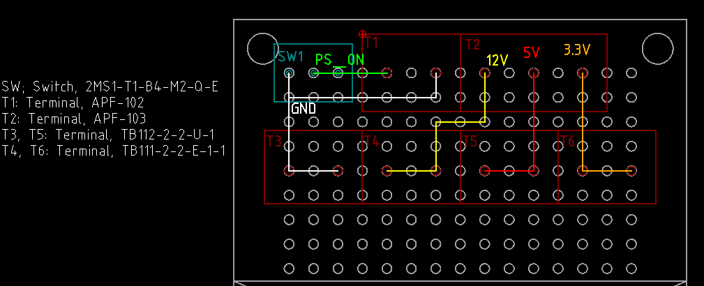

# 安定化電源を作りたい

## アイデア1, SFX 電源を流用する

まあ、TFX や ATX でも良いんだけど、サイズ感的に SFX。

放っておいても 12V, 5V, 3.3V が取れるので、あとはどう取り回して実用化するか的なところ。ケ
ーブルがおしゃれに黒統一とかではなく、ATX 規格色の通りのが使いやすいだろう。

Youtube 見てると、ケースに穴あけたりして、なんかバナナジャックみたいなの付けたりしてるけど、
金属加工する気はないのと、本体は机の空いてるところに置いたまま手元で操作したいのでそう言う
のはやらない。

電源側からはターミナルブロックあたりで受ければ良いかなと思う。青のスイッチ線と GND の間に
物理スイッチを挟めば手元でオンオフできると思う。ターミナルブロックは抜き差しが面倒だけど、
電源側は一度挟めば、そうそう外す機会はないと思う。

電源を取る側からが悩む。汎用的に電源を掛けたいということで、バナナジャックみたいな出し方に
して、バナナでもクリップでも好きに使ってくださいというスタンスなんだと思うし、なかなか良い
考えだと思う。が残念ながら、ユニバーサル基板に引っつけられるバナナジャックがないし、そうい
う DIP 化基板もない。

XH コネクタのポストはピンが指で触れる状態になっているのが、少し気になる。気にはなるが、電
源投入中に触らないという自分ルールを徹底できるなら、まあ自己責任だし良いのかもしれない。た
だこれだと、必ず一度 XH コネクタを経由する必要があり、なんか便利じゃない気もする。今、マザ
ーボードのファンヘッダに XH ハウジングを付けていて、これだと、ぷらぷらしてても安全だし、相
手を XH ポストにせずに、そのまま単線などを差して使うことも可能。

そういう風に運用できないのは、電源のコードが太くて XH の適合外だからだ(おそらく)。なので
VH ハウジングを使って、ぷらぷらさせておく、というのはありかもしれない。ただそうなると基板
に VH ポストを差して使いたくなるだろうけど、3.96mm ピッチでそれはできない。ただまあ、単線
やピンをそのまま差せるから、これはそんなに不便ではなさそうだ。

無難なのはターミナルブロック。いちいち、ねじ止めは面倒だけど、TB111-2-2-U-1-1 なんかだと、
もしかしてバナナが差さったり、みのむしで挟めたりするんじゃないかという期待がある。というか、
格好なんて気にしていないし、ターミナルブロックは最低でも 2配線なので、片方からはバナナジャ
ックかバインディングポストを絶縁テープで巻いて垂らしておけば良いのではないか。

2.5mm 間隔のものは、私の手先には難しいと判断。またプッシュ式のものは、4個並べることができ
ない。もちろん合計 4線あれば数の上では問題ないのだが、同じターミナルから別の電圧を出すとい
うのは、運用上、間違いのもとだと思う。緑と青の色違いで出力を分けることにする。
