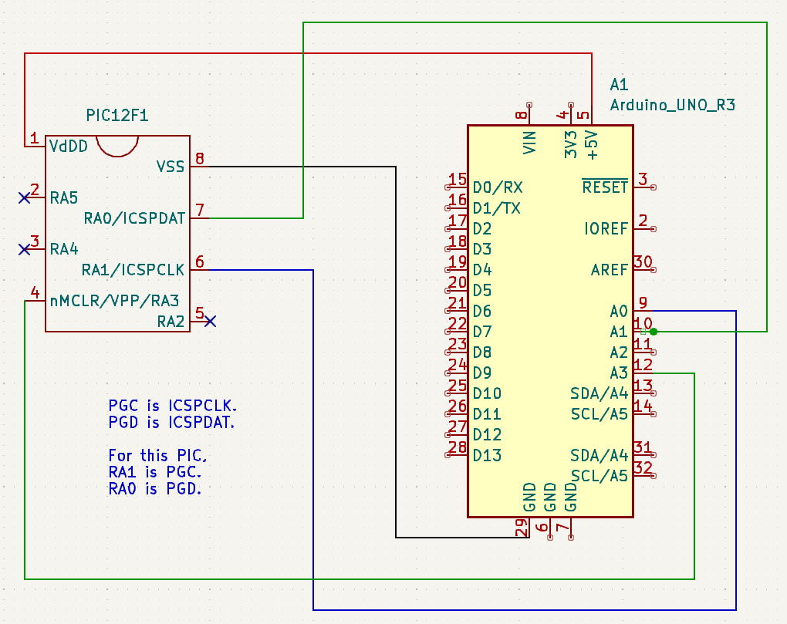
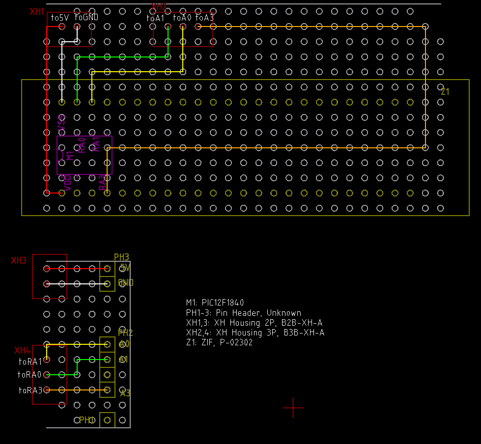
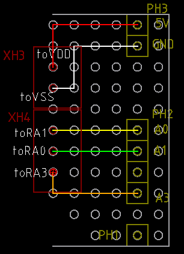
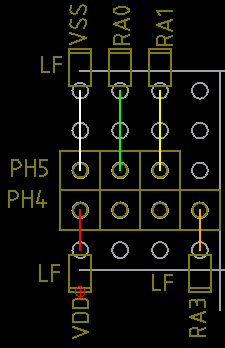
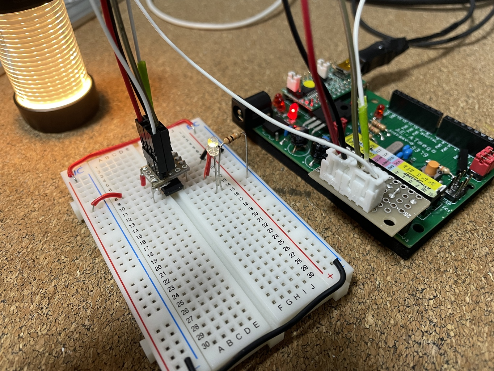
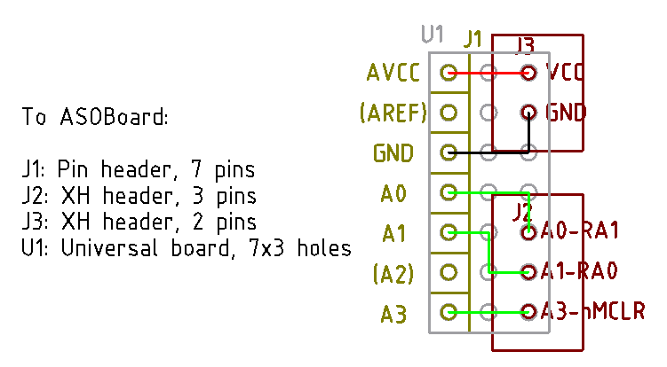
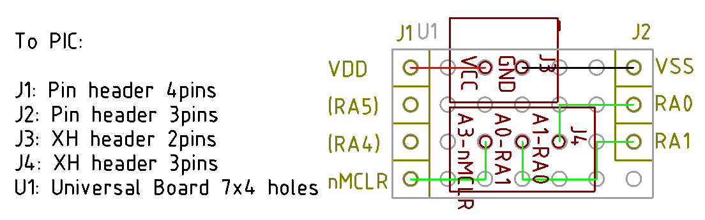

# 安価な PIC プログラマ

## 経緯

始めは秋月のマイコンボードキットを買うついでに付いてくる FT232RL を使う

https://github.com/gphalkes/fpicprog 

を使うつもりだったが、はんだ付けするように設計されており、別途送料 600円を払ってピンソケッ
トだけ購入するのもなんだったので、そのままはんだ付けしてしまった。

https://akizukidenshi.com/catalog/g/gK-04590/

うまく結線できれば使えそうだったが、うまく結線するには IC クリップが必要だと感じ、それをま
た購入して待つのもなんだったので Arduino を使う 

https://github.com/jaromir-sukuba/a-p-prog

切り替えた。

## a-p-prog 使いかた

### ハード
Hardware option 1 のところでは結線表 (GND, 5V, A3, A1, A0) ではこの 5線だが、写真では LED,
抵抗 2個が付いている。それらを試しに全部省いても動作した (PIC12F1840 にて)。

5V と MCLR の抵抗 (写真一番手前) だけど、おそらくもともと弱プルアップが入ってる PIC には不要だと思う。

VDD と GND の間のコンデンサは 0.1uF くらい。まあこれはブレッドボードにいつも差しっぱなしな
ので、取り除かなかったけど、普通なくても動くと思う。

奥の抵抗と LED は VDD にちゃんと電圧が来てるか確認するだけだから、無くてもよい。

ということで、写真に惑わされたけど、本当に表にある通りの結線で OK. 一応、結線図も書いてお
いた。交差せず書ける人は本当にすごいですね。




で、fw/pp フォルダの pp.ino を Arduino に書き込めば、PIC プログラマの完成である。

### ソフト

まず書き込まず、テストをしてみる。

```
./pp3 -c /dev/ttyUSB0 -n -p -t 12f1840 Lchika.X.production.hex
```

で、自分の場合、

```
PP programmer, version 0.99
Serial port failed to receive a byte, read returned 0
/dev/ttyUSB0: Success
zsh: IOT instruction  ./pp3 -c /dev/ttyUSB0 -n -p -t 12f1840 Lchika.X.production.hex
```

となり、失敗することが分かる。何がサクセスなのか知らんけど、間違いなく失敗している。

なので失敗しなくなるまでウェイトを掛ける。自分の場合は 2000ms 待つことにすると、

```
./pp3 -c /dev/ttyUSB0 -s 2000 -n -p -t 12f1840 Lchika.X.production.hex
```

```
PP programmer, version 0.99
Sleeping for 2000 ms while arduino bootloader expires
Wrong device ID: 0000, expected: 1b80
Check for connection to target MCU, exiting now
```

と failed が消えるので、これなら書き込める。

最後に実際に書き込む。


```
./pp3 -c /dev/ttyUSB0 -s 2000 -t 12f1840 Lchika.X.production.hex
```

### シールド化 (没)

IC ソケットが繰り返し使うためのものじゃないと知りゼロプレッシャーソケットを使うことにした。
おじいさんの遺言で日本と友好国のメーカーしか買えないので、やたらとでかい IC ソケットとなっ
た。そのため、ケーブルで繋ぐ別の基板としたので、厳密にはシールドではない。



下が Arduino に直結するシールドで、上が XH コネクタで飛ばした先となる。

a-p-prog が対応している他の PIC をいくつか調べてみた感じでは、多くの PIC に対応できそうで
ある。

と思ったけど、せっかくだから、シリアル通信とかもできるようにと思ってたら、折角だから 8ピン
全部つなげられるようにと思いだして、結局それってブレッドボードじゃない？ってなった。

要は自分が欲しいのは、ブレッドボードに差してある PIC に被せるように差したら、配線が終って
いるようなコネクタなんだな。

### シールド化 (改)

Arduino 側にこれを差して、


ブレッドボードで PIC の上からこれを差せば良い



基板上の部品は以下。XH を使うのは余っているから。ピンヘッダの品番が違うのは微妙に足りない
から。それぞれ深い意味はない。ピッチは Sunhayato のピンそろった、で揃えられるピッチにした。

| 記号 | 分類 | 品番 |
| ---- | ---- | ---- |
|LF | リードフレーム| PK2.54-1.4-11-SN|
|PH1-3| ピンヘッダ| 在庫、詳細不明 |
|PH4,5| ピンヘッダ| PH-1X20SG |
|XH3| XH 2P ハウジング|  B2B-XH-A|
|XH4| XH 3P ハウジング|  B2B-XH-A|

基板に直接載らない部品は以下。手元にあるもので適当に。

| 分類 | 品番 | 説明 |
| ---- | ---- | ---- |
| コネクタ用ハウジング| 254AH-D08 | ブレッドボード側基板の真ん中のヘッダにはこれでつなぐ |
| コネクタ用 ハウジング| XH の 2P と 3P やつ | Arduino 側はこれでつなぐ |
| コネクタ端子 | Qi 用のやつと XH 用のやつ |  |   
| ケーブル | AWG24 くらいのやつ | |



### ASOBoard 版シールド 1.0

ピン配置以外に以下を変更する。回路図は同じ。

- ピンフレームをやめて普通のピンヘッダを使う。
  - 弱すぎて使いにくい。あれは多分、基板段重ねするときに、はんだ付けして使うようなものだと
    思う。
- PIC 側の QI コネクタをやめて XH コネクタにする。
  - 1ピン用のを接着剤で付けてたけど、面倒だし外れやすいしで、やめる

ASOBoard 側の設計図



PIC 側 (ブレボ側) の設計図



XH コネクタは配置を変えないようにしたつもり。

### fpicprog はあきらめた件

独立した FT232RL が準備できたので、やってみたけど、どんなに配線を見直しても (と言っても
a-p-prog と同じ配線なわけだけど) unknown device エラーを回避できない。もう開発されてなさそ
うだしあきらめた。
