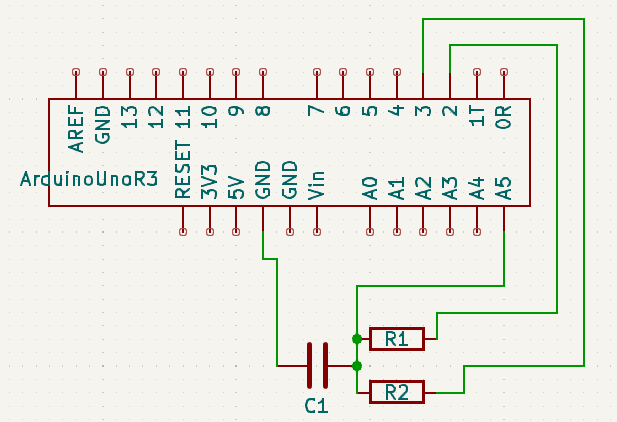

# コンデンサ静電容量測定

## 考えたり、やってみたこと

参考にしているのはこちら。

https://101010.fun/iot/arduino-measure-capacitance.html

まずは部品の確認。記事では測定用に 2MΩ, 1kΩを放電用に用いている。

放電に関しては、こちらで計算できる。

https://www.digikey.jp/ja/resources/conversion-calculators/conversion-calculator-capacitor-safety-discharge

手持ちの一番大きいコンデンサが 0.1μF。充電電圧を 5V で 0.01V まで落としてみる。0.01V まで
落ちれば、どうせ自分には測定できない。

10kΩで 0.006秒。まあとりあえずこれで OK でしょう。

時定数はこちらのサイトで計算できる。

https://www.digikey.jp/ja/resources/conversion-calculators/conversion-calculator-time-constant

手持ち 10kΩで 0.1μF の時定数は 0.001 sec. 16MHz 駆動だから 1万6千サイクル分なわけだけど、
どうなんだろうか。

参考サイトの方は、100pF も精度良かったとのことだが、この場合時定数は 0.0002 sec であり、自
分の手持ちよりも短い。

ということで、手持ちの 10kΩの抵抗でとりあえずやってみることにしよう。

手持ちのセラコンは 0.17uF と出て、フィルムコンデンサは 0.12uF と出た。セラコンは精度が
+80/-20%, フィルムコンは±5% ということで、これくらいの違いは出てもおかしくない。

とりあえず、容量の桁を知る、壊れていないかどうかを知る、という観点からは、問題ないようだ。

参考サイトの計測終了後の放電のギミックは、電力供給ピン D2 を GND接続、放電ピン D3 も GND接
続にして、両方から放電している。サイトでは D3 から放電と言ってるが、厳密には違う。 

## ソース、配線図

## 静電容量ごとの抵抗選択

|静電容量 [F]|R1 [Ω]|R2 [Ω]|時定数 [s]|放電直後の電力消費 [W]|1e-2Vまでの放電時間 [s]|
|---------------|----------|----------|-------- |-------------------------|-----------|
| 0.01u         | 10M      | 10k      | 0.100   | 2.5e-3 | 6.2e-4 |
| 0.1u          | 10M      | 10k      | 1.00    | 2.5e-3 | 6.2e-3 |
| 100u          | 10k      | 300      | 1.00    | 8.3e-2 | 0.19   |

時定数 0.1-1.0sec を狙う。

放電時間は Arduino Uno R3 のデジタルピンが 40mA までのようなので、5V なので、瞬間 0.2W ま
では対応できるから、そこを目処とする。面倒なので抵抗 R2 側に全電流が流れると仮定した。

10MΩを測定できる計測器は持ってないが、±1% だって書いてあるし、精度よりも動作確認なので、
まあ大丈夫でしょう。
