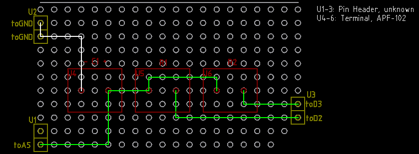

# コンデンサ静電容量測定

## はじめにまとめ

長くなってきた。今はこちらで、抵抗を自動で切替えるものを開発中。

[抵抗自動選択式の開発](./抵抗自動選択式の開発.md)

## 初期検討 (他に良い案ができたので見送り)

参考にしているのはこちら。

https://101010.fun/iot/arduino-measure-capacitance.html

参考サイトの計測終了後の放電のギミックは、電力供給ピン D2 を GND接続、放電ピン D3 も GND接
続にして、両方から放電している。サイトでは D3 から放電と言ってるが、厳密には違う。 

まあ面倒なので放電は 100% D3 から行われるものと仮定して考える。

放電に関しては、こちらで計算できる。

https://www.digikey.jp/ja/resources/conversion-calculators/conversion-calculator-capacitor-safety-discharge

Arduino Uno R3 のデジタルピンは 40mA まで吸える。ということは上記サイトで初期電力が 5V x
40mA = 0.2W までなら、大丈夫ということである。

時定数はこちらのサイトで計算できる。

https://www.digikey.jp/ja/resources/conversion-calculators/conversion-calculator-time-constant

Arduino の ADC はデフォルトで 16MHz/128 での駆動。ADC 一回の動作に 13 サイクル掛かるので、
ADC 1回のループは、1/(16MHz/128)x13 で約 1.0e-4 sec である。しかし ADCSRA レジスタの ADPS
ビットでこの分周比は、仕様上 2 まで小くできる。しかし、テストしたところ、分周比 2 では最初
に何の理由か不明だが1023 と読み取ってしまい、時定数が 0 になってしまった。そのため、実際に
利用できる下限は 4である。

分周比 4 だと 1/(16MHz/4)x13 で約 3.3e-6 sec となる。したがって、時定数は、1e-3 sec あたり
を越えておけば、まずまずの計測ができるだろう。

### ソース、配線図

[ソース](./arduino/main/main.ino)

### テスト

|公称静電容量 [F]|R1 [Ω]|時定数 [s]|測定値 [F]|補足|
| ---  | --- | ---    | ---   | ---     |
| 0.1u | 10k | 1.00e-3| 0.10u | フィルム|
| 0.1u | 10k | 1.00e-3| 0.14u | セラミック |
| 0.01u| 10k | 1.00e-4| 0.011u| セラミック |
| 22p  | 10k | 2.20e-7| 851p  | セラミック |

おおよそ期待どおりの試験結果かな。

### 静電容量ごとの抵抗選択

|静電容量 [F]|R1 [Ω]|R2 [Ω]|時定数 [s]|放電直後の電力消費 [W]|1e-2Vまでの放電時間 [s]|
|---------------|----------|----------|-------- |-------------------------|-----------|
| 0.01u         | 100k     | 10k      | 1.00e-3 | 2.5e-3 | 6.2e-4 |
| 0.1u          | 100k     | 10k      | 1.00e-2 | 2.5e-3 | 6.2e-3 |
| 1u            | 10k      | 300      | 1.00e-2 | 8.3e-3 | 1.86e-3|
| 100u          | 300      | 300      | 3.00e-2 | 8.3e-2 | 0.19   |
| 22p           | 100M     | 10k      | 2.20e-3 | 2.5e-3 | 1.37e-6 |

10k と 300Ωは手持ちなので優先。100MΩは入手性が悪いなあ。

### Arduino シールド

## PIC でやれるんじゃないの？ (一旦検討終了)

PIC12F1840 が手元にあるので、32MHz 駆動のこれなら ADC のカウントを稼げないかということで調
べてみる。ADC が 1ピン、IO に 2ピン、GND と Vdd で、合計 5ピン必要だから、IO 的にはできそうだ。

内部クロックで 32MHz 駆動できて、一応 ADC も最大 32MHz で駆動できる。変換開始から完了まで
11.5 T_AD という時間が掛かり、推奨範囲での最小 T_AD = 1.0usec. 1 ADC サイクルに 1e-5 sec
かかるので、Arduino よりも遅い。

## 時定数まで待つのではなく、時間指定で電圧を掛けるのは？ (没)

micros() の分解能が 4us, ``_delay_ms()`` の分解能が 1.25us らしいので、分解能的には時定数
のやりかたと大差ない。しかし抵抗を固定したまま運用できるかもしれない。でも、はんだしちゃっ
た後から 1e3uF 規模の測定がしたくなったりとか考えると余計面倒だし、プログラムの条件分岐と
かも

## PIC 再考 (没)

``__delay_us()`` は 1サイクル, 0.125us を待てる。

例えば 

1s 電圧掛ける --> 電圧取る. V1
0.1s 電圧掛ける --> 電圧取る. V2
0.01s 電圧掛ける --> 電圧取る. V3
0.001s 電圧掛ける --> 電圧取る. V4

実際には電圧といってもアナログ入力なので 1023x0.632=647 に最も近いものを選択。

Vc: コンデンサ電圧, V0: 全体の電圧, t: 採用した充電時間, R: 抵抗, C: 静電容量とすれば

$Vc = V0 ( 1 - e^{- \frac{t}{RC}})$

よって

$C=-\frac{t}{R}\frac{1}{\ln(1-\frac{Vc}{V0})}$

多分、この部分のプログラムは書ける。問題は出力。現在の自分の実力では Arduino 経由でシリア
ル送信するしか知らない。Arduino に対して必要なピンは D0 のみなので簡単にシールド化はできる
が、Arduino の上で PIC 動かすなら、Arduino で良いとなる。

FT232RL で直接シリアルの受信も、多分練習すればできる。PIC 側からの送信はなにも変わらないか
ら、普通に ``stty`` の設定と ``cat`` するだけで、受信できそうだと思っているんだけど、
FT232RL が割と大きいので、Arduino でいいやってなる。

LCD への表示は興味がある。ただ I2C の物でも 2ピンを使うので、3ピン使う今のやりかたではどう
にもならない。ただ 2ピン、つまり充電したピンから放電もすれば良くないのか？と今考えている。

結局、こういったことを乗り越える動機が生まれるほどの、性能差が出そうにはない。

## 充電、放電を一本化 (採用中)

良く考えたら R1=R2 でも全然問題ない。放電に関しては 5V からの放電で計算しているが、実際に
は 3.7V あたりからの放電だから、実際はさらに余裕がある。

|静電容量 [F]|R1 [Ω]|R2 [Ω]|時定数 [s]|放電直後の電力消費 [W]|1e-2Vまでの放電時間 [s]|
|---------------|----------|----------|-------- |-------------------------|-----------|
| 0.01u         | 100k     | 100k     | 1.00e-3 | 2.50e-4 | 6.21e-3|
| 0.1u          | 100k     | 100k     | 1.00e-2 | 2.50e-4 | 6.21e-2|
| 1u            | 10k      | 10k      | 1.00e-2 | 2.50e-3 | 6.21e-2|
| 100u          | 300      | 300      | 3.00e-2 | 8.33e-2 | 1.86e-1|
| 22p           | 100M     | 100M     | 2.20e-3 | 2.50e-7 | 1.37e-2|

[ソース](./arduino/tester2_2pin/tester2_2pin.ino)

ただ 22pF は 150pF くらいの測定結果となった。試しに、コンデンサのところに 100MΩ、抵抗
100kΩで繋ぐと 80pF という測定結果が出る。これ以上の分析は不可能だけど、100MΩくらいになっ
てしまうと、R だけじゃない C や L の効果が無視できなくなるのかもしれない。10MΩや 1MΩの方
がまだ良いのかも知れない。

ということで 10MΩだと 54pF, 1MΩだと 60pF と、数倍に収まることが分かった。

## アナログピンに一本化 (没、そこまでこだわることでもない)

時定数を使わなくても、対数を使って計算できる。Arduino は Analog pin をデジタルにも使えるの
で、

* digital output High で充電
* analog input で ADC 電圧測定
* digital output low で放電

すれば入出力ピンを 1本にできる。さらには充電時間の短縮ができれば 22pF とかが計測しやすくな
る、ということで TinkerCAD でいろいろ試験してみた。

https://www.tinkercad.com/things/3i2qGzTrHgV-analogpinmodetest

まず疑問だったのは digital output high の状態から analog input に切り替えたら、電圧を保持
するのかどうかで、これは test1() を実行すれば分かるが保持できる。

そうなると実際、どれくらいの時定数のものい使えるかやってみたのが test2()。残念ながらτ
=1e-4 sec では厳しく、これだと充電時間の短縮になならない。

そうすると digitalWrite や pinMode の変更にどれくらい時間が掛ってるのかが問題になるので、
それを確かめたのが test3, test4, test5。結局デジタル出力 High からアナログ入力に切り替える
までに 44 μsec 必要となり、そうなると結局 1000μs = 1ms くらいの時間が必要となり、時間短
縮という効果が得られない結果となった。

なお PORT と DD レジスタを直接書き換える方法も考えられる。安全に 2サイクルで書き換えるとす
れば 2個で合計 4サイクル。そこまでやる気がないから測定していないけど、多分 ATMega328P も 1
サイクルが 4クロックだと思うので 1/(16e6/4)x4 = 1μs。なので 100μs くらいの充電時間なら運
用できそうな感じである。

まあこれをしないと必要な抵抗が手に入らないとかなら検討するけど、まあいいか、というのが感想。
校正済みのコンデンサがあれば、直列に繋ぐだけで静電容量分かるし、それをやれば、1桁ずつ下げ
ることもできるので、抵抗が手に入る間は、こだわる必要はないのかなと。

## コンパレータを利用する高速化 (結局そこまでじゃない)

ADC は 50 サイクルくらい掛かるが、コンパレータはデータシートによると 1, 2サイクルで反応す
るらしい。ついでに digitalWrite() も 48 サイクルだかなので、このあたりもレジスタ操作で高速
したい。while() も 12サイクルだか掛かるので、タイマー割り込みしたい。

そんなこんなで完成したソースがこちら。

[ソース](./arduino/uFtester_by_comparator/uFtester_by_comparator.ino)

ある一つの 22pF ±5% とされてるセラコンで試したのがこちら。まあ良くて 41pF。

| C1 | R1 | 測定値 |
| -- | -- | ------ |
| 22pF | 100kΩ | 73pF |
| 22pF | 1MΩ   | 44pF |
| 22pF | 10MΩ  | 41pF |
| 22pF | 100MΩ | 43pF |

「充電、放電を一本化 (採用中)」をわざわざ作りかえるかと言うほどの成果ではない。RC 回路の
Arduino の計測の限界に近いのだろう。
