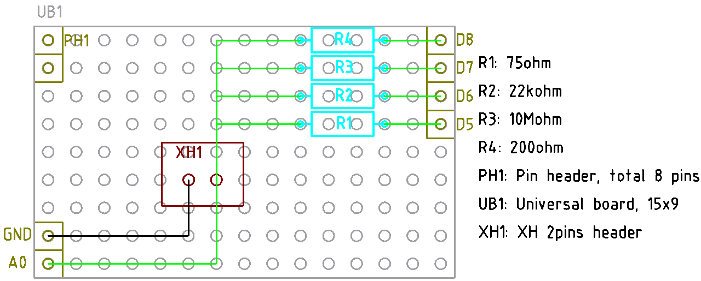

# 抵抗自動選択式静電容量測定器の開発

自分で思ってたよりも良く使うので、抵抗を自動で入れ替えるものを作ることにした。

75Ω, 22kΩ, 10MΩの在庫があるので、充電用に使うことにする。ある程度精度が出るであろう、時
定数 1e-3 sec を見たす最小の静電容量は、次の表となる。

| 抵抗 [Ω] | 静電容量 [F] |
| --------- | -----------  |
| 75        | 13u          |
| 22k       | 0.047u       |
| 10M       | 100p         |

こちらによると 200Ωあれば 5V 充電からでも、初期電力 0.125W で 25mA と ATmega328P のピンの許容電流を下回れるので、放電はやはり在庫の 200Ωで一本化することにする。

https://x.gd/iHjnX

今回は、自作の ASOBoard v2.0 に載せるものを設計する。

# 計測のおおまかな流れ

1. 75Ωで測定し、時定数が 1 msec を超えたら測定完了。超えなければ続く
1. 22kΩで測定し、時定数が 1 msec を超えたら測定完了。超えなければ続く
1. 10MΩで測定する。泣いても笑ってもこれが最後。

# 充電、放電のメカニズム

基本的にはデジタルピンのモードを input にすると、浮く (縁される) ので、そうすると充電も放
電もできない状態になるため、それを利用する。

デジタルピンは充電用 3ピンと放電用 1ピン。

充電時は、使用する抵抗のピンのみ output の high として、他を input としておく。

放電時は、充電用 3ピンを input として、放電ピンを output の low とする。

何もしないときは全て output の low としておく。

# ソース

[ソース](./arduino/CapacitanceMeter/CapacitanceMeter.ino)

# ユニバーサル基板でのテスト

10uF を超えるコンデンサがないので 75Ωでの計測結果は不明。

22kΩの計測は良好。

10MΩで 22pF を計測すると、106pF と出る。ただし、コンデンサを付けずに測定すると、84pF と出
る。差引 22pF である。すごく雑な考えだけど、コンデンサを付けずに測定することで、浮遊容量を
測定できた、マイコンの遅延とかひっくるめたシステム全体での見かけ上の浮遊容量が測定できた、
ような気がする。22pF 前後のコンデンサがないので、確定ではないが。

これを差し引いても良い気がするけど、自分が分かっていれば良いので、とりあえず出てきたものを、
そのまま表示することにする。

# 回路図

こちらの PDF

[回路図の PDF](./kicad/AutoRegisterSelectorEdition1.0/AutoRegisterSelectorEdition1.0.pdf)

| Reference | Value      | 数量 | 
| --------- | ---------- | ---- | 
| C1        | Any        | 1    | 
| R1        | 75         | 1    | 
| R2        | 22k        | 1    | 
| R3        | 10M        | 1    | 
| R4        | 200        | 1    | 
| U1        | ATmega328P | 1    | 

# ASOBoard シールド設計図

