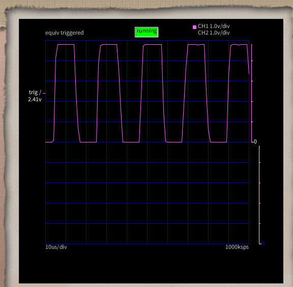
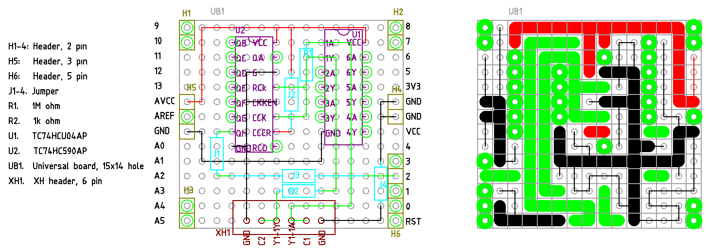

# クリスタルの発振を確認したい

なんとなく発振してることを信じて使うしかないのは嫌なので、なんとか確認したい。

## クリスタル発振回路

抵抗、コンデンサ、インバータとクリスタルで発振できる。必要な抵抗は 2個目のサイトに目安があ
る。

https://edn.itmedia.co.jp/edn/articles/1405/19/news008_2.html

https://www.ndk.com/jp/products/info/post_15.html

後で使うけど、選択したインバータは東芝の TC74HCU04AP。選定理由は

- 日本メーカー
- 4ns の高速動作。1/4ns=250MHz と余裕十分

## 発振を九大オシロで見ることができた

12MHz とか 16MHz とかの発振を見る機器は持っていないので、カウンタを使うことを考えた。8ビッ
トカウンタで 8ビット目が落ちる時が分かれば、それが 1/256 周期なので、Arduino などでも十分
に読めるのではないかと考えた。

選定したカウンタは東芝の TC74HC590AP。選定理由は

- 日本メーカー
- 33MHz 駆動と余裕十分

回路図

[回路図](./kicad/Crystal-Counter/Crystal-Counter.pdf)

オシロ観測結果



波長がおおよそ 20usec だから ``1/20e-6*256=12.8MHz`` とおおよそのところは分かる。

## Arduino で観測できるか

D2 ピンで 1000ms の間 Falling をカウントする。

[ソース v1.0](./arduinio/CrystalChecker1.0/CrystalChecker1.0.ino)

KDS の 12MHz クリスタルのとき

```
Count: 46878
Freq [MHz]: 12.00
```

Murata の 16MHz セラロックのとき (水晶じゃないのはご愛嬌)

```
Count: 62497
Freq [MHz]: 16.00
```

ちゃんと出た。

## Crystal Checker Shiled for ASOBoard 1.0

設計図



部品表

| 記号  | 品目                                | 個数  |
| ---   | ----------                          | ---   |
| H1-4  | ピンヘッダ 2ピン                    | 4     |
| H5    | ピンヘッダ 3ピン                    | 1     |
| H6    | ピンヘッダ 5ピン                    | 1     |
| J1-4  | ジャンパ抵抗等                      | 4     |
| R1    | 抵抗 1MΩ                           | 1     |
| R2    | 抵抗 1kΩ                           | 1     |
| U1    | インバータ TC74HCU04AP              | 1     |
| U2    | 8 bit カウンタ TC74HC590AP          | 1     |
| UB1   | ユニバーサル基板 15x14穴            | 1     |
| XH1   | XH ヘッダ 6ピン                     | 1     |
