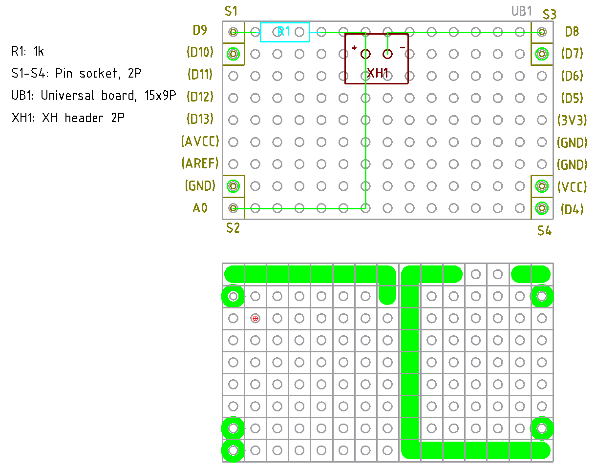

# ダイオードテスター

## 目的

壊れていないかどうかの判断と、+- (アノード、カソード) が分かれば良い。正確な値を測定する必
要はない。

## v1.0

動作原理:

抵抗 1kΩとダイオードを直列に継ぎ、両側をデジタル出力ピンにつなぐ。両側から交互に Vcc を掛
けるて、ダイオードの電圧 Vf, Vr を測定する (f: 順方向, r: 逆方向)。

正常品なら Vr≒Vcc, Vf << Vr となるはず。それを出力するだけ。

向きを間違えていたら、単純にメッセージで向きが違うことを通達する。

異常品なら、何かおかしな電圧が出るはずだ。

LED は逆耐圧が 5V ないものも世の中にはあるようなので、あくまで壊しても良いときだけ使おう。

[ソース](./arduino/DiodeChecker1.0.ino)

[回路図](./kicad/DiodeTester1.0/DiodeTester1.0.pdf)

設計図:

UI はいつも通り IC クリップで良いだろう。

部品表:

| 記号  | 品名、品目             | 個数 |
| ---   | ---                    | ---  |
| R1    | 抵抗 1kΩ              | 1    |
| S1-S4 | ピンヘッダー 2P        | 4    |
| UB1   | ユニバーサル基板 15x9P | 1    |
| XH1   | XH ヘッダー 2P         | 1    |
| ---   | 以下 UI                | ---  |
|       | ケーブル 5cm 程度      | 2    |
|       | IC クリップ            | 2    |
|       | XH ハウジング 2P       | 1    |
|       | XH コンタクト          | 2    |
