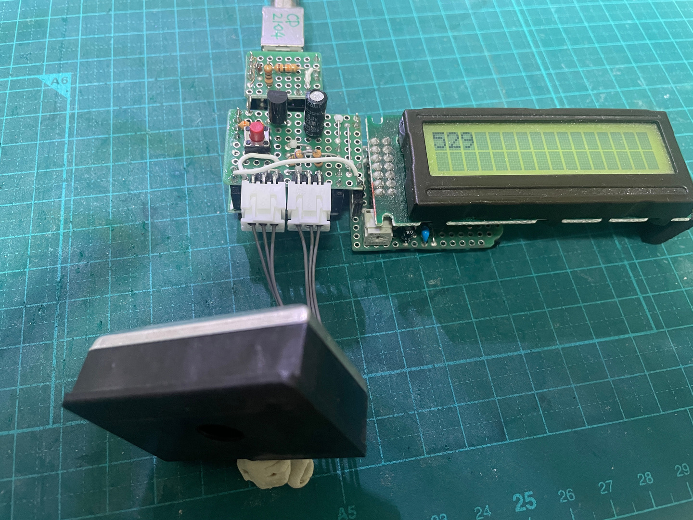

# テスト (をしようと思ったけど止めた)

[データシート](./GP2Y1010AU0F.pdf)
[ユーザガイド](./gp2y1010au_appl_j.pdf)

ユーザガイドの 6-1 の接続図のように回路を組んで、10ms 周期、立ってる時間 0.32ms でチカチカ
させる。#3 を Hi にするとトランジスタが繋がって GND に落ちて流れるわけだから Nch mosfet で
も良いはず。

波形を反転させて LOW でマイコンに流し込んでも大丈夫そう (データシートによると LED の最大電
流は 20mA らしいので）だが、長いものには巻かれておこう。

0.28ms で最大の出力が出るようだが、まあ別にすごい精度を求めてないので、PWM で雑に波を作っ
ておいて、ADC も雑に 10秒に 1度とかに、10秒間の最大値とか出せば良いと思う。

RL78/G24 の
[データシート](https://www.renesas.com/ja/document/mah/rl78g24-users-manual-hardware-rev120?r=25442531)

表20-6 A/D変換時間の選択 (1/11) によると 16MHz 駆動で、分周率 4 で 16.5us。0.28ms の間に
19 回くらい測れる。

いちいちタイマーで 10s とか計らなくても、500回とか測った最大値とかで良いだろう。

PWM は TAU0 というので十分らしい (Gemini より)。スマートコンフィグレータで 10ms, 0.032ms
パルス ( Duty=3.2%) が簡単に作れる。

2個のタイマーを使うことになっていて、タイマー 2 をスレーブにした。タイマー 1の出力ピン
TO01 が I2C の SDAA0 と被るので。スマートコンフィグレータではマスターの選択はできない。し
かしマスターはタイマ 0 か 2 しかなれない (図10 - 71 PWM機能としての動作のブロック図) ので、
スレーブに 2 を選んだ時点で 0 がマスターで確定する。``void R_Config_TAU0_0_Create(void)``
に TMR00 はマスターとして使う旨が書き込まれている。

スマートコンフィグレータの作る ``void R_Config_TAU0_0_Start (void)`` は例によって開始を要
求するだけのはず。

状態は TE0 レジスタの TE00, TE02 を見れば良いはず。具体的には TE0 と 0b101 の & が 0b101
になれば良いはず。まあ 1ms とか待っても良いはずだし、そもそも雑に ADC を掛けつづけるんだか
ら気にしても仕方ないはず。

ブレッドボードでテストしようかと思ったけど、このレベルになると、多分間違えるし、間違えても
思い込んでるから、自分で解決できないし、動かなくても、実際に組んで確かめることになるから、
最初から組むことにする.

# v1.0

とりあえず、コンフィグレータを使って選択したらこうなった。物理的な距離とかは考えていない。

使用ポート一覧:
| 端子番号 | 端子名 | 利用機能    |
| ---      | ---    | ---         |
|  2       | P00    | TxD1 (UART) |
|  3       | P120   | TO02 (PWM)  |
| 11       | P15    | SDAA0 (I2C) |
| 12       | P14    | SCLA0 (I2C) |
| 15       | P11    | ANI21 (ADC) |

Kicad のアップデートに付き合うのに疲れたので、今回から LibrePCB の Appimage 版。

[回路図](./v1.0/GP2Y1010AU0F_v1.0/GP2Y1010AU0F_v1.0_Schematics.pdf)

[設計図](./v1.0/GP2Y1010AU0F_1.0.pdf)

部品表:
| 記号  | 品番、品目    | 個数 |
| ---   | ---           | ---  |
| B1    | 基板 13x9P    | 1    |
| C1    | 220uF         | 1    |
| H1-4  | ヘッダ 1P     | 4    |
| H5-8  | ヘッダ 2P     | 4    |
| H9,10 | 低ヘッダ 3P   | 2    |
| Q1    | nMOS, 2SK2989 | 1    |
| R1    | 150Ω         | 1    |
| R2    | 300Ω         | 1    |
| S1    | スイッチ      | 1    |
| TP2   | チェック端子  | 1    |
| X1,2  | XH ポスト 3P  | 2    |

[ソース](./v1.0/src/DustMeter1.0/)

65535 回 ADC を測定して、最大値を表示。ADC 一回が 16usec くらいで、自分の処理が入るので 1
秒強だと思う。特に工夫も無く 12bit ADC をそのまま表示。0.6V-3.7V くらいまでなので、
500-3000 くらい表示されることになる。

息を吹き掛けたり、布をわしゃわしゃやると数値が上がるから、多分大丈夫。
