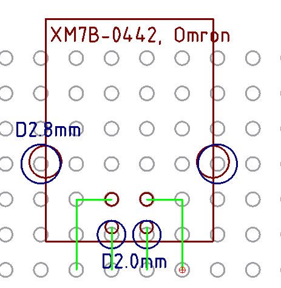
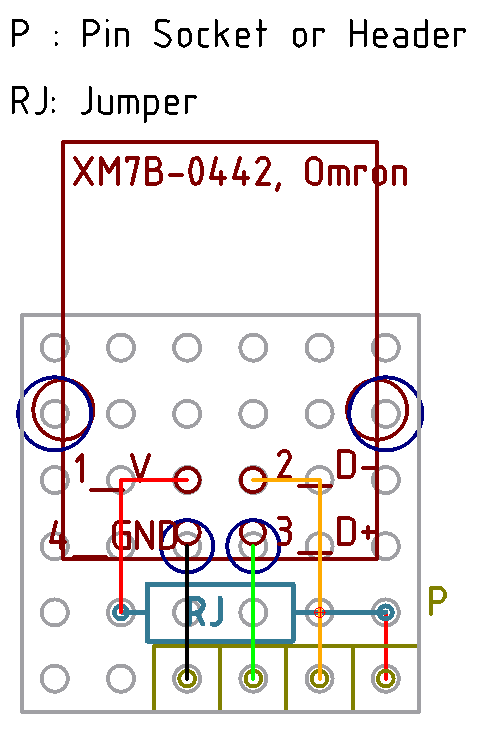
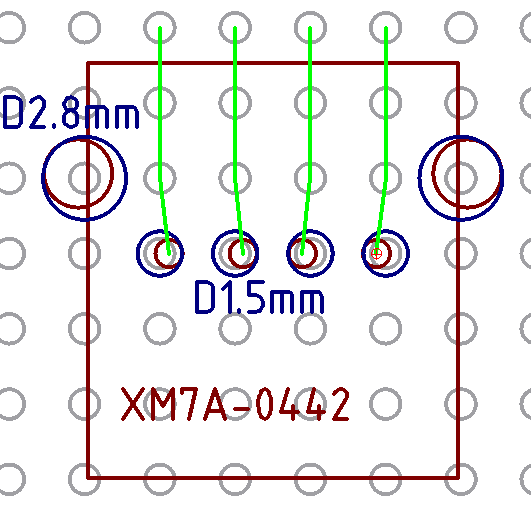

# パーツをユニバーサル基板に配置する方法

2.54mm ピッチに合わない部品をどう配置するのか検討してみた。

## USB B メスコネクタ

Omron の XM7B-0442 が対象だけど、だいたいどのコネクタも同じ。あと 0.5mm 頑張れよって思った
人も多いはず。エレショップとマルツで売っている。

https://eleshop.jp/shop/g/gE6A368/
https://www.marutsu.co.jp/pc/i/2537574/

手元に直径 2.0mm と 2.8mm のドリルがあるので、とりあえずやれそう。ランドは剥れると思うので、
シール基板なりでなんとかする。加工図は以下。

DIP 化しておくならこんな感じ。ピンヘッダかソケットかは用途に合わせて。

## USB A メスコネクタ

Omron XM7A-0442 が対象だけど、これもやはりどれも変わらないと思う。

https://eleshop.jp/shop/g/gE6A367/
https://www.marutsu.co.jp/pc/i/2537572/

直径 1.5mm のドリルが必要になりそう。剥がれたランドはシール基板で修復を。以下が加工図。

