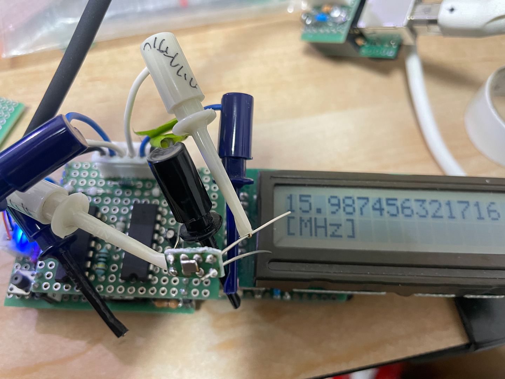

# 表面実装クリスタル 12MHz Epson FA238V

[図面](./librecad/Epson_12MHz_Crystal_FAV238V.pdf)

実際には 16MHz の FA238-16MHz でやってみた。

分かったこと

- #2, #4 は導通している
- #2, #4 を GND に落とさなくても動作する
- 横にランドが無いので、はんだできたのかどうか非常に分かりにくい
- なんとなく #1 と #3 のはんだがケースに付いてしまいそうな、つまり #2, #4 と導通してしまう
  気がするが、実際は、なんかまあ大丈夫
