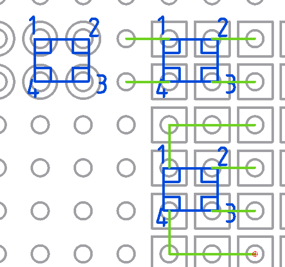

# 表面実装クリスタル 12MHz Epson FA238V

こんな感じでユニバーサル基板に載りそうだ。左にあるように、普通に基板に直接載せることもでき
そうだが、私はリード部品化したいので右側の
[秋月の 0.3mm の角型ランドの基板](https://akizukidenshi.com/catalog/g/g109725/)
を使うだろう。

はんだは、

1. ランドに予備はんだ
1. クリスタルを載せて上からピンセットで抑えておく
1. ランドとクリスタルの角にこてを当てて、はんだがクリスタルの下でしっかり溶けるよう
   に。こて先は D 型が合いそうで、実際には C 型がしっくり来るだろう。

こんな感じだろうか。このあたりは練習してみるしかない。

平面にしたければ右上のようにリード線を付ければ良いし、立てたければ右下のように付ければ良さ
そうだ。

また 2 と 4 が導通してる気がするので 4 は省いて良さそうだし、そもそも GND 接続 (データシー
トには GND 接続して下さいというお願いがある) しなくても動くのではないかと思っている。この
あたりは買って確かめるしかない。
