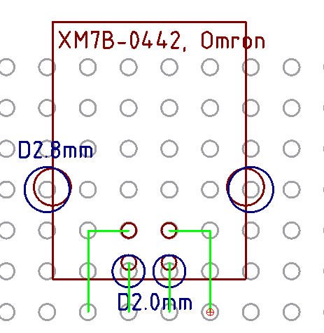
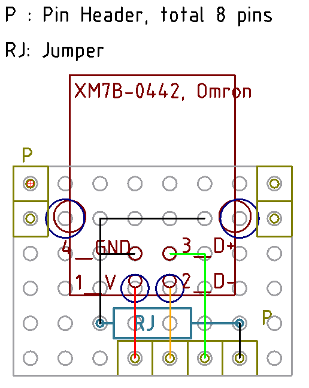
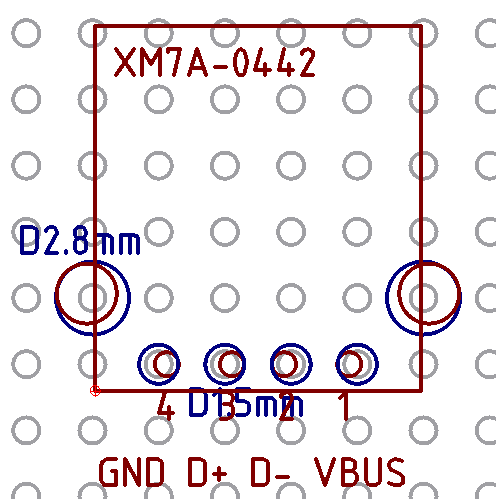
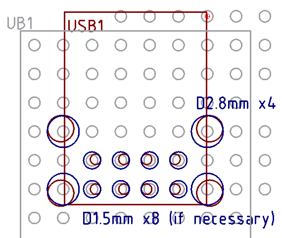
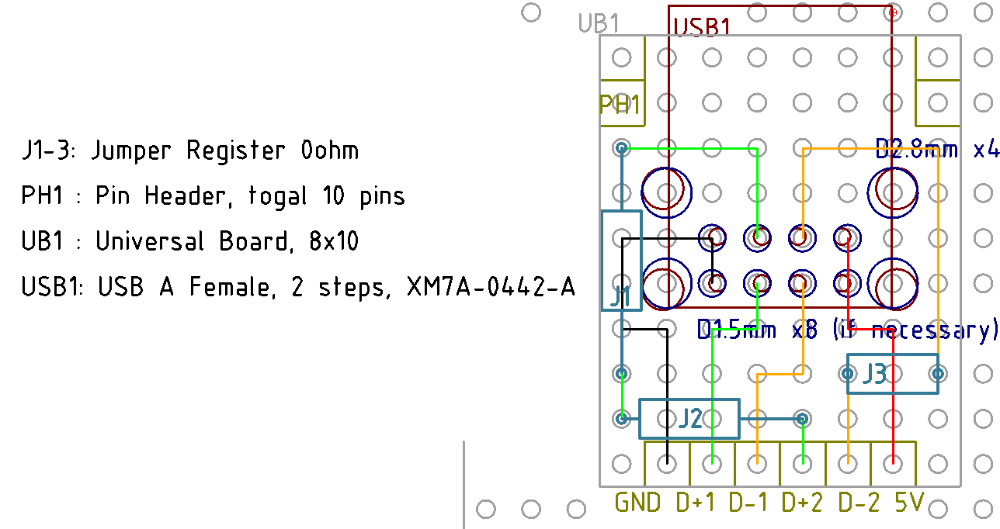
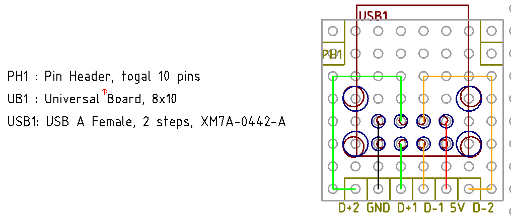

# パーツをユニバーサル基板に配置する方法

2.54mm ピッチに合わない部品をどう配置するのか検討してみた。

## USB B メスコネクタ

Omron の XM7B-0442 が対象だけど、だいたいどのコネクタも同じ。あと 0.5mm 頑張れよって思った
人も多いはず。エレショップとマルツで売っている。

https://eleshop.jp/shop/g/gE6A368/
https://www.marutsu.co.jp/pc/i/2537574/

手元に直径 2.0mm と 2.8mm のドリルがあるので、とりあえずやれそう。ランドは剥れると思うので、
シール基板なりでなんとかする。加工図は以下。

DIP 化しておくならこんな感じ。ピンヘッダかソケットかは用途に合わせて。

実際にやってみたところピン用の穴は加工せずにホールを通った。なのでピン用の穴は現状合わせで
となる。またブラケットのはんだは、その隣のホールまではんだが延びるので、GND を延しておけば
ケースも GND に落とせる。

## USB A メスコネクタ

Omron XM7A-0442 が対象だけど、これもやはりどれも変わらないと思う。

https://eleshop.jp/shop/g/gE6A367/
https://www.marutsu.co.jp/pc/i/2537572/

直径 1.5mm のドリルが必要になりそう。剥がれたランドはシール基板で修復を。以下が加工図。

こちらは真っ直ぐ出すだけだから DIP は図面無しで作れるだろう。

## USB A 2段メスコネクタ

Omron の XM7A-0442-A が対象。加工はこちら。

ピンの穴は不要かもしれない。

DIP は、ある程度ピンの順番を分かりやすくしておくバージョンがこちら。

ピンの順番を無視して、作りやすいように作るのがこちら。自分で使うなら、これで良い気がする。

右下以外のブラケット足は内側に折れるが、ケースを GND に落とすので、右下は、一つ上、もしく
は二つ上の穴にスズメッキ線をはんだして、その線にはんだする、等になりそうだ。

また制作は、配線済みユニバーサル基板で、GND 以外を彫って、残りを全部 GND にしてしまうのが
楽そうだ。

