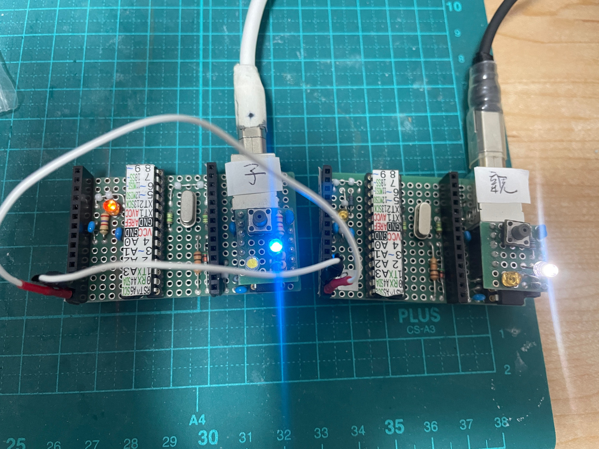

# 目的

I2C を使ってマイコンを IO エキスパンダにしてみる。

# 01: ATmega328P MiniCore で練習: 接続時に子機を LED 点灯
<!-- {{{ -->
とは言え、そもそも I2C を、特に子機のことを、全く分かっていないので、まずは練習。
単純に親機と接続してみる。ただ接続しただけじゃ、接続したのか分からないので、接続できたら 
D13 に引っ付いている LED を点灯

ちなみに自分の専門分野では、slave (奴隷の意味がある) は使わない方が良い言葉とされている。
こっちの分野では、あまり気にせず使われているみたいだけど、なんとなく居心地が悪いので、親機、
子機と呼ぶことにする。

子機アドレスは 1 。Arduino の Wire 関数では、7ビットの (本来の) 子機アドレスを指定
する。R/W ビットは Wire 関数が勝手に付けてくれる。個人的には、これは正しい設計思想。

配線

| 親 | 子 |
| --- | --- |
| SDA (A4) | SDA (A4) |
| SDL (A5) | SDL (A5) |

[ソース](./01_328p_minicore_slave_lchika/)

<!-- }}} -->

# 02: ATmega328P MiniCore で練習: 送信データ 1 と 0 で子機を Lチカ
<!-- {{{ -->
01 が上手く行ったので、今回は、親機から 1 または 0 を出力して、それを受け取った子機が 1 な
ら点灯、0 なら消灯としてみる。

これも上手く行った。
<!-- }}} -->

# 03: ATmega328P MiniCore で MCP23017 のような動き

オリジナルな動きにしても良いんだけど、有名なものに合わせておく方が何かと便利。
なお、出力以外の機能 (命令) は書かない。

- アドレス (7ビット) は 0b0100000 とする。
- GPIOA (0x12) と GPIOB (0x13) レジスタ (命令) のみ
  - 出力モードのみ

ピン配置だが、GPIOA/B に対してポートをそっくり割り当てられれば、ポートレジスタに受信データ
を流すだけでチカチカできるので、速くて便利だが、何かと制約がある。

https://solderingmind.com/atmega328/

- B ポートは 6,7 が水晶
- C ポートは元々 7ピンで 4,5 が I2C, 6 が Reset
- D ポートは 0,1 が UART. まあこれは無くても良いが。

とすると、物理配置で決めたら良い。右下から反時計回りに、主要機能ピンを除けて一周する。

| GPIO のどこ？ | 実際のピン |
| ---           | ---        |
| A0            | B1         |
| A1            | B2         |
| A2            | B3         |
| A3            | B4         |
| A4            | C0         |
| A5            | C1         |
| A6            | C2         |
| A7            | C3         |
| B1            | D2         |
| B2            | D3         |
| B3            | D4         |
| B4            | D5         |
| B5            | D6         |
| B6            | D7         |
| B7            | D8         |
