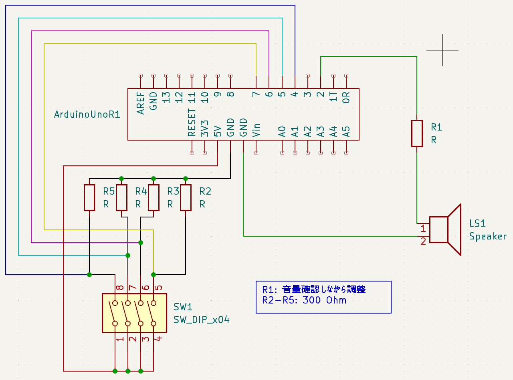
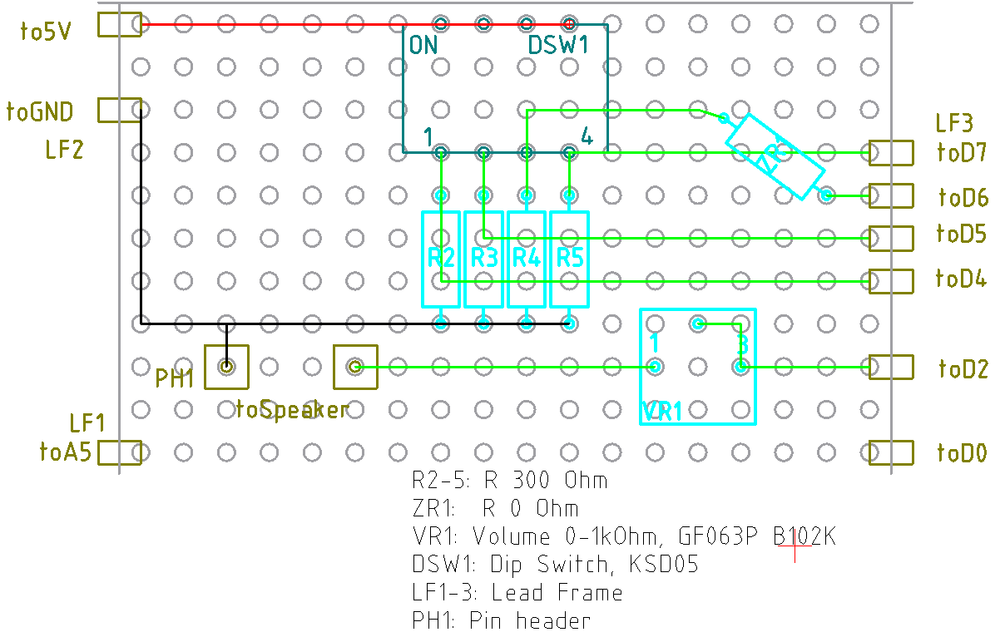
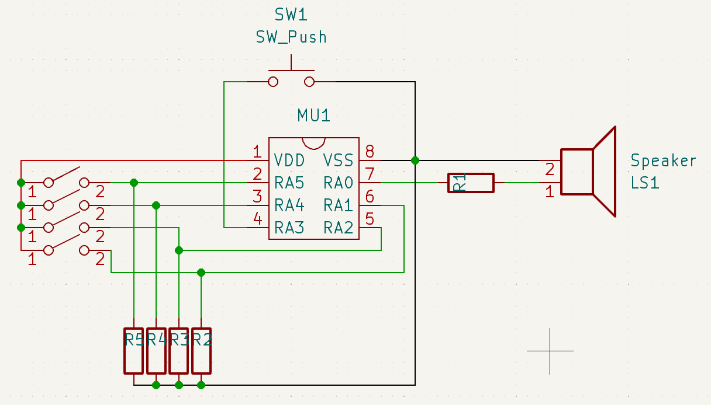
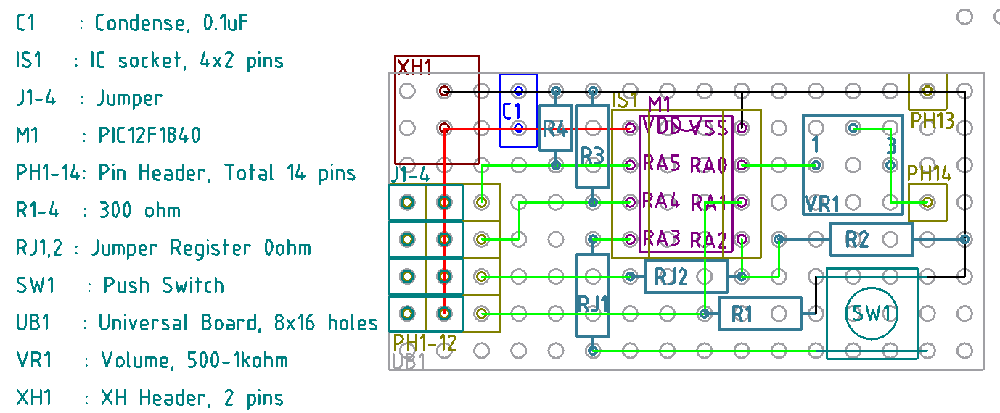

# キッチンタイマーを作ろう

## 初版

まずは TinkerCAD で練習。

https://www.tinkercad.com/things/kBFFgeoPNej-timer

4 DIP スイッチで 0 分から 15 分まで設定できるようにする。2進数を使う。

マザボ用スピーカーでも Muvo Play でも音出しに成功したので、回路図。

シールド設計図

完成したシールド。

### 課題

- リードフレームとピンヘッダの嵌め合いがゆるくて、動作しないことが多い
- Arduino は割と他のプログラムを書いてある機会が多いので、使いたいときに、すぐに使えない
- DIP スイッチが小さすぎて、思うように操作できない

## PIC 版 ver 1.0

PIC12F1840, 8 pin, 6 I/O のものが余ってるので、これで専用機を作る。

- RA1,2,4,5 をタイム設定用のスイッチに, RA0 をスピーカー出力にする。
- RA3 はリセットボタンとして使う。
- DIP スイッチじゃなくて、ピンヘッダを並べてジャンパーを挿すスタイルにしてみる

回路図はこんな感じ。

設計図はこんな感じ。

