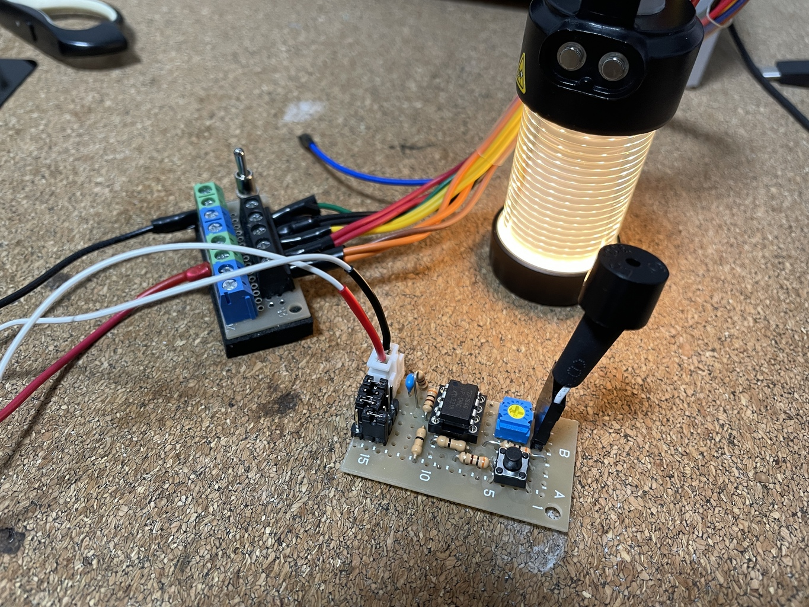

# キッチンタイマーを作ろう

## 初版

まずは TinkerCAD で練習。

https://www.tinkercad.com/things/kBFFgeoPNej-timer

4 DIP スイッチで 0 分から 15 分まで設定できるようにする。2進数を使う。

マザボ用スピーカーでも Muvo Play でも音出しに成功したので、回路図。

シールド設計図

完成したシールド。

### 課題

- リードフレームとピンヘッダの嵌め合いがゆるくて、動作しないことが多い
- Arduino は割と他のプログラムを書いてある機会が多いので、使いたいときに、すぐに使えない
- DIP スイッチが小さすぎて、思うように操作できない

## PIC 版 ver 1.0

PIC12F1840, 8 pin, 6 I/O のものが余ってるので、これで専用機を作る。

- RA1,2,4,5 をタイム設定用のスイッチに, RA0 をスピーカー出力にする。
- RA3 はリセットボタンとして使う。
- DIP スイッチじゃなくて、ピンヘッダを並べてジャンパーを挿すスタイルにしてみる

回路図はこんな感じ。

設計図はこんな感じ。

完成品はこんな感じ。

知見:

今回は片面基板 + シール基板主体での配線でやってみた。そこで得た知見。使ったのは Sunhayato
の直線配置のものと秋月の十字のもの。

- ちょっとぐらつく部品も出てくる。あまり気にせず、後から接着剤で良いかと思う。
- 部品取り付け穴周囲の難しくなってるところだけシール基板で良い。
  - 難しいところはシール基板がやってくれてるから、その間を単純な直線のみのスズメッキ線で継
    げば良い。
  - 普通なら部品の足にスズメッキ線を当てなくてはならないが、シール基板のおかげで、コの字に
    曲げて、穴にはめておけば押さえもなにも必要ないという手軽さ。
  - 長めにコの字にしておくと作業しやすい。邪魔ならあとでカットすれば良い。今回はしなかった
    が、残しておけばチェック端子の代りにもなる。
  - 銅箔はさほど便利ではないが、基板の穴が余計なはんだで塞がってしまっている場合、雑にはん
    だで押しつければ、はんだが回り込んで勝手にひっつくので、そういうところは、はんだを取り
    除くよりも手軽で便利
- シール基板の形を間違えていて、回路が足りなかったとき、もう一度正しい回路を作って、はんだ
  してあるリード線の上から入れて、はんだごてで雑に押しこめば、勝手にはんだが回り込んで、新
  しい回路で上書きできる。

そもそもスズメッキ線をくねくね曲げながら取り回すのをやりたくないから、もうスズメッキ線なん
て使わないようにしようと思って使ってみたシール基板だけど、実はスズメッキ線を楽に使えるよう
になるという、面白い結果となった。
