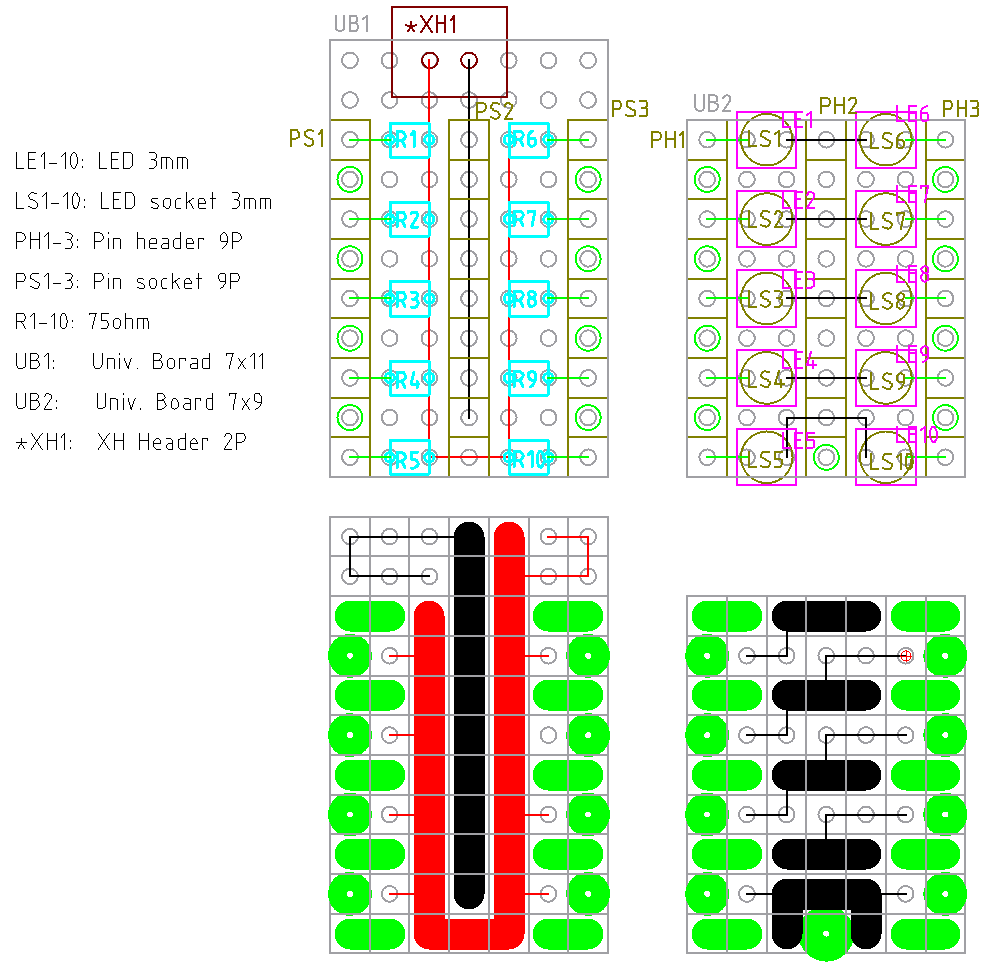

# LED 手元ライト

LED 何個か並べたら手元ライトとして使えないかなと思ったので作ってみる。

## V1.0

LED は日亜の NSPW310BS と袋に書いてあるもの。ただし袋には DC3.2V, 20mA と書いてあるが、デ
ータシートによると VF=3.6V, IF=20mA と書いてあり、微妙に異なる。元のテープから剥された状態
で販売されてたので、どの情報が正しいのか確認はできない。

https://bright-co-ltd.com/LED/pdf/device/nichia/NSPW310BS.pdf

5V 電源でのテスト。1個しかテストしていないし抵抗は誤差 5% のやつだし、結果は適当ではあるが、
3.2V で 20mA になることはなさそうだし、VF, IF の関係から、おそらく型番が正しいのだろう。

| R[Ω] | VF[V] | IF[mA] |
| ---   | ---   | ---    |
| 300   | 3.4   | 5      |
| 150   | 3.5   | 10     |
| 125   | 3.6   | 11     |
| 100   | 3.6   | 14     |
| 75    | 3.6   | 19     |

(IF は計算)

手持ちは 75Ωか 300Ωなので 5V なら 75Ωを消費しよう。

12V, LED 3直列テストは下記。

| R[Ω] | VFx3[V] | VF[V]  | IF[mA] |
| ---   | ---     | ---    | ---    |
| 75    | 10.5    | 3.5    | 20     |

(VFx3 が LEDx3 の電圧, VF, IF は計算値)

IF が 15mA くらいまで下がるかなと思ったけど、あまり変化がないので、雑に調達できる 5V を電
源としよう。汎用性のない 75Ωはどんどん使いたいので、消費量が増える 5V の方が良いまである。

小くしたいことと、ひっつき虫などを付けられる場所を考えて 2段構成とした。XH は反対側に付け
て、配線の通りを良くする。
