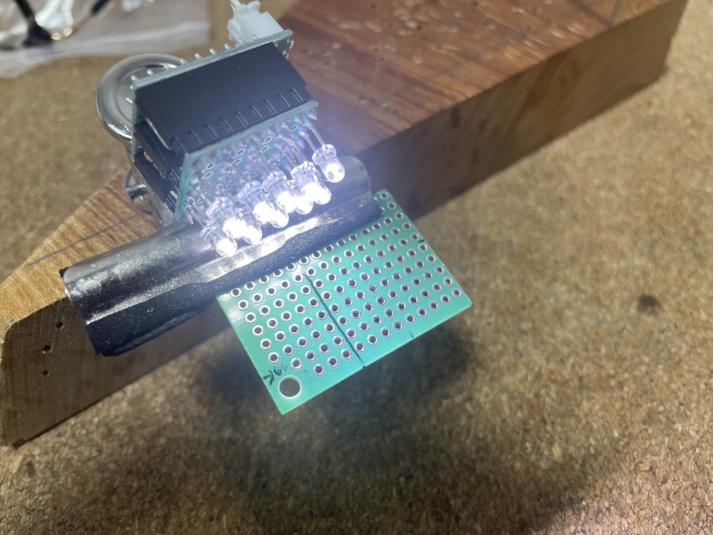

# LED 手元ライト

LED 何個か並べたら手元ライトとして使えないかなと思ったので作ってみる。

## V1.0

LED は日亜の NSPW310BS と袋に書いてあるもの。ただし袋には DC3.2V, 20mA と書いてあるが、デ
ータシートによると VF=3.6V, IF=20mA と書いてあり、微妙に異なる。元のテープから剥された状態
で販売されてたので、どの情報が正しいのか確認はできない。

https://bright-co-ltd.com/LED/pdf/device/nichia/NSPW310BS.pdf

5V 電源でのテスト。1個しかテストしていないし抵抗は誤差 5% のやつだし、結果は適当ではあるが、
3.2V で 20mA になることはなさそうだし、VF, IF の関係から、おそらく型番が正しいのだろう。

| R[Ω] | VF[V] | IF[mA] |
| ---   | ---   | ---    |
| 300   | 3.4   | 5      |
| 150   | 3.5   | 10     |
| 125   | 3.6   | 11     |
| 100   | 3.6   | 14     |
| 75    | 3.6   | 19     |

(IF は計算)

手持ちは 75Ωか 300Ωなので 5V なら 75Ωを消費しよう。

12V, LED 3直列テストは下記。

| R[Ω] | VFx3[V] | VF[V]  | IF[mA] |
| ---   | ---     | ---    | ---    |
| 75    | 10.5    | 3.5    | 20     |

(VFx3 が LEDx3 の電圧, VF, IF は計算値)

IF が 15mA くらいまで下がるかなと思ったけど、あまり変化がないので、雑に調達できる 5V を電
源としよう。汎用性のない 75Ωはどんどん使いたいので、消費量が増える 5V の方が良いまである。

小くしたいことと、ひっつき虫などを付けられる場所を考えて 2段構成とした。XH は反対側に付け
て、配線の通りを良くする。

ひっつき虫で適当にひっつけると結構便利かも。ポータブルにしたくなってきた。

## v2.0 日亜化学製 NFSW757HT-V1

5個入りだったけど、はんだが難しく 3個は熱で割ってしまった。陽極のランドが狭すぎてつらい。
一応、横面にも電極は出ているが、とてもはんだに使える大きさではない。

失敗したやり方:

- 銅線を直接はんだ。
  - 陰極は良いが、陽極をやったときに熱でプラを割る
- 両面の薄いユニバーサル基板に、はんだを盛っておいて LED を当てて、裏から熱を加える。
  - 実は基板へのはんだは成功した
  - 銅線を付けるときに、陽極のはんだが外れた。直そうと熱を加えたらプラが割れた
- 上のことを片面の基板でやってみたが、熱が伝わらない。なんとか溶かそうとグリグリ押しつけて
  いたら、プラが割れた

成功したやり方:

- サンハヤトのシール基板（電源・グランドラインパターン）（ICB-062）を使う
  - 長めに切る。
  - ホールではない部分に多めに広めに予備はんだ
  - 予備はんだを溶かしながら LED をちょんと置く。
  - しばらくしたら、こてを離す。
    - LED から離れたところにこてを当てることになるので、それで多めに広めに予備はんだが必要
  - まだ銅線を継いでいないので本当の成功はまだ
    - 銅線をはんだするときの熱を LED に伝えないために基板を長めに切っている。

標準 Vf=2.86V, If=65mmA なのでエネループ 3本、3.6V で使うには R=6.8Ω。最大 Vf=3.1V に対し
てだと 3.1Ω。明るさ狙いなら 4.7Ω, 安定狙いなら 10Ωとなる。

エネループ 3本のケースは 47x57mm くらい。基板をケースの背面にひっつき虫などでひっつける予
定。

[設計図v2.0](./librecad/LEDLight_2.0.pdf)

一応、後から LED 増やせることができるように基板は彫っておく。トグルスイッチはピンヘッダを
曲げてはんだして、基板に寝かせられるようにする。なぜなら手元に基板に寝かせるタイプのスイッ
チが無いからである。

XH ではなくてターミナルを使う理由は、基板の横からケーブルを挿したいのだが、寝ている XH ヘ
ッダを持っていないのと Omron のターミナルが手元にあったというだけである。

ケミコン 1uF は使い道の無いのが余っているから消費する。

部品表

| 記号 | 品目 | 個数 |
| ---  | ---  | ---  |
| C1   | ケミコン 1uF | 1 |
| D1-2 | NFSW757HT-V1 をリード化したもの | 2 |
| J1   | Omron のターミナル 2P           | 1 |
| R1-2 | 4.7Ω                           | 2 |
| SW1  | ミヤマ MS-500 系, on-off-on, 1回路 | 1 |
| UB1  | ユニバーサル基板 12x15P            | 1 |
