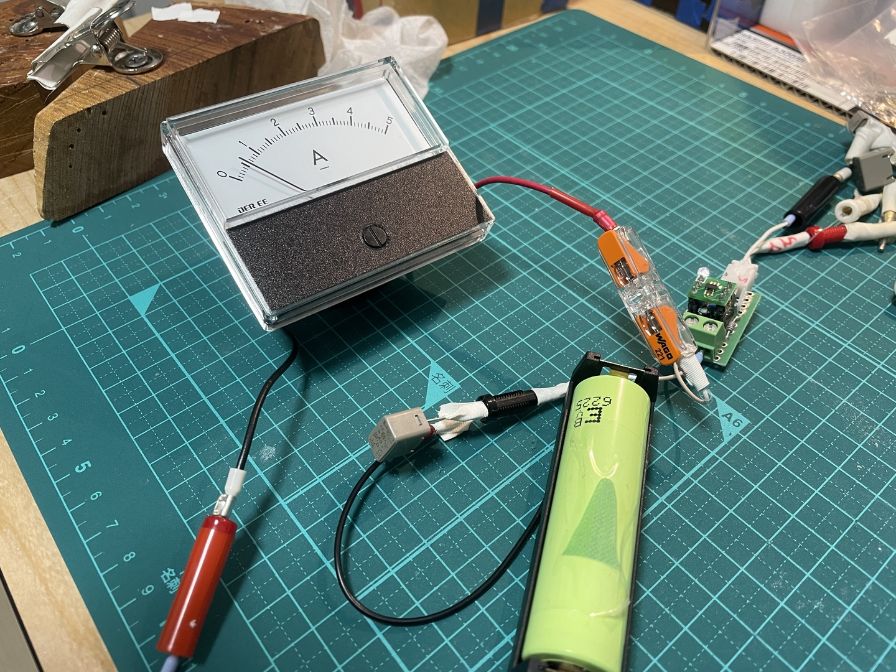
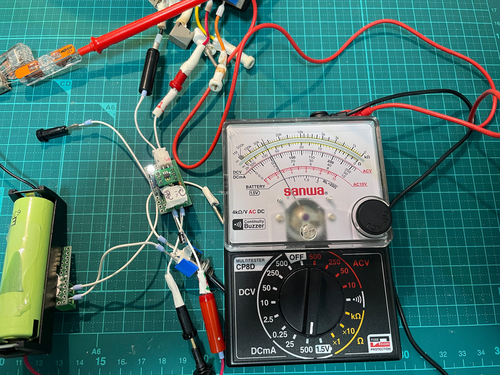

# リチウムイオン充電器の自作

Bonton で made in Japan と書かれた 18650B を入手したので、充電器を作ってみよう

# v1.0

Torex の IC, 
[XC6802A42XMR-G](https://product.torexsemi.com/ja/series/xc6802)
の SOT-25 パッケージを使う。
[マルツ](https://www.marutsu.co.jp/pc/i/2585649/)
で買える。

Rsen だけど Ibat を 800mA 以下にするので 1.3k ~ 2.0k くらいで入手しやすい抵抗で。

Ibat = 1.0/Rsen * 1000 [A] なので、1.3kΩで 770mA, 2.0kΩで 500mA となる。

[回路図](./kicad/LiIonCharger1.0/LiIonCharger1.0.pdf)

[設計図](./librecad/LiIonCharger1.0.pdf)

設計図部品表

| 記号 | 品目、品番             | 個数 |
| ---  | ---                    | ---  |
| C1   | セラコン 1uF           | 1    |
| C2   | ケミコン 1uF 在庫処分  | 1    |
| D1   | LED                    | 1    |
| J1   | ターミナル 2P          | 1    |
| K1   | ユニバーサル基板 11x6P | 1    |
| R1   | 1kΩ                   | 1    |
| Rsen | 1.3k〜2kΩ             | 1    |
| S1,2 | ピンソケット 3P        | 2    |
| U1   | XC6802A42XMR-G         | 1    |
|      | DIP 化基板             | 1    |
|      | ピンヘッダ 3P          | 2    |
| X1   | XH 横型ポスト 2P       | 1    |

その他の部品

| 品目、品番     | 個数 |
| ---            | --- |
| ケーブル       | 適量 |
| フェルール 0.25 | 4  |
| ニチフ TC 1.25 | 4   |
| チップジャック | 4   |
| 18650用ボックス | 1  |
| ヒューズ  | 1 |
| XH コンタクト | 2 |

なんか電流が 200m - 600mA で揺れてるんだけど、一応動いているように見える。

熱でシャットダウンしてるかも。火傷しないまでも、触ると熱い。良く分かってなかったけど、Vin
から Vbat への電圧低下は、このIC が受け持つ。つまり $`P=(V_{in}-V_{bat}) I_{bat}`$ [W] 発
生する。Ibat=0.77A, Vin=5V, Vbat=3.6V のとき 1.1W 発生する。IC 単体で許容損失は  0.25W、
40mmx40mm 基板で 0.6W だけど、実際の基板は 8mmx10mm なので、ほぼ期待できない。

動作的には Vbat>2.9V で通常充電なので、ここを基準にしないといけない。Vin-Vbat は 2.1V、な
ので流せる電流は 0.25W/2.1V = 0.119A。Rsen=10kΩで.1A となる。

10kΩに付け替えたところ 0.1A で安定した。しかし面白くない結果になってしまった。

