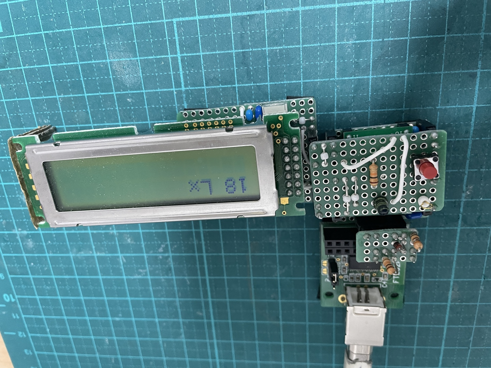

# v1.0 NJL7502 + RL78/G24
<!-- {{{ -->
[ロームのセンサー BH1750 を使った Adafruit センサー](https://www.adafruit.com/product/4681)
を使うのが素直なのだろうけど、NJL7502L で似たようなことができそう。より手作り感が出るので、
こっちでやってみる。

こちらがデータシート
https://www.nisshinbo-microdevices.co.jp/ja/pdf/datasheet/NJL7502L_J.pdf

P5 の NJL7502L Light Source A Vce=5.0V の 10kΩの Vout-Ev(Lx) 線図を使ってルクスを測定、表
示できそう。家の中は、シーリングも純粋な白ではないだろうし、いろいろ反射していろんな波長が
混ってると思うので、こっちのグラフ。家の中は数100Lx 程度らしいので、マイコンの ADC のレン
ジを考えると 10kΩのラインとなる。

対数同士では、ほぼ線形なので Vout[V] と Ev[Lx] の関係式は、

```math
log(V_{out})=a \, log(E_v) + b
```

Ev=500Lx で Vout=3V, Ev=100Lx で Vout=0.6V から

```math
log(3)=a \, log(500) + b
```

```math
log(0.6)=a \, log(100) + b
```

よって

```math
a=\frac{log(3)-log(0.6)}{log(500)-log(100)}=1.0
```

```math
b=log(0.6)-a\,log(100)=-2.2218487
```

ちなみに白 LED なら a=1.0, b=-2.7 くらいになる。

よって Ev[Lx] は次のように書ける。

```math
E_v=10^{\frac{log(V_{out})-b}{a}}=10^{log(V_{out})+2.2218487} = 166.66665 V_{out} 
```

検算: OK
- Vout=3V のとき、式のEv=500Lx でプロットと一致
- Vout=1V のとき、式の Ev=167Lx で、多分そんな感じ
- Vout=0.6V で、式の Ev=100Lx で OK
- Vout=0.1V で、式の Ev=17Lx で、だいたい OK

ADC 12bit を使って表すと

```math
V_{out}=5 ({\frac{ADC+0.5}{4096}} )
```

だから、

```math
E_v=0.20345 ADC + 0.1027 \simeq 0.2ADC
```

(10 から 100 Lx くらいのオーダーで考えてるので、少数の 0.1 云々は無視)

プログラムを小さくしたいなら、12 bit ADC を右に 2ビットシフトさせたり 10 bit ADC の値をそ
のまま表示するくらいで、十分かもしれない (0.2倍ではなく 0.25 倍となる) 

[回路図](./v1.0/LuxMeter1.0/LuxMeter1.0.pdf)

[設計図](./v1.0/LuxMeter1.0.pdf)

部品表
| 記号 | 品目、品番 | 個数 |
| ---  | ---        | ---  |
| B1   | ユニバーサル基板 13x9P | 1 |
| H1-5 | ピンヘッダ 1P          | 5 |
| H6-8 | ピンヘッダ 2P          | 3 |
| Q1   | NJL7502L               | 1 |
| R1   | 10kΩ                  | 1 |
| SW1  | プッシュスイッチ       | 1 |
| T1   | チェック端子           | 1 |

雑な対数表から雑に出した式なので、抵抗 R1 は誤差 5% の普通のカーボン抵抗で良いだろう。

卓上でセンサを真上、何もない天井に向けていると 20 Lux, シーリングライトにきっちり向けると
200 Lux くらい出る。もちろん同じ場所なので明さが変わったわけではない。反射光を含めた環境的
な部屋の明さの測定いは不向きで、光源の強さを測定する方が得意のようだ。



[ソース](./v1.0/src/LuxMeter1.0/)
<!-- }}} -->

# v2.0 NJL7502R

おそらく廃止品。日清紡に情報なし。
[データシート](https://akizukidenshi.com/goodsaffix/NJL7502R_J.pdf)
は秋月より。

NJL7502L に比べてかなり指向性が広い。

P5 の右下のグラフによると R=50kΩが良い感じで線形で拾えそう。300Lx で 2V なので、傾きは
150Lx/V で良さそう。

5V 駆動の ADC 12 ビットで考えると、

```math
V_{out}=5 ({\frac{ADC+0.5}{4096}} )
```

```math
E_v = 150 V_{out}
```

なので、細かい値を無視すると

```math
E_v \simeq 0.183 ADC
```

回路は v1.0 の NJL7502L と入れかえるだけなので同じ。うまく銅線をちょん付けして、幅 5mm
くらいのスルーホール部品として使えるという前提で設計する。

[設計図](./v2.0/LuxMeter2.0.pdf)

部品表
| 記号 | 品目、品番 | 個数 |
| ---  | ---        | ---  |
| B1   | ユニバーサル基板 13x9P | 1 |
| H1-5 | ピンヘッダ 1P          | 5 |
| H6-8 | ピンヘッダ 2P          | 3 |
| Q1   | NJL7502R               | 1 |
| R1   | 50kΩ (47k, 51k で OK) | 1 |
| SW1  | プッシュスイッチ       | 1 |
| T1   | チェック端子           | 1 |

