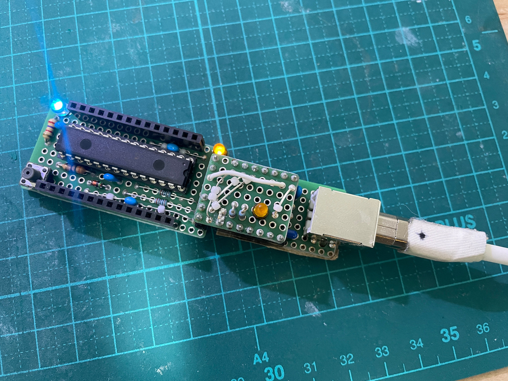

# はじめに

AVR64DD28 でマイコンボードを作ってみたい。

# 研究

ピン配置等はここ

https://github.com/SpenceKonde/DxCore/blob/master/megaavr/extras/DD28.md

こちらに開発ボードを作って売っている方がいる。

http://ikkei.akiba.coocan.jp/ikkei_Electronics/AVR64DB32.html

で、気になるのが BOOTLOADER 経由の UART に DTR ではなく RTS と記号が振ってある。

自作 UART は RTS の準備がないので、DTR じゃないのと思いつつ本家をチェック。

https://github.com/SpenceKonde/DxCore

すると

> Note the exception about not having autoreset unless you disable UPDI (except for the 20
> and 24-pin 2-Series parts which can put reset on PB4 instead), which is a bit of a
> bummer.

と、なんだかどのマイコンにも当て嵌らないことが書いてある。どうも MegaTinyCore からの派生の
ようで、これはドキュメントの更新が間に合ってないのだろう。

普通に F7ピンが UPDI で F6 が RST で単独で存在してる。

こちらの方は AVR128DB28 で開発ボードを作っているが FT231 の DTR を ATMega328P と同様に 0.1uF
経由で RST ピンに当ててるので、同じで良いのではないだろうか。

https://sunday-engineer.jimdofree.com/2024/08/10/avr128db28%E3%81%A7arduino-3/

DxCore の ADC を調べてみたところ ADC クロックは 2MHz を上限としているようだ。プリスケーラ
が 2 から選べるので 24MHz/2 = 12MHz で動作自体はするはずだが (値を読めるかどうかは知らない
けど)、おそらく最大定格 38.17章の Tclk_ADC 最小の 0.5us を採用したということだと思われる。

プログラマは UPDI. 詳しくはここ

https://github.com/SpenceKonde/AVR-Guidance/blob/master/UPDI/jtag2updi.md

Are you sure? とか言われているが自作 UART に抵抗入れてないから、この決戦パターンで良いのだろう。
参考回路とか普通のダイオード使っているが、シリコンは駄目、ショットキー使えと言っているので守る。

```
No internal resistor on adapter.
Yes resistor on target >= 100 ohms and not more than a few k.

--------------------                                   To Target device
                DTR|                                  __________________
 No resistor?   Rx |--------------,------------------| UPDI----\/\/\/------>
  Are you sure? Tx |----|<|------`          .--------| Gnd     > 100
 This is rare!  Vcc|---------------------------------| Vcc     < 2.2k
                CTS|                     .`          |__________________    Resistor of around a few hundred to a few k
                Gnd|--------------------'
--------------------
```

# 開発ボード 1.0

RST は Datasheet 4.3 によると内部でプルアップしてるとのことなので、プルアップ抵抗は不要。

参考回路の 2個は RST から 5V に向けてのダイオードがないのだが、ATMega328P と同じやりかたで
コンデンサ経由の DTR でのリセットならパルス的な電圧が立つはずなので、入れておくことにする。

スイッチの手前の 330Ωは不要だと思うが Datasheet のおすすめなので、入れておく。手持ちで
330Ω以下の適当なもので良いと思う。内部プルアップ抵抗が不明なので 330Ωは超えない方が良さ
そう。

VDDIO2 は VDD と別電圧を入れられるようだ。3.3V と 5V の信号線の混在とかできるんだと思う。
念のため、ジャンパでシールド側からも供給できるようにしておく。多分使わないけど。

[回路図1.0](./kicad/AVR64DD28_1.0/AVR64DD28_1.0.pdf)

VDDIO2 はスペースの都合で、ただのジャンパ線となった。広げればピンヘッダのジャンパのやつが
使えるけど、必要かどうか分からないので、広げないことにした。

[設計図1.0](./librecad/AVR64DD28_v1.0.pdf)

部品表

| 記号  | 品番、品目               | 個数 |
| ---   | ---                      | ---  |
| B1    | ユニバーサル基板 10x20P  | 1    |
| C1-4  | セラコン 0.1uF 前後      | 4    |
| D1,2  | LED                      | 2    |
| D3    | ダイオード               | 1    |
| J1,2  | ピンソケット 14P         | 2    |
| J3    | ピンソケット 2P          | 1    |
| J4    | ピンソケット 3P          | 1    |
| R1-4  | 1kΩ 前後                | 4    |
| R5    | 330Ωまたは以下          | 1    |
| S1    | IC ソケット 28P          | 1    |
| SW1   | プッシュスイッチ 2P      | 1    |
| U1    | AVR64DD28                | 1    |
| ---   | ---                      | ---  |
| B2    | ユニバーサル基板 7x9P    | 1    |
| D4    | LED                      | 1    |
| H1,2  | ピンヘッダ 7P            | 2    |
| H3    | ピンヘッダ 2P            | 1    |
| H4    | ピンヘッダ 3P            | 1    |
| R6,7  | 1kΩ 前後                | 2    |
| ---   | ---                      | ---  |
| B3    | ユニバーサル基板 7x10P   | 1    |
| D5    | ショットキーなダイオード | 1    |
| D6    | LED                      | 1    |
| H5,6  | ピンヘッダ 7P            | 3    |
| H7    | ピンヘッダ 3P            | 1    |
| H8    | ピンヘッダ 2P            | 1    |
| R8    | 300Ω                    | 1    |
| R9,10 | 1kΩ前後                 | 2    |

動いたら試したいこと

- analogRead() の速度
- 1~13 ピンはどこ？
- I2C による LCD hello world

結果:

動かない。テスターとキットスコープで導通、UPDI, TX, RX の信号ラインの電圧なんかは見てみた
けど、配線間違いではなさそう。

```
pymcuprog.programmer - INFO - Setting up programming session for 'avr64dd28'
pymcuprog.deviceinfo.deviceinfo - INFO - Looking for device avr64dd28
pymcuprog.serialupdi.physical - INFO - Opening port '/dev/ttyACM0' at '115200' baud
pymcuprog.serialupdi.link - INFO - STCS 08 to 0x03
pymcuprog.serialupdi.link - INFO - STCS 06 to 0x02
pymcuprog.serialupdi.link - INFO - LDCS from 0x00
pymcuprog.serialupdi.link - WARNING - UPDI init failed: Can't read CS register. likely wiring error.
pymcuprog.serialupdi.physical - INFO - extra-long break requested. Close serial port, reopen @ 300, send 0x00, receive the 0x00, and then proceed. 
pymcuprog.serialupdi.physical - INFO - Double-break sent. Re-initializeing USART to retry.
pymcuprog.serialupdi.physical - INFO - Opening port '/dev/ttyACM0' at '115200' baud
pymcuprog.serialupdi.link - INFO - STCS 08 to 0x03
pymcuprog.serialupdi.link - INFO - STCS 06 to 0x02
pymcuprog.serialupdi.link - INFO - LDCS from 0x00
pymcuprog.serialupdi.link - WARNING - UPDI init failed: Can't read CS register. likely wiring error.
```

大元の [ここ](https://github.com/SpenceKonde/AVR-Guidance/blob/master/UPDI/jtag2updi.md)
なのだけど、Ideal つまり理想は Tx に 2.2kΩで UPDI に 470Ωと書いてあるのに、なんで Tx に
抵抗が始めから入っていないものは、入れなくて良いのだろうか。コネクタの手前にあるかどうかな
んて電気回路的には関係ないのだから、どんな場合でも Ideal に近づけるような抵抗の入れ方をし
ないといけないのでは？？？

急遽 [jtag2updi by SpenceKonde 氏](git@github.com:SpenceKonde/jtag2updi.git) を試してみたんだけど、

```
Writing | ################################################## | 100% 0.26s

avrdude: 812 bytes of flash written
avrdude: verifying flash memory against /tmp/arduino/sketches/CA09F6DE8155DB6DA91F3C3F89B8BB8F/Blink.ino.hex:
avrdude: load data flash data from input file /tmp/arduino/sketches/CA09F6DE8155DB6DA91F3C3F89B8BB8F/Blink.ino.hex:
avrdude: input file /tmp/arduino/sketches/CA09F6DE8155DB6DA91F3C3F89B8BB8F/Blink.ino.hex contains 812 bytes
avrdude: reading on-chip flash data:

Reading | avrdude: jtagmkII_paged_load(): timeout/error communicating with programmer (status -1)
avrdude: jtagmkII_paged_load(): bad response to read memory command: RSP_NO_TARGET_POWER
#########################avrdude: jtagmkII_recv(): msglen 167772161 exceeds max message size 100000, ignoring message
avrdude: jtagmkII_recv(): msglen 167772161 exceeds max message size 100000, ignoring message
avrdude: jtagmkII_recv(): msglen 167772161 exceeds max message size 100000, ignoring message
avrdude: jtagmkII_recv(): msglen 167772161 exceeds max message size 100000, ignoring message
avrdude: jtagmkII_read_byte(): timeout/error communicating with programmer (status -1)
avrdude: jtagmkII_read_byte(): timeout/error communicating with programmer (status -1)
avrdude: jtagmkII_read_byte(): timeout/error communicating with programmer (status -1)
avrdude: jtagmkII_read_byte(): timeout/error communicating with programmer (status -1)
avrdude: jtagmkII_read_byte(): fatal timeout/error communicating with programmer (status -1)
avr_read(): error reading address 0x0000
    read operation not supported for memory "flash"
avrdude: failed to read all of flash memory, rc=-2
avrdude: jtagmkII_program_disable(): timeout/error communicating with programmer (status -1)
avrdude: jtagmkII_close(): timeout/error communicating with programmer (status -1)
avrdude: jtagmkII_close(): timeout/error communicating with programmer (status -1)

avrdude done.  Thank you.

Failed programming: uploading error: exit status 1
```

書き込みはできているようだけど、verify に失敗してるみたい。Lチカはできた。

検索してたらオリジナルの [ElTangas 氏の jtag2updi](https://github.com/ElTangas/jtag2updi)
の方が新しい更新があり DB, DD に対応と書いてある。しかし、結果は同じだった。

とりあえずブートローダを書き込んでおいた。一応 OptiBoot で USB シリアルでのアップロードは
成功した。



## UPDI は FT232RL なら動くが PIC16F1455 では動かないことが判明

コマンドでボーレート 300bps でゆっくり動かしながら kit_scope で観察し -vv でデバグ出力もさ
せてみたところ、どうも PIC16F1455 からは信号を送っているが、AVR64DD28 から信号が出てこない
ように見えた。

マイコンのピンは流れる電流が少ないので、電流が大きいと Hi 5V, Low 0V がしっかり出ないのは
抵抗測定器などで経験済。回路シミュレーターは理想的なので UPDI 側が Low になれば Rx に Low
が入るが、実際には UPDI の Low で電圧がちゃんと下がらずに、信号を観測できなかったのかも。

```
"/home/snob/.arduino15/packages/megaTinyCore/tools/python3/3.7.2-post1/python3" -u "/home/snob/.arduino15/packages/DxCore/hardware/megaavr/1.5.11/tools/prog.py" -t uart -u /dev/ttyACM0 -b 300 -d avr64dd28 --fuses 0:0b00000000 1:0x00 2:0x00 5:0b11011000 6: 0b00001100 7:0x00 8:0x01 -f "/home/snob/.arduino15/packages/DxCore/hardware/megaavr/1.5.11/bootloaders/hex/optiboot_64dd_ser0_extr.hex" -a write -v -vv 
```

あとは、UART は物によっては Tx-Tx, Rx-Rx を繋ぐものもあるので、何か自分が勘違いしているの
かも。

とにかくいろいろテストして動くようにしたい。OptiBoot は Atmega328P で結構失敗していたので、
あまり頼りきりたくない。

まずはただの配線間違えかもしれないので、UART アタッチメントとブレッドボードで同じ UPDI を
組んでみたが

```
pymcuprog.deviceinfo.deviceinfo - INFO - Looking for device avr64dd28
pymcuprog.serialupdi.physical - INFO - Opening port '/dev/ttyACM0' at '57600' baud
pymcuprog.serialupdi.physical - DEBUG - send 1 bytes
pymcuprog.serialupdi.physical - DEBUG - data:  : [0x0]
pymcuprog.serialupdi.link - INFO - STCS 08 to 0x03
pymcuprog.serialupdi.physical - DEBUG - send 3 bytes
pymcuprog.serialupdi.physical - DEBUG - data:  : [0x55, 0xc3, 0x8]
pymcuprog.serialupdi.link - INFO - STCS 06 to 0x02
pymcuprog.serialupdi.physical - DEBUG - send 3 bytes
pymcuprog.serialupdi.physical - DEBUG - data:  : [0x55, 0xc2, 0x6]
pymcuprog.serialupdi.link - INFO - LDCS from 0x00
pymcuprog.serialupdi.physical - DEBUG - send 2 bytes
pymcuprog.serialupdi.physical - DEBUG - data:  : [0x55, 0x80]
pymcuprog.serialupdi.physical - DEBUG - We were supposed to receive 1 bytes - we got
nothing! Check connections.
pymcuprog.serialupdi.link - WARNING - UPDI init failed: Can't read CS register. likely
wiring error.
```

で変わらない。

Tx, Rx を逆にしている可能性もあるので、引っくり返したけど変化なし。

これも駄目。一応 Ideal に近付けたつもりなんだけど。

```
RX -------------+- 680Ω - UPDI
TX - 1.5kΩ - D +
```

なので PIC16F1455 の問題かと思い 
[秋月の FT232RL](https://akizukidenshi.com/catalog/g/g106693/) 
で最初の 300Ωだけのやつをやってみたところ、普通に書き込みが成功した。秋月も Tx (Rx にも)
に何も抵抗を入れていない。

本家を読んでいたら

```
The UPDI protocol uses parity and 2 stop bits (parity can be disabled by a control register flag, but you need to access UPDI in the default mode using parity to change this). Adapters that do not support parity or 2 stop bits, such as the MCP2200 and MCP2221, cannot be used.
```

という記述を見つけた。これらは PIC をプログラムしたもの、というようなことを聞いたことがある。もしかしてこれだろうか。
