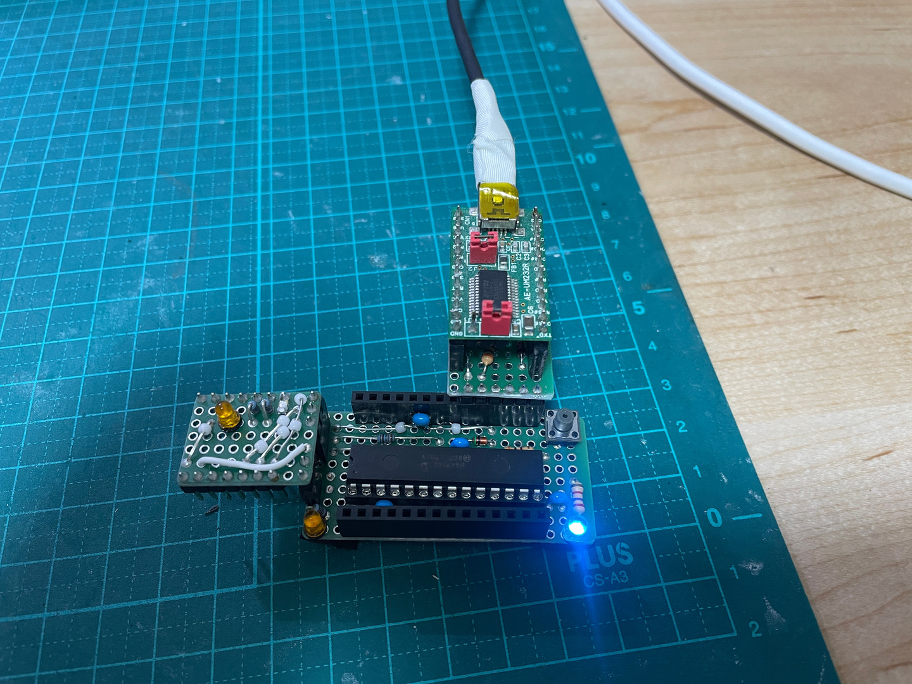

# FT232RL UPDI アダプタ 1.0 for 秋月

アダプタは本ボードでしか使えないから、このページでいいでしょう。

使う FT232RL は
[秋月 AE-UM232R](https://akizukidenshi.com/catalog/g/g106693/)

[回路図](./v1.0/ft232rl_updi_adaptor_1.0/ft232rl_updi_adaptor_1.0.pdf)

[設計図](./v1.0/ft232rl_updi_adaptor_1.0.pdf)

部品表:

| 記号 | 品番、品目 | 個数 |
| ---  | --- | --- |
| B1 | ユニバーサル基板 7x7P | 1 |
| D1 | ショットキーダイオード | 1 |
| J1 | ピンヘッダ 6P | 1 |
| R1 | 300Ω | 1 |
| S1 | ピンソケット 4P | 1 |
| S2 | ピンソケット 5P | 1 |

# UPDI アダプタ for ストロベリーリナックス 

FT232RL モジュールはストロベリーリナックスの 
[FT232RX](https://strawberry-linux.com/catalog/items?code=50025)

DIY 派に扱い安い TYPE-B 版。商品にはピンヘッダが付いているが、ピンヘッダを上に向けるべきで
はない (付けたままなら別に良いけど) 気がするので、ピンソケットを付けてある。

秋月版と同じように TX, RX ラインには抵抗は入っていない。

まあ 2台目の AVR64 ボードを作るときにでも、設計する。
