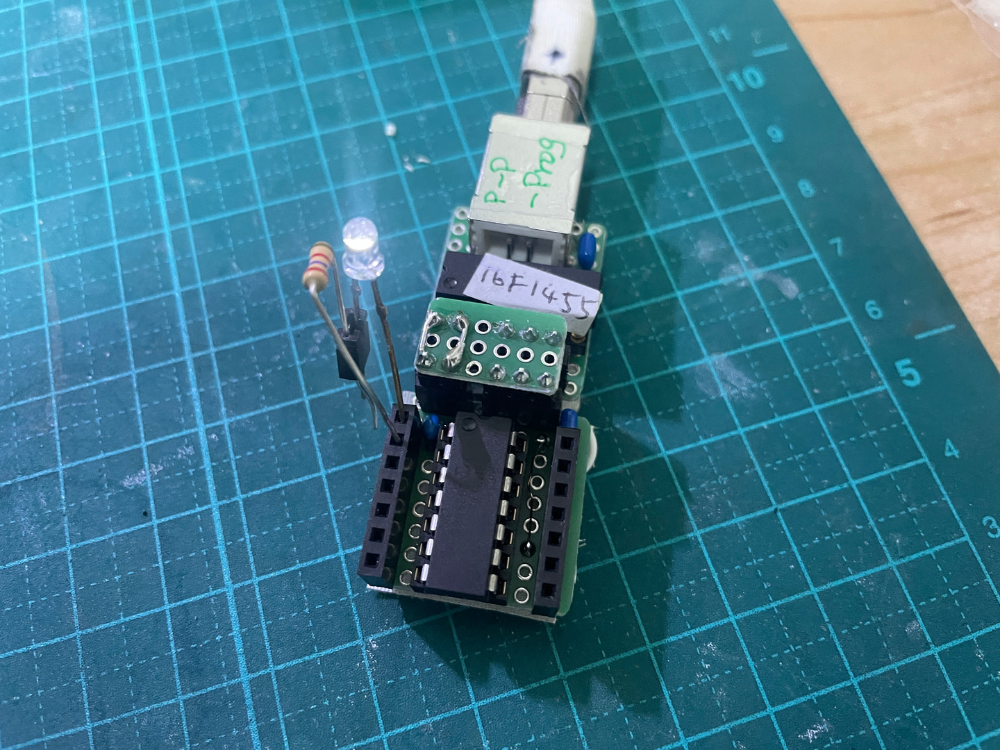

# 動機

[a-p-prog 機](../../ArduinoPICProgrammer) の UART 接続が不安定。どうも 57600bps 接続決め打
ちのようだが、PIC16F1455 で作った UART-USB 変換器には、それを安定させる力はないようだ。

PIC16F1455 は [PS/2-USB変換器](../../PS_2-to-USB_KB/) に実際に活用してるマイコンだから、気
軽に高い確実性で書き込みできるようにしておきたい。

ということで PIC16F1455 を書き込み&電源供給とし、PIC16F1455 をターゲットとする開発ボードを
作っておくことにした。

# v1.0 

pic_pic_prog 2.0 をプログラマ、電源供給とした開発ボード。

[pic-pic-progi v2.0](../../Pic_Pic_Prog/) 

[回路図](./v1.0/PIC16F1455_v1.0/PIC16F1455_v1.0_Schematics.pdf)

[設計図](./v1.0/PIC16F1455_v1.0.pdf)
pic-pic-prog 2.0 用のアダプタも設計

部品表:

| 記号 | 品目、品番等                     | 個数 |
| ---  | ---                              | --- |
| B1   | ユニバーサル基板 8x9P            | 1 |
| C1   | セラコン 0.22uF                  | 1 |
| C2   | セラコン 1.5uF                   | 1 |
| J1,2 | ピンソケット 2P と 3P, または 6P | 2(1) |
| J3,4 | ピンソケット 7P                  | 2 |
| S1   | IC ソケット 14P                  | 1 |
| U1   | PIC16F1455                       | 1 |

p-p-prog v2.0用アダプタ部品表l:

| 記号 | 品目、品番等          | 個数 |
| ---  | ---                   | --- |
| B2   | ユニバーサル基板 6x3P | 1 |
| H1,2 | ピンヘッダ 2P         | 2 |
| H3,4 | ピンヘッダ 3P         | 2 |

