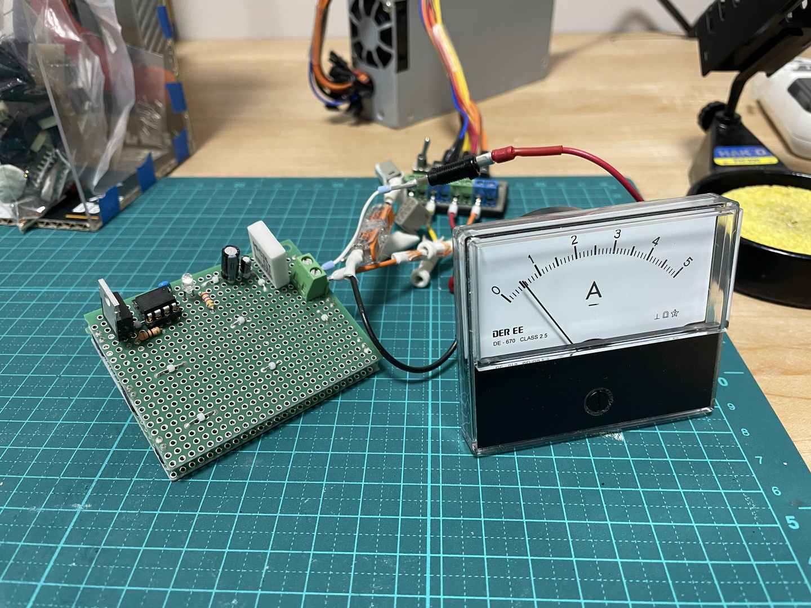
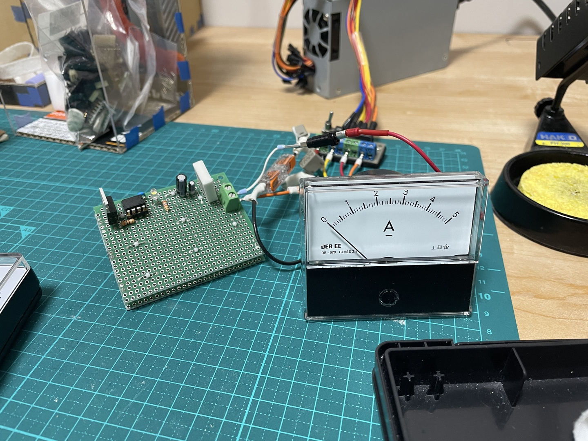
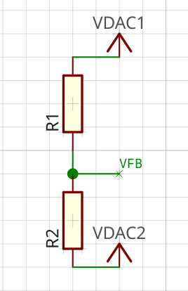

# NiMH 充電器

## version 1.0 (没)
<!-- {{{ -->
最初は MAX713 と言うのを考えたが、電源要求電圧が 6V 以上であり、自分が充電してみたいのは、
とりあえず 1本、大体、1V くらいまで低下してる電池とすると、ざっくり 5V は捨てることになる
ので、あまりに非効率なため、却下。

そこで ATMega8 で似たようなことをやってる方がいるので参考にする。

https://pa5m-med60.hatenablog.com/entry/2023/03/21/195354

この方は 5V 電源で 3本充電しているようだ。いろいろ回路シミュレーションしながら分かったこと

- 充電中は電池電圧が上がり、1.4V~1.5V で推移する。
  - https://chibim.com/%E5%85%85%E9%9B%BB/
- 電圧に余裕がないとトランジスタは電流を一定に保てない
  - MAX713 は電池電圧に +1.5V は必要としている
- 参考回路の方はトランジスタベース電圧に 100Ω、Icb=43mA くらいになるから理想的には 4.3A
  とか流れることになるが、実際は電池 1.45Vx3 = 4.35V に対して 600mA 弱である
  - https://tinyurl.com/2ytdbwou
- Icb 増やしていくど、だんだん倍率が低くなる。

というか、全然定電流にできていない。結局トランジスタは単なるスイッチにしかなっていない感じ。

それを踏まえて、3.3V 電源で電池 1本 1C を目指すと、こんな感じ。実際はファームウェアで PWM
のデューティを 90% くらいにしてるので 0.9C くらい。

https://tinyurl.com/2b6jf37f

トランジスタの消費電力 Pc=1.84W (電池充電電圧 1.45V にて)。秋月での PNP トランジスタ一番人
気の TTA008B は、ヒートシンクなしで 1.5W までなのでヒートシンクが必要。

熱抵抗値がデータシートに無いが、図7-9 (https://x.gd/xnZYc) より、ヒートシンク無限大のとき
ジャンクション温度 Tj と雰囲気温度 Ta の差 dTja=125K で P=10W 発熱できる。ヒートシンク無限
大なので雰囲気温度 Ta とケース温度 Tc は一致していると見なせる。つまりジャンクション温度と
ケース温度の差 dTjc = dTja とこの場合は見なせる。したがってジャンクション、ケース間の熱抵
抗 Rjc は

$`_{jc} = \frac{dT_{jc}}{P}`$ 

今回は Rjc = 12.5 K/W となる。

ではここからヒートシンクを付けたときの許容損失 P を求めたい。

ヒートシンクの熱抵抗を Rca とする。温度が定常になった状態ではジャンクションからケースに流
れる熱とケースから空気に流れる熱は等しく P であるから

$`P=\frac{dT_{jc}}{R_{jc}}=\frac{dT_{ca}}{R_{ca}}`$

またケースと空気の温度差を dTca とすると 

$`dT_{ja}=dT_{jc}+dT_{ca}`$

この二つの式で未知なのは P, dTjc, dTca である。dTja はジャンクションの許容最大温度と運用環
境温度差なので既知である。式が 3 個に未知数 3個だから、この未知数は求まる。

$`dT_{ca}=\frac{dT_{ja}}{\frac{R_{jc}}{R_{ca}}+1}`$

と dTca が求まるので、あとはなしくずして

$`dT_{jc}=dT_{ja}-dT_{ca}`$

$`P=\frac{dT_{ca}}{R_{ca}}`$

と決まる。本当はケースとヒートシンクの間もあるんだが、とりあえずそんなにぎりぎりを目指さな
いなら十分だろう。まあ CPU グリスでも塗っておこう。

例えば水谷電機の SP111K (TO-220用と書いてあるが TTA008B が付かないようには見えない)
Rca=32.4K/W の場合、dTja=125K の最悪条件で P=2.8W となる。シミュレーションだと電池充電電圧
1V まで行ける。これは最小クラスで 13x9x18.5mm である。

ただ、そもそも充電抵抗を 0.47Ωから 1Ωにすると、充電電圧 1.45V のときに 1.7A と 0.2A ほど
下がるが、充電電圧 0.6V で 1.5W のヒートシンク無しのところまで行ける。

https://tinyurl.com/289rhg9m

ヒートシンクでこれに対抗しようとすると一回り大きい 16x16x25mm で 20W/K クラスが必要になる。
割に合う気がしない。これは CPU のオーバークロックや、最適化のやりすぎと同じで割に合わない。
ヒートシンクの選び方を身に付けたから OK としよう。
<!-- }}} -->

## version 2.0 (没)
<!-- {{{ -->
全開うやむやで終ってしまったので、もう一度 MAX712 or 713 で考えてみる。712 はエレショップ
で売っていて 713 は秋月で売っている。

[データシート](https://www.analog.com/media/jp/technical-documentation/data-sheets/MAX712-MAX713_jp.pdf)

で気になるのは Q1 トランジスタの発熱。一番厳しいのは急速充電開始直後のセルの電圧が低くて電
流が大きいときのはず。とりあえず 図4 を参考にするとセルは 1.35V としてみる。

セル 3個、入力電源 12V、ダイオード D1 の Vf=0.6V と仮定、Vsense=0.25V ならば Q1 での電圧降
下は $`12-(3*1.35+0.6+0.25)=7.1`$ V。TO パッケージのトランジスタの生許容損失が 1.5W なので
200mA 程度となる。 

うーんやっぱり面倒くさいな。それになんとなく直列で充電するのってどうなのという気がする。先
に充電が終ったセルにいつまでも電流流れるんだよね。
<!-- }}} -->

## version 3.0
<!-- {{{ -->
何も作っていないけど v3.0

こんな感じでシンプルに充電したら良いのではないか。nch mosfet かフォトリレーを使って、マイ
コンの pwm で電流を調整したら良いんじゃないのか、と思い直す。トランジスタに発熱させるより、
金属板抵抗やセメント抵抗に発熱させた方が話が簡単な気がする。それに一本ごとに充電できるよう
にしたい。それにやはりマイコンで遊ぶべきだろう。

https://tinyurl.com/28vmjkox

ルールは max713 を参考にしてみる。細かい数値は現物で調整

- 入力電源は 3.3v
- 抵抗は 5w1ωmpc74-1ohmj 福島双羽
- 電池電圧は充電停止して測定
- 電池電圧 0.5v までは 100ma になるように pwm 制御
- 0.5v 以上は 1a になるように pwm 制御
  - 充電中は電池の電圧が上がる (抵抗の電圧は下がる) ので、実際はもう少し小さくなるはず
- 60秒ごとに電圧測定。
  - max713 は c/2 なら 84秒ごとの測定
- 1.2v 以上で変化無し、もしくは低下したら終了
- 1.3v 到達で終了
  - 満充電である必要もない
- 最長 120分で終了
- マイコンは pic12f1501
  - なんか書いてみたら収まった。
  - 1個で上手くいったら、そのまま増やせば良い。
  - pwm には速さが欲しく、充電時間を考えると遅くしたいが、なんとなく 8mhz 駆動となった。

電源電圧 vin, 電池電圧 vbat、抵抗 r とすると制御なしでの最大電流 iorg は

$iorg=\frac{vin-vbat}{r}$

adc はマイナス側を読むので vin-vbat を読んでいる。式が面倒くさくなるので

$adc=1023-adc$

と vbat 自体の値に置き換えておく。

電圧測定値的には vin --> 1023 であるから、vbat の読み値を adcbat とすると

$vin:vbat=1023:adcbat$

だから

$vbat=\frac{vin adcbat}{1023}$

だから

$i_{org}=\frac{v_{in}}{r}\frac{1023-adc_{bat}}{1023}$

vbat=0.5v までは i=0.1a にしたい。pwn のデューティは 0-255 ということにコードを書いた結果なっ
たので、デューティ d は 

$d:255=0.1:i_{org}$

よって d=25.5/iorg なわけだけど、ここに adcbat での iorg 式を加味すると

$d=\frac{26086 r}{v_{in}(1023-adc_{bat}}$

r=1ω, vin=3.3vの場合こうなる。整数演算で十分そうだ。

$d=\frac{7905}{1023-adc_{bat}}$

それ以降は 1a にしたいので 10倍すれば良い

可読性的には毎回小数点演算で電圧、電流を計算した方が良いが節約を優先した。

mosfet のゲートと入力端子の間には抵抗を入れるのが一般的らしい。検討している n-mos はサンケ
ンの eki04036。オン抵抗が 3.1mωと非常に低い。まあ 1a や 0.1ma でどうなるのか知らんけど。

turn-on delay time が vgs=10v, rg=4.7ωで 6.2ns とある。vgs=2.0v とあるので、これくらいな
ら電流の減少は無視できるとして、電荷は 10/4.7 x 6.2e-9 = 1.319e-8c である。

2v なので 6.595e-9 f = 6.6nf くらいである。

一方 pic12f1501 の通常のピンの出力電流は 25ma とデータシートの表紙にある。最大定格に 50ma
とあるけど、これはかなり電圧も下がっているはず。先が読めないのは計算に困るので
3.3v/25ma=132ωとなると手持ちでは 300ω.

3.3v 入力で 2v って、おおよそ時定数なので digikey の時定数カルキュレータで 2e-6秒となった。
500khz 相当なのでコードでの pwm 31khz に対しては十分な速度が出るだろう。

プルダウン抵抗 rgs は、igss=100na とあるので 100kωなら誤差δv=0.01v で、gs=3.29vと誤差と
電圧降下の良いバランスだろう。

ただし、どちらも多分必要ない。電流を制限しなくてはならないほどピンから電流出せないし、グラ
ンドはマイコント mos で共通だから、誤動作も考えにくい。ジャンパ線にしておいて、必要なら繋
ぐ形にする。

[ソース](./src/v3.0_pic/main.c)

[回路図](./kicad/nimhcharger3.0/nimhcharger3.0.pdf)

[設計図](./librecad/nimhcharger3.0.pdf)

部品表

| 記号    | 品目、型番等                  | 個数 |
| ---     | ---                           | ---  |
| c12-13  | セラコン 0.1uf                | 3    |
| cxx     | 在庫処分コンデンサ            | 適量 |
| d11-13  | led                           | 3    |
| dc1-3   | 電池ケース sn3-1pc            | 3    |
| is11-13 | ic ソケット 8p                | 3    | 
| ph1-6   | ピンヘッダ 2p                 | 6    |
| ps1-6   | ピンソケット 2p               | 6    |
| q11-13  | nch mosfet, eki04036          | 3    |
| r11-13  | 抵抗 mpc74-1ohmj              | 3    |
| r21-23  | 抵抗 2.7kω                   | 3    |
| r31-33  | 抵抗 300ω、ジャンパ線で様子見| 3    |
| r41-43  | 抵抗 100kω、未実装で様子見   | 3    |
| t1      | ターミナル 2p                 | 1    |
| u11-13  | pic12f1501                    | 3    |
| ub1,2   | ユニバーサル基板 26x21p       | 2    |

pwm 止めた状態では電池の電圧測れないし、止めないと pwm の周期と被ってやはり測れないし、で
ばたばたになった。p-mos の方が素直なのかもしれない。

結果は失敗。手元の電圧計で解放電圧 1.2v 程度のものに対して pic では 1.5v 程度に判定されて
いるみたい。そして、duty が 150程度 (40% くらい) になるはずなのに、全然波が立たない。オシ
ロで見た感じ10% 前後しか波が立たない。そして led 出力ピンがなぜか pwm の出力の影響を受けて
しまい、光らないため、デバグもできず。

数式がおかしいのか何なのか不明なため、duty サイクルを決め打ちにしてみた。

[ソース 3.0.0.2](./src/v3.0.0.2_pic/main.c)

これでも謎の duty 比数 % 程度な波が出て、やはり led は光らない。ということで pwm で波立て
ようとするたびにシャットダウンしているのではないかという予測が付いた。そこで無視していた
r32 を入れてみたら、見事動いた（ように見える）。電流が瞬間的に流れすぎということか。

ということで、結論としては r31-33 のゲート抵抗は必須ということが分かった。

なお、0.5v とかまでへたばっている電池をなんとかして使おうとは思わないだろうから、duty サイ
クル決め打ち版で行くことにする。

ルールはこうなっている。

- 0.5v, 1.0v, 1.5v 刻みで 0.8~1.0a 程度を狙って pwm を決める。
- 60秒ごとに電圧測定。
  - これは調整の余地がありそう。ばらつきの範囲ですぐに止ってしまうかもしれない。
- 1.2v 以上で変化無し、もしくは低下したら終了
- 1.5V 到達で終了
- 最長 120分で終了


0.5A くらい流れてるから OK。だいたい狙いの半分なので、電池やボックスでの抵抗が 1Ω弱ありそ
うだ。まあどうにもできん。期待通り MOSFET は全く熱くなっていない。


変化無しで終了の LED パターンで 0A で完了。

もう少し使った電池で試さないとなんともだけど、とりあえず、先は見えてきた。
<!-- }}} -->

## version 4.0 (途中)

Mulrata LXDC55 を使った秋月の電源キットでの充電を考える。
https://akizukidenshi.com/catalog/g/g109981/

どの電圧版でも回路は同じで、可変電源として使える。

4V 以上での動作なので 5V で動かうことになる。

FB に抵抗を差す代りに、DAC で抵抗を掛ければ動く（はず）。

[データシート](https://x.gd/p49lo)

によると図 4-3 より FB ピンは 1.6kΩの抵抗を介して EA ピンと、Vout に分岐する。Vout 側には
9.1kΩ入っている。EA は入力ピンだと思う。

また 8節の図より、RFB は GND に落す。

ということで FB の電圧 [V] は次の式。抵抗の単位は [kΩ]。式1 とする。

```math
VFB=Vout \frac{RFB}{9.1+1.6+RFB}=Vout\frac{RFB}{10.7+RFB}
```

一方で、Vout と RFB の式が次。式2

```math
RFB=\frac{7.28}{Vout-0.8}-1.6=\frac{8.56-1.6Vout}{Vout-0.8}
```

二つの式から RFB を消すと、式3

```math
VFB=\frac{8.56-1.6Vout}{9.1}
```

ついでに式4
```math
Vout=5.35-5.6875 VFB
```
10節に RFB と Vout の対応表があるから検算しよう。→大丈夫。

RFB example
| Vout[V] | RFB[kΩ] | VFB (式1) [V] | VFB (式3)[V] | 
| ---     | ---      | ---           | --- |
| 0.8     | ∞       | 0.8           | 0.8 |
| 1.5     | 8.8      | 0.6769        | 0.6769 |
| 3.3     | 1.312    | 0.3604        | 0.3604 |

さて、電流制限抵抗には 0.47Ωを考えている。というのも、電池電圧よりも 0.5V 程度高く設定し
て、電流 1A 流れれば C/2 の充電スピードで、十分かなというころで。

で、先生の MAX712 の
[データシート](https://www.analog.com/media/en/technical-documentation/data-sheets/MAX712-MAX713.pdf)
で、4ページ目の電圧推移を見てみると、1.55V を越えるくらいが C/2 のピークとなっている。もち
ろん個体差が大きいだろうが、こっちもきっちりいつでも 1A 流したいとかではないので、おおよそ
で良い。1.55V がマックスとすると 2.05V まで出せれば良いことになる。式3 から VFB=0.58V であ
る。

最下限の Vout はデータシートのとおり 0.8V として、VFB は 0.58 から 0.8V まで出せれば良い。
ありえないが、もし VFB=0V でも 0.47Ωがあるので 1.7A。まあ良いでしょう。

これを 5V の DAC をフルレンジでやろうと考える。DAC を 2個使えばできそう。


式5,
```math
VDAC1-VFB:VFB-VDAC2=R1:R2
```

よって 式6
```math
VFB=\frac{R2}{R1+R2} VDAC1 + \frac{R1}{R1+R2} VDAC2
```

| VDAC1 | VVFB | Vout |
| ---   | ---  | ---  |
| 0.0   | 0.58 | 2.05 |
| 5.0   | 0.8  | 0.8  |

この表を式6 に入れて連立させて、R1, R2 を解きたいところだが VDAC2 も未知数のため、式2個で
は解けない。そこで式7
```math
\alpha=\frac{R2}{R1+R2}
```

からの、式8
```math
VFB=\alpha VDAC1 + (1-\alpha) VDAC2
```

これにより式 9
```math
0.58 = (1-\alpha) VDAC2
```

式10
```math
0.8 = 5 \alpha + (1-\alpha) VDAC2
```

とαと VDAC2 の連立となる。

以下、失敗も込みの検討
<!-- {{{ -->


と式9
```math
V3(V1=3.3)=3.3 \alpha + (1-\alpha) V2 = 0.8
```

式8, 9 の連立を解いて, α=0.07576, V2=0.5951

αから行くと、R1=12kΩ, R2=1kΩで、α=0.06792 が丁度良い。

また DAC の出力は RL78/G24 の場合 ``DAC / 1024 x vdd`` と言うことになるので、DAC = 185 で
0.5962V となる。

3桁あれば十分だと思うので今は 4桁で書いておく。

もう一回,式6に当てはめると,Vout は表から読みとっただけだが、

| V1  | V3 (VFB) | Vout |
| --- | ---      | ---  |
| 0.0 | 0.5503   | 2.22 |
| 3.3 | 0.8042   | 0.8  |

良さそうだ。

式3, 6, 7 を合体させて V3(=VFB) を消すと、式10
```math
V1=\frac{8.56}{9.1 \alpha} - \frac{1.6}{9.1 \alpha}Vout - \frac{1-\alpha}{\alpha}V2
```

ここで、充電電圧 Vout は電池の電圧 Vbat + 0.5V とすると、式11
```math
V1=3.911-2.286 Vbat
```
となる。

ここで一度検算

| Vbat  |  V1    |  DAC  | VFB    | Vout   | コメント                         |
| ---   | ---    | ---   | ---    | ---    | ---                              |
| 0.200 |  3.454 | 1072  | 0.8160 | 0.7089 | これ以上は DAC=1023 で上限にする |
| 0.300 |  3.225 |  1001 | 0.7984 | 0.8089 |                                  |
| 1.700 |  0.025 |  8    | 0.5522 | 2.2091 |                                  |
| 1.800 |  -0.204|  -63  | 0.5347 | 2.3091 | これ以下は DAC=0 で下限とする    |

正しそう。``DAC = V1/3.3 x 1024`` で導出

式11 を ``V1=3.3/1024 x DAC1`` から DAC1 の式にすると、式12
```math
DAC1=1214-709.4 Vbat
```

さらに Vbat は ADC 12 ビットとすると、もう少し、式を追い込めるが、さすがに性能に余力のある
RL78/G24 に任せるとしようか。ちと面倒くさい。

とかさんざん考えてきたが LXDC55 の動作範囲が 4.0V以上だった。
Obso. まあ、小さい電圧のコントロールを DAC のフルレンジを使えるようにする手法なんかを考え
ることができたので良いでしょう。
<!-- }}} -->


