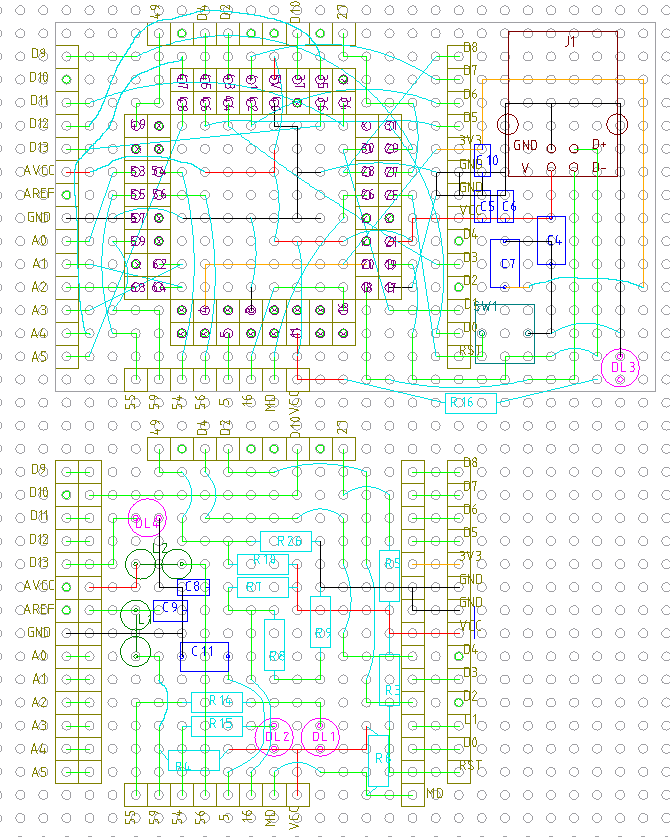

# 何

R7FA4M1AB3CFM を使って ASOBoard 互換レイアウトの開発ボードを作りたい。MCU は Arduino UNO
R4 と同じ。DIP 化キットは秋月から。

https://akizukidenshi.com/catalog/g/g129397/

# V1.0

回路図はここ

https://docs.arduino.cc/resources/schematics/ABX00080-schematics.pdf

まずは綺麗に作ろうとは思わずに、最初の段は必要なピンを出すことに集中する。

64ピン中、回路図に x が打ってあるのは 16 個。

6,7,1,2,3,15,14,13,12,22,23,38,52,58,60,61,

さらに水晶の 9, 10 は不要なので、ここまでで 18個。

LOVE も不要なので 24 も不要。これで 19個。

SWD だかと言う使い道の不明なコネクタも不要。32, 33, 50, 51、これで 23個。

残りの 42ピンを ASOBoard 配置に都合が良いように、2段目に運ぶのが 1段目の仕事。

1段目には USB-B コネクタとリセットスイッチ、C4~C6 の 5V 系コンデンサを配置。ASOBoard の下
に来る部分は取り敢えず、配線のみとする。

## 疑問

- [ ] 電源系コンデンサ C4=C7=4.7uF は必要か。33uF のケミコンでも 1uF のセラコンでも良いか？
  - [データシート](https://www.renesas.com/ja/document/dst/ra4m1-group-datasheet?r=1054146)
    2.1節の注記には電源端子には 0.1uF 程度を差せと書いてあるが 4.7uF は書いてないので UNO
    R4 の判断と思う。
- [ ] VCC に C4=C5=0.1uF の 2個も必要か？
- [ ] リセットのプルアップ抵抗は 10kΩで良いか。余っている。
  - 漏れ電流最大が 1uA だから最大誤差は 0.01V で何の問題も無いはず。
- [ ] AVCC にコイル L2 必要か？
  - 表 2.2 の注 2 に VCC → AVCC または VCC と同時に投入とある。コイルがあれば遅れを作れる
    んだろうけど、必要な気がしない。
- [ ] VREF を 5V に繋ぐ必要あるのか？
  - ATMega や PIC はオープンで VCC になるのだが、本機はならないの？
  - 繋ぐとして R4 は 10kΩでいい？
- [ ] VREF にコイル L1, コンデンサ C9 必要か？
  - そこまでの基準電圧用意したければシールド側ですれば良いのでは？
- [ ] 26, 27番ピンのプルアップも 10kΩでいいっしょ。
- [ ] 16番, USB_VBUS は USB からの電源投入を検知するピンとなっているが、この回路、どう見て
  も何で給電しても常に 3.3V 入る。それなら LDO 出力入れておけば良くない？
  - [ ] やるにしても 10kΩでもいいでしょう.
- [ ] MD R6 も 10kΩでいいでしょ？
- [ ] VBATT 必要？VCC 電源降下、消失時の電源供給らしいが内蔵 LDO の 3.3V 挿したら、VCC 異
  常時に LDO も 3.3V ちゃんと出ないと思うんだが。。。

## 設計図

んー、一段目が壊滅的。間違い、失敗する未来しか見えない。そもそも ASOBoard が Arduino 配列
をあきらめて ATMega328P の配列をそのまま活かそうというものなんだから、R4 も同じように、R4
の MCU の配列をそのまま活かずべきなのではなかろうか。

# v1.1

v1.0 はあきらめて、R7 マイコンの配列をそのまま活かすようにやってみよう。
