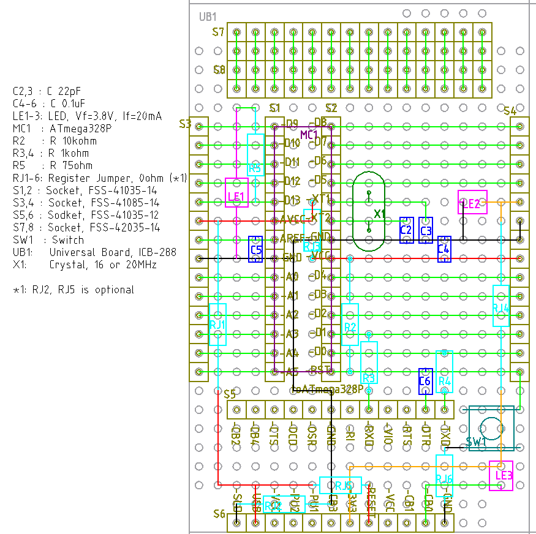
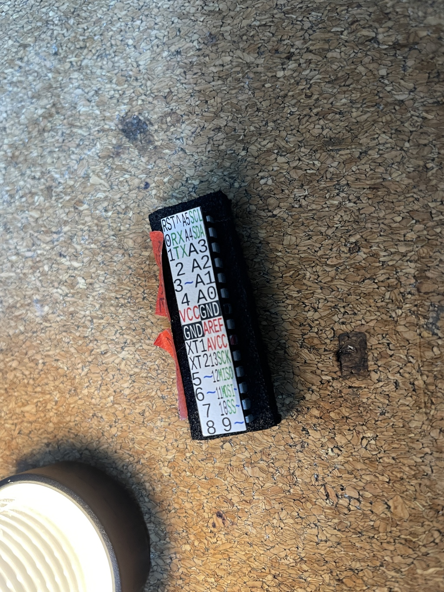
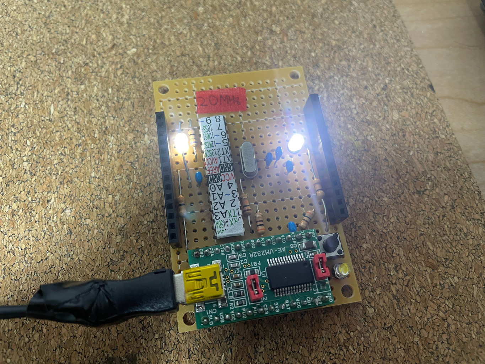

# アソボード開発

UNO 互換配置は難しすぎるのであきらめた。

[UNO 互換配置に挑戦はしてみた](./UnoLayoutDesign_giveup.md)

そこで、素直に ATMega328P のピン配置をそのまま使うことにした。

ATMega328P (A) の配置を、そのまま (Sonomama) 使うマイコンボード (Board) ということで、
このリポジトリでは ASOBoard, アソボードとすることにした。というのも、作者が某duino ではなくて、ちゃんと名前を
付けてほしいと考えているそうだからである。

https://trac.switch-science.com/wiki/ArduinoCompatible

## 省スペース化のために FT232RL の EEPROM 書き換え

秋月のマイコンボードでは、FT232RL の CBUS0, CBUS1 から、それぞれ RX, TX 信号に応じた Lチカ
をしている。ただし FT232RL 自身は EEPROM の書き換えにより CBUS の挙動を変えられる。RX, LX
の光り方を自分がなにか判別できるわけではないので、CBUS0 を TX, RX 両方の信号に応じた Lチカ
とすることで、LED を 1個減らす。

Linux には FTDI 謹製ソフトはないので、次を使う。

https://github.com/eswierk/ft232r_prog

古いコードなので libusb-compat と libftdi-compat が必要と思われる。``make`` したら

```
echo "使い方チェック"
./ft232r_prog --help

echo "現在の設定を確認"
./ft232r_prog --dump

echo "CBUS0 の書き換え"
./ft232r_prog --cbus0 TxRxLED
```

で完了。

## 初版の制作

### 設計方針

- ATMega328P のピン配置をそのまま使うことにしたので、基板も Sunhayato の一番安い小型の
  ICB-288 を、カットとかせず、そのまま使うことにする。
  - https://shop.sunhayato.co.jp/collections/universal-boards/products/icb-288
- リセットボタンは付ける。
- 電源+D13+TxRx の LED 3個は付ける。
  - 3.3V ラインの利用で抵抗を省く (Vf=3.8V)
- ICSP ヘッダは要らない。D10-D13, VCC,(AVREF は挟まるが) GND と一列に並ぶため。
- 余ったスペースはソケットでブレッドボード化する。

### 配線図、図面、部品表


[kicad 配線図 PDF](./kicad/ASOBoard/ASOBoard_kicad.pdf)
kicad による配線図


[LibreCAD 図面 PDF](./librecad/ASOBoard_librecad.pdf)
LibreCAD による図面

| 記号 | 品目                   | 品番                           | メーカー     | 個数 |
| ---- | ----                   | ---                            | --------     | ---- |
| C2,3 | セラコン 22pF          | RD15N220J1HL2L                 | Supertech    | 2    |
| C4-6 | セラコン 0.1uF         |RPEF11H104Z2P1A01B              | Murata       | 3    |
| LE1-3| LED Vf=3.8V            | SLP-WB89A-51                   | 三洋         | 3    |
| MC   | マイコン               | ATmega328P                     | MicroChip    | 1    |
| R2   | 抵抗 10kΩ             | CFS50J10KB                     | Faithful Link| 1    |
| R3,4 | 抵抗 300Ω (注1)       | CF25J300RB                     | Faithful Link| 2    |
| R5   | 抵抗 75Ω              | CFS50J75RB                     | Faithful Link| 1    |
| RJ1-6| ジャンパー抵抗 0Ω     | CFS50J0RB                      | Faithful Link| 6    |
| S1,2 | ソケット 1x14 H3.5     | FSS-41035-14                   | Hirosugi     | 2    |
| S3,4 | ソケット 1x14 H8       | FSS-41085-14                   | Hirosugi     | 2    |
| S5,6 | ソケット 1x12 H3.5     |     FSS-41035-12               | Hirosugi     | 2    |
| S7,8 | ソケット 2x14 H3.5     | FSS-42035-14                   | Hirosugi     | 2    |
| SW1  | タクトスイッチ         | DTS-63-N-V-BLK(TS-0606-F-N-BLK | Cosland      | 1    |
| UB1  | ユニバーサル基板       | ICB-288                        | Sunhayato    | 1    |
| X1   | クリスタル 16 or 20MHz | 不明                           | 不明         | 1    |

注1) 秋月のマイコンボード (https://akizukidenshi.com/catalog/g/gK-04590/) を見ながら 1kΩ
で考えてたけど、良く考えたらブレッドボードで FT232RL と ATmega328P の TX/RX 同士を直接差し
ていたわけで、それなら別に 1kΩという大きさ自体に大した意味はないはずだから、手持ちの 300
Ωで十分だろう。

### シール

ソケットと CPU 用にシール用画像も Inkscape で作ってみた。

[シールデザイン](./inkscape/)

自分では L版サイズでのシール用紙印刷は上手くできず、A3 サイズでの普通紙印刷したのを接着剤
でつけている。



### 完成品と獲得した知見


Lチカに成功したところ。

発見:

- 配線済みのシール基板 (今回使ったのは Sunhayato ICB-062) を普通の配線材として使うと、大変
  便利。スズメッキ線を使いたくなくなるくらい便利。ここからの発想で以下の物も試してみたい。
  - 秋月にある 0.1mm厚さの十字配線基板
  - 秋月の 1.2mm 厚さの十字配線基板 (こちらは逆に線を削り取って使う)
  - 銅箔テープ
- 片面基板はすぐにはんだの盛り過ぎになる。今 1.2mm 径のはんだ線を使ってるが 1mm とか 0.8mm
  とかの方が調整しやすいかもしれない。
- FT232RL の SLD と RESET は当初の予想通り、無くても動く。

失敗、課題:

- 24ピンある FT232RL の抜き差しが固すぎる。1個の FT232RL を使い回す用途に対して、全ピンを
  ソケットで受けるというのは不向き。
- ピン、ソケット共に、どうしても斜めになったり、前後左右のずれはあり、そのせいで、右下の
  GND が内部で接合できずに断線してしまった。なので Reset ボタンが効かない。
  - 前述の問題も合わせて考えると、FT232RL から必要な線だけコネクタで持ってくるのが良さそう。
- ソケットを使わずに ATmega328P をはんだすることになったため、ジャンパー抵抗 RJ3 が基板裏
  に行ってしまった。
- 抵抗を 5mm で折り畳むのが難しく R4 は斜めに配置することになった。最低でも 7.5mm は確保し
  よう。
- ピン長さ 2.5mm のソケットは 1.6mm厚さの基板でのはんだが難しかった。シール基板を置くと、
  どうやっても、はんだできないこともあった。一方でピン長さ 3mm のソケットのはんだ性は非常
  に良かった。限界長さはまだ見えてこないが、十分な長さがないと難しいことが分かった。

## 初版の改良版の制作

初版を捨てるのはもったいないので、FT232RL 用のソケットを外して、TXD, DTR, RXD, GND, 3V3,
VUSB の 6線だけ、XH コネクタあたりで持って来てみることにする。これにより他の USB シリアル
変換でも、同じ線が引けるなら使えるようになるはずで、むしろ汎用性は高まると言える。
