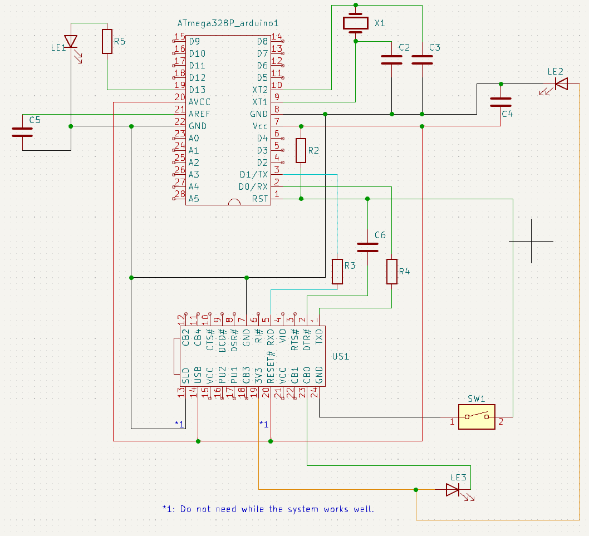
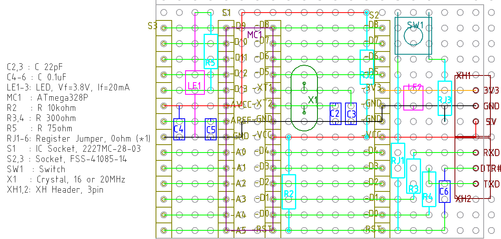
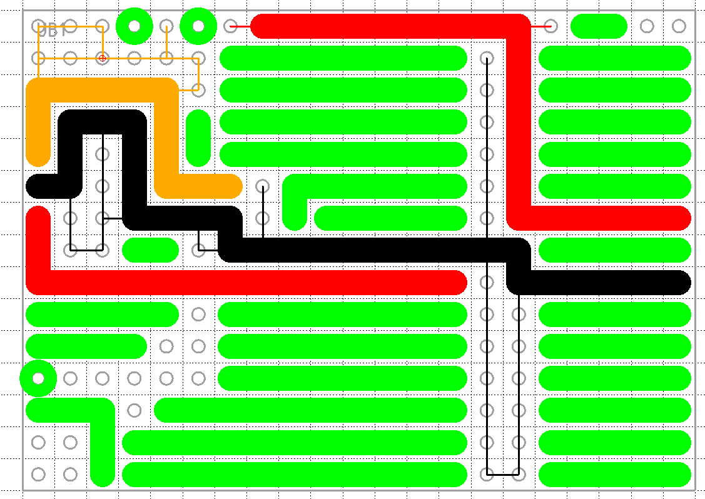

# アソボード開発

UNO 互換配置は難しすぎるのであきらめた。

[UNO 互換配置に挑戦はしてみた](./UnoLayoutDesign_giveup.md)

そこで、素直に ATMega328P のピン配置をそのまま使うことにした。

ATMega328P (A) の配置を、そのまま (Sonomama) 使うマイコンボード (Board) ということで、
このリポジトリでは ASOBoard, アソボードとすることにした。というのも、作者が某duino ではなくて、ちゃんと名前を
付けてほしいと考えているそうだからである。

https://trac.switch-science.com/wiki/ArduinoCompatible

# 省スペース化のために FT232RL の EEPROM 書き換え

秋月のマイコンボードでは、FT232RL の CBUS0, CBUS1 から、それぞれ RX, TX 信号に応じた Lチカ
をしている。ただし FT232RL 自身は EEPROM の書き換えにより CBUS の挙動を変えられる。RX, LX
の光り方を自分がなにか判別できるわけではないので、CBUS0 を TX, RX 両方の信号に応じた Lチカ
とすることで、LED を 1個減らす。

Linux には FTDI 謹製ソフトはないので、次を使う。

https://github.com/eswierk/ft232r_prog

古いコードなので libusb-compat と libftdi-compat が必要と思われる。``make`` したら

```
echo "使い方チェック"
./ft232r_prog --help

echo "現在の設定を確認"
./ft232r_prog --dump

echo "CBUS0 の書き換え"
./ft232r_prog --cbus0 TxRxLED
```

で完了。

# 初版の制作 (v1.0)

## 設計方針

- ATMega328P のピン配置をそのまま使うことにしたので、基板も Sunhayato の一番安い小型の
  ICB-288 を、カットとかせず、そのまま使うことにする。
  - https://shop.sunhayato.co.jp/collections/universal-boards/products/icb-288
- リセットボタンは付ける。
- 電源+D13+TxRx の LED 3個は付ける。
  - 3.3V ラインの利用で抵抗を省く (Vf=3.8V)
- ICSP ヘッダは要らない。D10-D13, VCC,(AVREF は挟まるが) GND と一列に並ぶため。
- 余ったスペースはソケットでブレッドボード化する。

## 配線図、図面、部品表


[kicad 配線図 PDF](./kicad/ASOBoard/ASOBoard_kicad.pdf)
kicad による配線図


[LibreCAD 図面 PDF](./librecad/ASOBoard_librecad.pdf)
LibreCAD による図面

| 記号 | 品目                   | 品番                           | メーカー     | 個数 |
| ---- | ----                   | ---                            | --------     | ---- |
| C2,3 | セラコン 22pF          | RD15N220J1HL2L                 | Supertech    | 2    |
| C4-6 | セラコン 0.1uF         |RPEF11H104Z2P1A01B              | Murata       | 3    |
| LE1-3| LED Vf=3.8V            | SLP-WB89A-51                   | 三洋         | 3    |
| MC   | マイコン               | ATmega328P                     | MicroChip    | 1    |
| R2   | 抵抗 10kΩ             | CFS50J10KB                     | Faithful Link| 1    |
| R3,4 | 抵抗 300Ω (注1)       | CF25J300RB                     | Faithful Link| 2    |
| R5   | 抵抗 75Ω              | CFS50J75RB                     | Faithful Link| 1    |
| RJ1-6| ジャンパー抵抗 0Ω     | CFS50J0RB                      | Faithful Link| 6    |
| S1,2 | ソケット 1x14 H3.5     | FSS-41035-14                   | Hirosugi     | 2    |
| S3,4 | ソケット 1x14 H8       | FSS-41085-14                   | Hirosugi     | 2    |
| S5,6 | ソケット 1x12 H3.5     |     FSS-41035-12               | Hirosugi     | 2    |
| S7,8 | ソケット 2x14 H3.5     | FSS-42035-14                   | Hirosugi     | 2    |
| SW1  | タクトスイッチ         | DTS-63-N-V-BLK(TS-0606-F-N-BLK | Cosland      | 1    |
| UB1  | ユニバーサル基板       | ICB-288                        | Sunhayato    | 1    |
| X1   | クリスタル 16 or 20MHz | 不明                           | 不明         | 1    |

注1) 秋月のマイコンボード (https://akizukidenshi.com/catalog/g/gK-04590/) を見ながら 1kΩ
で考えてたけど、良く考えたらブレッドボードで FT232RL と ATmega328P の TX/RX 同士を直接差し
ていたわけで、それなら別に 1kΩという大きさ自体に大した意味はないはずだから、手持ちの 300
Ωで十分だろう。

## シール

ソケットと CPU 用にシール用画像も Inkscape で作ってみた。

[シールデザイン](./inkscape/)

自分では L版サイズでのシール用紙印刷は上手くできず、A3 サイズでの普通紙印刷したのを接着剤
でつけている。


## 完成品と獲得した知見


Lチカに成功したところ。

発見:

- 配線済みのシール基板 (今回使ったのは Sunhayato ICB-062) を普通の配線材として使うと、大変
  便利。スズメッキ線を使いたくなくなるくらい便利。ここからの発想で以下の物も試してみたい。
  - 秋月にある 0.1mm厚さの十字配線基板
  - 秋月の 1.2mm 厚さの十字配線基板 (こちらは逆に線を削り取って使う)
  - 銅箔テープ
- 片面基板はすぐにはんだの盛り過ぎになる。今 1.2mm 径のはんだ線を使ってるが 1mm とか 0.8mm
  とかの方が調整しやすいかもしれない。
- FT232RL の SLD と RESET は当初の予想通り、無くても動く。

失敗、課題:

- 24ピンある FT232RL の抜き差しが固すぎる。1個の FT232RL を使い回す用途に対して、全ピンを
  ソケットで受けるというのは不向き。
- ピン、ソケット共に、どうしても斜めになったり、前後左右のずれはあり、そのせいで、右下の
  GND が内部で接合できずに断線してしまった。なので Reset ボタンが効かない。
  - 前述の問題も合わせて考えると、FT232RL から必要な線だけコネクタで持ってくるのが良さそう。
- ソケットを使わずに ATmega328P をはんだすることになったため、ジャンパー抵抗 RJ3 が基板裏
  に行ってしまった。
- 抵抗を 5mm で折り畳むのが難しく R4 は斜めに配置することになった。最低でも 7.5mm は確保し
  よう。
- ピン長さ 2.5mm のソケットは 1.6mm厚さの基板でのはんだが難しかった。シール基板を置くと、
  どうやっても、はんだできないこともあった。一方でピン長さ 3mm のソケットのはんだ性は非常
  に良かった。限界長さはまだ見えてこないが、十分な長さがないと難しいことが分かった。
- IC ソケットを使わないと、作ってみていろいろ問題があったときに IC を捨てなくてはならない
  可能性が高いので、IC の価格 >> IC ソケットの価格であるなら、使っておくほうが節約になりそ
  う。どうせ何度も失敗すると思うし。

# 初版の改良版の制作 (v1.2)

初版を捨てるのはもったいないので、FT232RL 用のソケットを外して、TXD, DTR, RXD, GND, 3V3,
VUSB の 6線だけ、XH コネクタあたりで持って来てみることにする。これにより他の USB シリアル
変換でも、同じ線が引けるなら使えるようになるはずで、むしろ汎用性は高まると言える。


FT232RL 側の部品を取り除いて、XH コネクタで持ってくる形に設計変更


FT232RL のアダプタ化。他のピンが必要なこともあるのでピンソケットで外せるように。


Lチカ例

発見:

- 片面基板は、はんだ済みのパーツが上手く取れないとランドごと剥れる。しかしシール基板さえあ
  れば補修は容易である。やり直しを考えると両面スルーホールよりも楽だと思う。
- ピンソケットに対象物を刺した状態ではんだすると、いい角度で組付けられる。FT232RL は抜いて
  使える固さに収まっている。
- FT232RL を分離したことで、もっと小型化できる。横穴 18 個ない基板も多いが、収められそう。

ASOBoard の良かったところ:

- マイコンとソケットのピン配置がそのまま対応しているので、配線するときに目視しやすい。
- 左右どちらにも 5V, GND があり、ブレッドボードと接続しやすい。

# ver 2.0 の制作

Sunhayato の ICB-288 は板一杯に穴のある基板だけど、47x92mm でも、もっと穴の少ない基板でも
作れるようにと、小型化してみる。USB シリアル変換を本体から切り離すのは、継続して採用。

回路は変わらないので、設計図はこちら。15x21 穴 (右上下で多少、穴が減っても大丈夫) になった
ため、たいていの 47x92mm ユニバーサル基板に収まるだろう。実際のところ、表面の部品にはまだ
余裕があるから、上下に重ねたり隙間を通せば 2列くらい減らせると思うが、立体的に事前に検討す
る能力がないし、その割に成果が小さいと思うので、とりあえず、ここでやめておく。



Lチカ成功!


知見:

- 今回は十字配線基板を使った。背の低い部品から順番に設計した場所にはんだするだけで良いので
  楽だった。
- 十字配線基板は三角彫刻刀で彫るのが一番簡単だった。
- 普通の基板なら気にしない補強のための電機的には浮いているはんだも、絶縁を気にする必要があ
  る。図面でスイッチの上側を、常時導通状態にしてしまった。
- 両面スルーホールなため、部品を確実に浮かせるのは少し気を使う。
- 逆にピッチの全然合っていないクリスタルは、浮かせるのに丁度都合が良かった。
- 図面右のピンソケットが空間的にフリーになっていないため、完成後、あ、これシール (ただの紙)
  貼れないんじゃないか？と思ったけど、特に問題もなく貼れた。
- XH コネクタを抜きやすくするには、これまでケーブル側の出っ張りを削っていたが、基板側にも
  少し出っ張りがあるので、基板側も削るほうが抜きやすくなる。

失敗:

- データ通信用の XH コネクタの向きを全然気にしていなかったため、ver 1.2 のデータケーブルが
  逆で使えない状態に。しかし逆に考えれば、次からは、DTR# さえ真ん中にしておけば、必ずどち
  らかが、使える状況になる。まさに災い転じて福となる、である。
- XH コネクタは取り外すことを考えると、もう 1マス開けた方が良い。

今後検証してみたくなったこと:

- 十字配線基板は失敗を考えなければ、とても便利であった。しかし必ず失敗はするので、その時に
  なんとか片面基板並にダメージが小さくて、修復も簡単な手法を発見したい。
- 秋月を覗いているとパワーグリッド・ユニバーサル基板なるものがある。あるのは知っていたが気
  にしていなかったのだが、ふと過去の自分の作品を見ると、配線の取り回しが複雑になるのは、全
  ての場所に必要な電源ラインで、他は真っ直ぐなものが多い。信号線はレジストされてるようなの
  で、シール基板も問題なく使えそう。これを使うのも楽そうだし、小型化にも有効そう。

# ver 2.1 改善作 (没)

v2.0 を使っていて見えてきたいろんな問題点を解決、またはテストしたい。

## 問題1: ArduinoIDE でスケッチのアップロードができない

MiniCore でできていたのも、いつの間にかできなくなってしまった。FT232RL や Arduino as ISP
でのプログラミングはできていて、プログラム後は、普通に Serial.read, write が使えているので、
TX, RX 単体では動いてるんだけど、スケッチアップロードの時に必要な DTR# との連携とか、その
辺が上手くタイミング合わないのかなと思う。 

で一つ気になるのが TX, RX に 300Ωを挟んでいるのだけど、抵抗計を作ったときの経験で電圧が 6%
くらい下がるのは分かっている。これくらい下っても単独での機能としては問題ないのだろうが、本
家 Arduino UNO R3 も秋月のマイコンボードも 1kΩを挟んでいる。1kΩならおそらく 2% 程度の低
下しかない (900Ωで試験はしたが 1kΩは持っていない) ので、違いが出るかもしれないし、出ない
かもしれないけども、とりあえず可能性を一つ潰しておきたい。

ということで抵抗 3, 4 は 1kΩとする。

## 問題2: LED 結構まぶしい

実は ATMega328P に抵抗なしで直接差しても大丈夫だった三洋の LED だけど、まぶしい。動作が分
かれば十分なので、手元テストでは 5V なら 2.2kΩ、3.3V なら 1kΩくらいで良さそう。

2.2kΩとか買うのがだるいので D13, 3V3 共に 1kΩで良いかな。3V3 の方も立てれば入るはずだ。
300Ωとか 75Ωとかまじで 100本単位で買うものじゃない。。。

というか設計してて思ったんだが、3V3 に入れたのは抵抗を減らすためだったので、普通に 5V に入
れたら良い。

逆に普通に抵抗をつなぐことで何の LED でも大丈夫な設計になった。

## 問題3: XH コネクタ、外しにくい

隣接させすぎ。1 マス空けた方が良い。これは設計変更のみで済む。

## 回路図

[回路図](./kicad/ASOBoard_V2.1/ASOBoard_V2.1.pdf)

## 設計図


| 記号 | 品目                   | 個数 |
| ---- | ----                   | ---- |
| C2,3 | セラコン 22pF          | 2    |
| C4-6 | セラコン 0.1uF         | 3    |
| JR1-6| ジャンパー             | 6    |
| LE1-2| LED                    | 2    |
| R2   | 抵抗 10kΩ             | 1    |
| R3~6 | 抵抗 1kΩ              | 4    |
| S1   | IC socket, 28pin       | 1   |
| S2,3 | 14ピンソケット         | 2   |
| SW1  | タクトスイッチ         | 1    |
| U1   | ATMega328P             | 1    |
| UB1  | ユニバーサル基板 21x15 | 1    |
| X1   | クリスタル 16MHx       | 1    |
| XH1,2| XH ヘッダ, 3pin        | 2    |

# ver 2.2 FT232RL プログラマシールド対応

まだ v2.1 を作ってもいないのだけど、作り直すことにした。

Arduino ブートローダに頼らずプログラムを楽にしようということで FT232RL プログラマシールド
の開発をしている。

[こちら](./ProgrammerForASOBoard.md)

FT232RL から RTS# を出す必要があるため v1.1 で FT232RL アダプタのコネクタが変わることにな
ったため、こちらも変更が必要となった。5V, 3V3, GND は ASOBoard 本体に継ぎ、TXD, RXD, DTS#,
RTS# を ASBoard 本体、もしくはプログラマシールドに継ぎ換えて使うことを想定しているので、
ASOBoard 側は 5V, 3V3, GND の 3ピンと他の信号線の 4ピンの XH ヘッダを差すことになる。

ケーブルから作り直しで、FT232RL 側とはコネクタがそもそも違うので、線の順番をあちらに揃える
必要はなく、シールド側はスペースに余裕がありどうとてもなりそうなので、ASOBoard側で好きに配
線することにしてみる。

また Arduino Uno R3 のように 5V と RESET# の間にダイオードを入れないと DTR が 5V に戻ると
きに 10V とか立つようなので、ダイオードを入れることにした。

[ダイオード有無の違いを調査](./DiodeOnResetLine.md)

回路図

[v2.2 回路図](./kicad/ASOBoard_v2.2/ASOBoard_v2.2.pdf)

設計図はこちら


反転済みの十字配線基板パターンはこちら. 線が細い部分は切削をさぼっても OK な部分。



部品表

| 記号 | 品目                   | 個数 |
| ---- | ----                   | ---- |
| C2,3 | セラコン 22pF          | 2    |
| C4-6 | セラコン 0.1uF         | 3    |
| D1   | ダイオード             | 1    |
| JR1-2| ジャンパー             | 6    |
| LE1-2| LED                    | 2    |
| R2   | 抵抗 10kΩ             | 1    |
| R3-6 | 抵抗 1kΩ              | 4    |
| S1   | IC socket, 28pin       | 1   |
| S2,3 | 14ピンソケット         | 2   |
| SW1  | タクトスイッチ         | 1    |
| U1   | ATMega328P             | 1    |
| UB1  | ユニバーサル基板 21x15 | 1    |
| X1   | クリスタル 16MHx       | 1    |
| XH1  | XH ヘッダ, 3pin        | 1    |
| XH2  | XH ヘッダ, 4pin        | 1    |

ダイオードは分からないので東芝の 1SS178 としてみる。Arduino UNO R3 に搭載のものに、なんと
なく特性値の桁が合っているので。

ケーブルも忘れないように部品表. FT232RL 側は FT232RL の記事に記載。

| 記号 | 品目                   | 個数 |
| ---- | ----                   | ---- |
| XX1  | XH ハウジング 3pin     | 1    |
| XX2  | XH ハウジング 4pin     | 1    |
| XX3  | XH コンタクト          | 7    |
| XX4  | 適当なケーブル         |      |

# v2.3, セラロック, 2P ボタンへの対応と FT232RL プログラマシールドへの非対応化

まず、村田のセラロックとアルプスの 2P のタクトスイッチを入手したので、それらに合わせた部品
配置にする。

次に v2.2 作成してたころは USB シリアル通信は FT232RL しか考えられなかったが、今は PIC で
シリアル変換器を作ることができる。少なくとも FT232RL が主軸ではなくなった。FT232RL で何か
したいときは、そのときに特別なことをすれば良く、ASOBoard 側で常に受け入れ体制を整えておく
のはやりすぎに感じる。ということで RTS# ピンの受けは削除して v2.0 と同じ RX, TX, DTR# に戻
す。

また XH コネクタを分けておく必要もなくなり、丁度 6P のヘッダと受けの在庫があるので 6P の
XH ヘッダとすることにする。

設計図。ちょっとだけ小くできた。もちろん互換性を考えて、両ソケットのピッチは同じ。ジャンパ
JR2 は裏面に付ける予定。


部品表

| 記号 | 品目                   | 個数 |
| ---- | ----                   | ---- |
| C4-6 | セラコン 0.1uF         | 3    |
| D1   | ダイオード             | 1    |
| JR1-3| ジャンパー             | 3    |
| LE1-2| LED                    | 2    |
| R2   | 抵抗 10kΩ             | 1    |
| R3-6 | 抵抗 1kΩ              | 4    |
| S1   | IC socket, 28pin       | 1   |
| S2,3 | 14ピンソケット         | 2   |
| SW1  | タクトスイッチ         | 1    |
| U1   | ATMega328P             | 1    |
| UB1  | ユニバーサル基板 20x14 | 1    |
| X1   | クリスタル 16MHx       | 1    |
| XH1  | XH ヘッダ, 6pin        | 1    |
|      | XH ハウジング 6P       | 1    |
|      | 8芯ケーブル 15cm くらい| 1    |
|      | XH コンタクト          | 7    |

一応ケーブルも書いておいたがケーブルは USB シリアル変換器側で準備しよう。

書き込み済みの ATMega328P で L チカに成功。なお不注意でマイコンをショートさせてしまってい
るので、どこか壊しているかもしれない。


# 3.0

USB シリアルアダプタと一体化する。別々にしていたが、シリアルアダプタ単体で使うことはほぼな
く、また、ATMega 側の RST と GND に落としておけば、そのままシリアル通信ができるので、別々
にしておく必要がほぼない。

[回路図 v3.0](./kicad/ASOBoard_V3.0/ASOBoard_V3.0.pdf)

部品表

| 記号         | 品目                   | 個数 |
| ---          | ---                    | ---  |
| C1-C4        | セラコン 0.1uF         | 4    |
| C5           | セラコン 1uF           |   1  |
| D1,3,4       | LED                    | 2    |
| D2           | ダイオード             | 1    |
|    J1        | USB B コネクタ         | 1    |
| R1,3-7       | 1kΩ                   |  6   |
| R2           | 10kΩ                  |  1   |
| SW1          | プッシュスイッチ 足2本 | 1 |
| U1           | ATMega328P             | 1 |
| U2           | PIC16F1455             | 1    |
| Y1           | セラロック 16MHz       | 1    |

