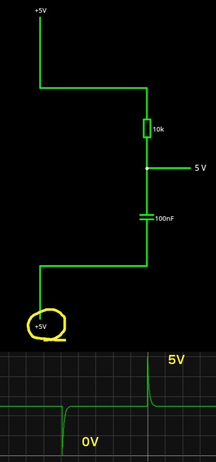
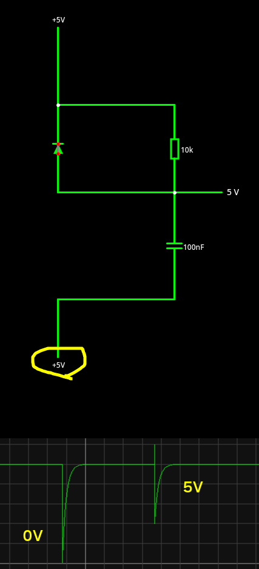
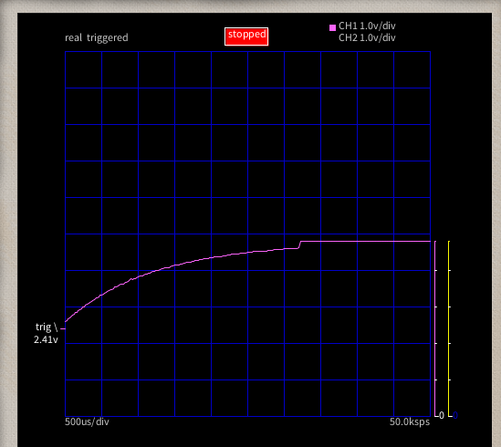

# リセットラインにあるダイオードの役割

Arduino UNO R3 には ATMega328P のリセットラインに、10kΩ抵抗と並列にダイオードが 5V に向け
て入っている。

https://www.arduino.cc/en/uploads/Main/Arduino_Uno_Rev3-schematic.pdf

そこでさっそく、すばらしい回路シミュレーターで違いを見てみた。

https://www.falstad.com/circuit/circuitjs.html

DTR ピンは知らないけど、普段は 5V で ATMega328P をリセットしたいときに 0V にしているのだと
思う。そしてダイオードが無い場合、5V に復帰するときに 10V 程度の電圧が立つことが分かった。

逆にダイオードが有る場合、6V 程度で収まることが分かった。

データシートによると絶対最大定格は RESET# ピンは 13V で、定格最大は 5.0+0.5 = 5.5V という
ことになる。定格越えで動作するかどうかは個体差だろうから、10V だと動かないものが多くでてく
るが、ダイオードを入れると動く可能性は相当高まるということになるのでは無いだろうか。

と思って ASOBoard の RESET# ピンを九工大オシロで観察したが、全く出なかった。

やはり ATMega328P 側の問題ということになりそうだ。

と、ちょっと待て、このオシロは VCC 5V までしか測定できないんだった。とりあえず安いし買って
おこう。
