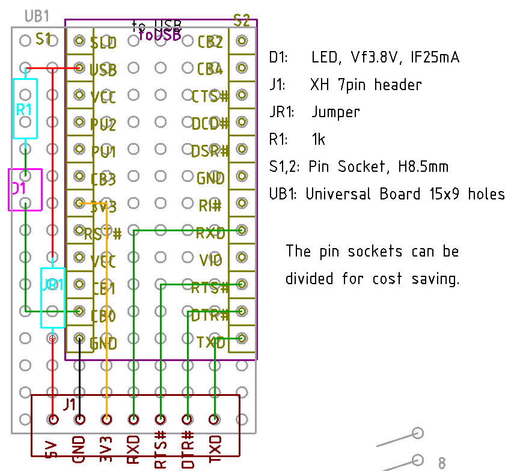
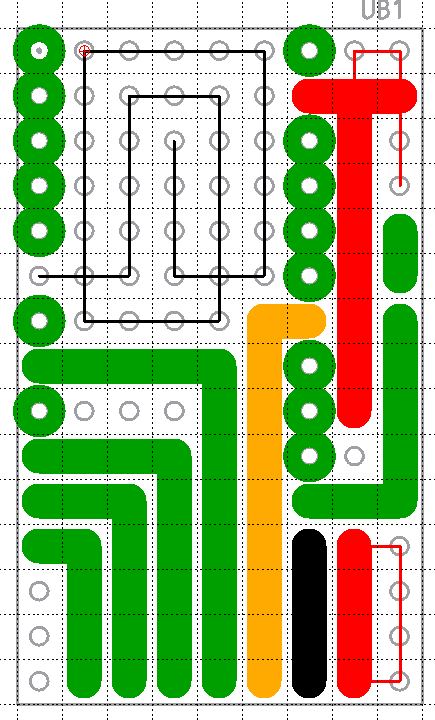

# ASOBoard プログラマの開発

## 考えていること

普通の Arduino IDE からの書き込みに失敗する ATMega328P に当たる確率が高いことを考えると、
手軽にプログラミングできる手段を用意しておきたい。

プログラマの候補としては手持ちでは Arduino Uno R3 (互換含む) と FT232RL (avrdude による)
がある。

Arduino Uno R3 を使う場合、双方にケーブル接続されたシールドを載せて使うことになる。Arduino
は VCC が反対側のソケット、または ICSP ヘッダに D10 が無いし、ASOBoard は RST がD10-13,
GND, VCC の反対となってしまうからだ。Arduino Uno R3 は 2個余ってる (ASOBoard に愛着が涌く
のでそっちを使いたくなるだけで、悪いわけではない) ので、さほど悪いアイデアでは無いと思う。

FT232RL の場合、ASOBoard と継いでいる FT232RL はソケット挿入で取り外し可能にしてある。ただ
FT232RL くらいの幅だと、ソケットからの取り外しがいちいち不安になるくらい硬い。一方配線に使
っている XH コネクタは爪さえ切り落しておけば、まあまあ抜き差しできる。

すでに FT232RL からは VCC, GND, TxD, RxD, DTR# は出ているので、プログラマとして追加が必要
なのは RTS# の一本。なのでもう一本出すようにする。これならばさほど大きくならずに済むだろう。
ASOBoard には専用シールドを作り、プログラマのときだけ、FT232RL からの XH の接続先を変える
ことで対応できそうだ。

一方 ASOBoard 側の機能として、スイッチで RxD, TxD, RTS# の接続先を切り換えるようなことは、
スペース的に難しそうだ。せっかく小さくまとまっている ASOBoard がでかくなってしまう。

面白そうだから両方作って試してしまえば良いだろう。

## FT232RL版 ver 1.0

### FT232RL 側のアダプタ
FT232RL 側のアダプタの回路図はこちら。

[FT232RL アダプタ回路図](./ProgrammerForAsoBoard/kicad/FT232RL_Adaptor/FT232RL_Adaptor.pdf)

設計図はこちら。なるべく現行の延長線上で。

配線済み基板切削図はこちら。左右反転済みなので、そのまま彫れば良い。

部品表

| 記号 | 品目                   | 個数 |
| ---  | ---                    | ---  |
| D1   | LED                    | 1    |
| J1,2 | 3ピン XH ヘッダ        | 2    |
| J3   | 2ピン XH ヘッダ        | 1    |
| JR1,2| ジャンパー             | 2    |
| R1   | 1kΩ                   | 1    |
| S1,2 | 12ピンソケット         | 2    |
| -    | ユニバーサル基板 15x10 | 1    |

### ASOBoard 側のプログラムシールド

回路図 pdf

[ASOBoard FT232RL プログラムシールド v1.0](./ProgrammerForAsoBoard/kicad/ASOBoardShield_FT232RLProgrammer/ASOBoardShield_FT232RLProgrammer.pdf)

設計図

十字配線基板切削図。反転済み。

部品表

| 記号 | 品目                   | 個数 |
| ---  | ---                    | ---  |
| H1   | ピンヘッダ、計 11ピン  | 11   |
| J1   | XH 3ピンヘッダ         | 1    |
| J2   | XH 2ピンヘッダ         | 1    |
| UB1  | ユニバーサル基板 15x14穴 | 1  |

### 感想

これで行こうと思って、十字配線基板を彫ってみてしまったんだけど、やっぱり FT232RL 側の配線
が嫌だな。3-3-2 で 7線ではなくて、7列、3-4, 3-2-2, というようにしたほうが収まりが良い。彫
ってしまった十字配線基板はなにかの練習に使うとして、きっちり作りなおした方が、のちのちの自
分が納得するのではないだろうか。

## FT232RL版プログラマ ver 1.1

使用する XH コネクタとそれに関係する設計の違い。方針は

- FT232RL 側は 7ピンコネクタにする
- シールド側は 4 ピンにする。
- ケーブルは電源 3ラインと信号 4ラインに分ける
  - そうなると ASOBoard も変更が必要になる。
  - ASOBoard の配線をシールドの配線よりも優先するため、設計の順番は FT232RL アダプタ,
    ASOBoard, シールドの順番となる

### FT232RL アダプタ ver 1.1

設計図

十字配線基板切削パターンはこちら。細線は切削をさぼっても大丈夫なところ

部品表

| 記号 | 品目                   | 個数 | 備考 |
| ---  | ---                    | ---  | ---  |
| D1   | LED                    | 1    |      |
| J1   | 7ピン XH ヘッダ        | 1    |      |
| JR1  | ジャンパー             | 1    |      |
| R1   | 1kΩ                   | 1    |      |
| S1,2 | 12ピンソケット         | 2    | 必要なところだけで OK |
| UB1  | ユニバーサル基板 15x9  | 1    |      |
| X1   | XH 7ピンハウジング     | 1    | 配線用 |
| X2   | XH コンタクト          | 7    | 配線用 |
| X3   | 適当なケーブル         |      | 配線用 |

### ASOBoard シールド ver 1.1

ASOBoard v2.2 で信号線の接続順番が決まったので、こちらも設計しなおす。

https://github.com/Nobutarou/ArduinoDeAsobu/blob/main/OreDuino_wo_Tsukuritai/ASOBorad.md

設計図

十字配線基板の切削パターンはこちら

部品表

| 記号 | 品目                     | 個数 |
| ---  | ---                      | ---  |
| S1   | ピンヘッダ、計 11ピン    | 11   |
| UB1  | ユニバーサル基板 15x14穴 | 1    |
| XH1  | XH 4ピン ヘッダ          | 1    |
