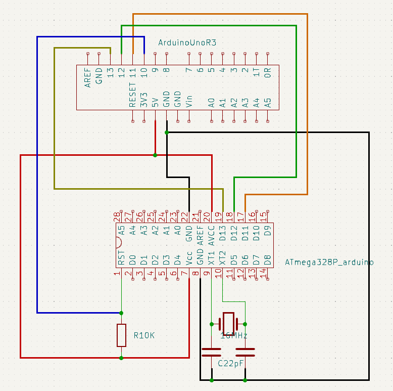

# 安価なArduinoの作りかた

信仰上の理由により、中華互換品を除く。

## 秋月の ATmega168／328マイコンボードキット

https://akizukidenshi.com/catalog/g/gK-04590/

2023年11月時点で 2,100 円と超安価なわけではなく、Arduino そのものではないが、Arduino BIOS
書き込み済の ATmega328P に挿げ替えれば、Arduino Uno R3 互換となる。

https://akizukidenshi.com/catalog/g/gI-12774/

なお自分は失敗したが、本機に付属している超有能な USB シリアル変換アダプタ FT232RL は、その
ままだとはんだ付けが必要になる。がんばって結線すれば他でも使えなくはないけど IC ソケットを
買っておいて、取り外せるようにするべきだと思う。

https://akizukidenshi.com/catalog/g/gP-00032/

ボードで開発して、実装は別途ユニバーサル基板などで行なうのであれば、2個目からは Boot 書き込み済み
ATmega328p だけ購入すれば良い。

または、Arduino Uno R3 があれば Arduino ブートローダも書きこめる。

https://ht-deko.com/arduino/atmega328p.html

こちらのサイトが分かりやすい

こちらのサイトが無くなると困るから、Kicad で似た図を書いておく。このサイトは Frit某という
ソフトで書いているのだと思うけど使いこなせないので、Kicad。一応実際のブレッドボードを意識
した図にはしておいた。

# FT232RL と IC ソケットについて

IC ソケットって基本的に本番までに何回か試せるようにするだけのもので、基本的に奥までしっか
り差し込んで使うものらしい。なので一般的なピンソケットか、FT232RL を Arduino シールド化し
てしまうほうが良いのかも知れない。
