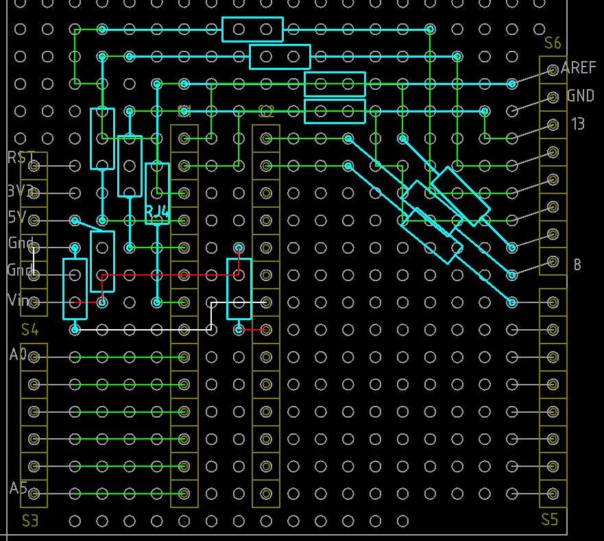

# マイコンボードの設計

## ユニバーサル基板で UNO 互換配置の設計 (Give Up)

Arduino のシールド用基板で UNO と互換のボードを作れないかと、検討してみた。

基板は Sunhayato UB-ARD01WH, 

https: //shop.sunhayato.co.jp/collections/universal-boards/products/ub-ard01wh

ここまでやって、あきらめた。Reset 配線とか FT232RL の配線とか、もうどうにもならなそう。3D
的に検討する能力がないと無理。
