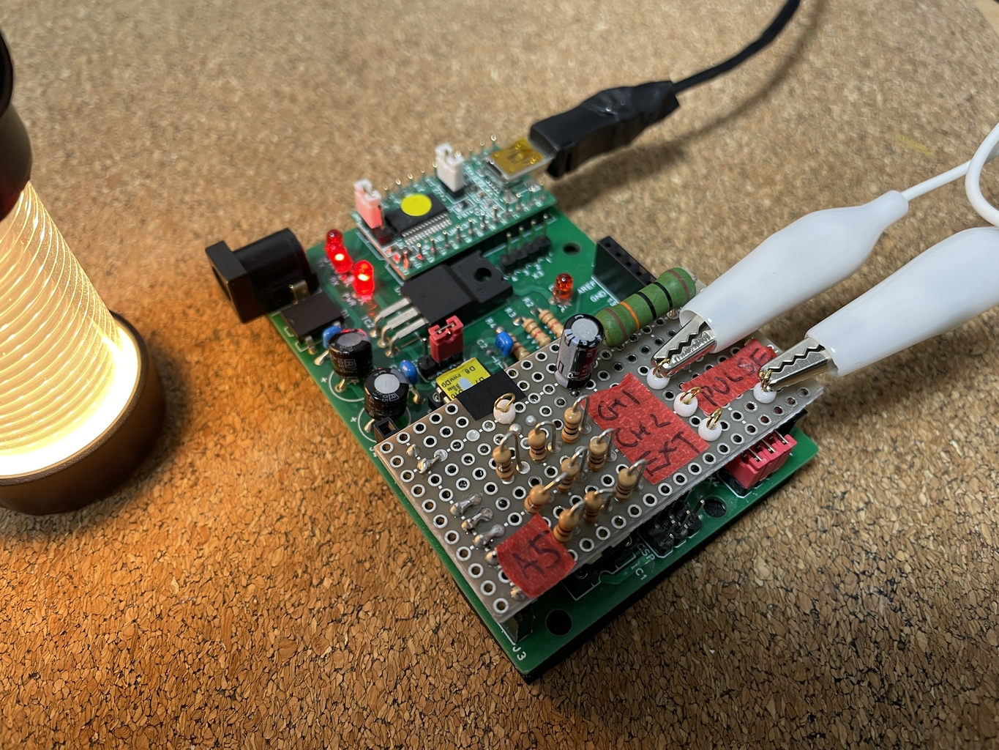
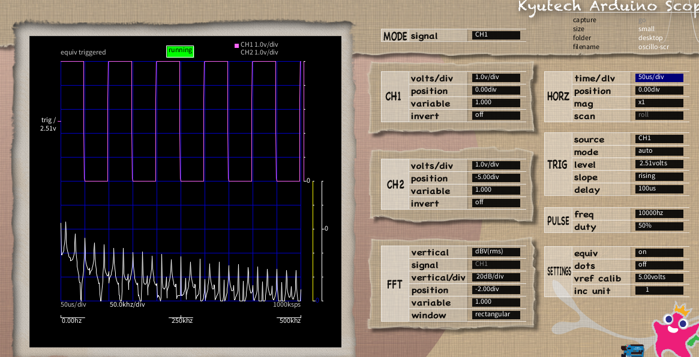
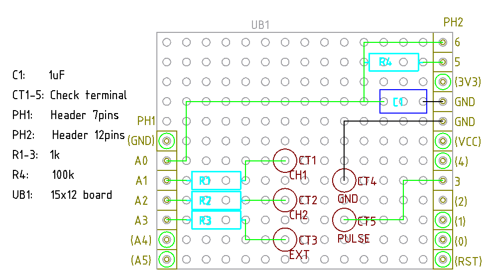

# Arduino でオシロスコープ

ここにあるのをそのままやってみよう、というだけ。

https://www.iizuka.kyutech.ac.jp/faculty/physicalcomputing/pc_kitscope

## シールド化

利用ピンが左側が A0, GND, A1, A2, A3 で問題の右側が D6, D5, D3 のため普通のユニバーサル基
板で位置が合う。

と思ったけど余っている 300Ωを使おう。この 1kΩはおおよそで良いはずだ。一方で 100kΩのは、
10kΩを 10本差す場所はさすがにないので、そのままにする。

位置決めのために、あえて使わない A5, A4 にもピンヘッダをかます。

入出力はチェック端子を IC クリップやみのむしなどで摘む形にする。

## ASOBoard 用シールド v1.0

何かと便利なので ASOBoard でも使えるようにする。

部品表

| 記号  | 品目                     | 個数   |
| ---   | -----------              | ---    |
| C1    | 1uF                      | 1      |
| CT1-5 | チェック端子             | 5      |
| PH1   | ピンヘッダ 7ピン         | 1      |
| PH2   | ピンヘッダ 12ピン        | 1      |
| R1-3  | 1kΩ                     | 3      |
| R4    | 100kΩ                   | 1      |
| UB1   | ユニバーサル基板 15x12穴 | 1      |

