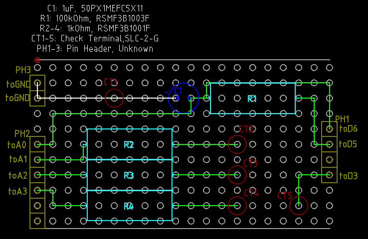

# Arduino でオシロスコープ

ここにあるのをそのままやってみよう、というだけ。

https://www.iizuka.kyutech.ac.jp/faculty/physicalcomputing/pc_kitscope

## シールド化

利用ピンが左側が A0, GND, A1, A2, A3 で問題の右側が D6, D5, D3 のため普通のユニバーサル基
板で位置が合う。

位置決めのために、あえて使わない A5, A4 にもピンヘッダをかます。

入出力はチェック端子を IC クリップやみのむしなどで摘む形にする。
