# PIC で USB シリアルアダプタを作る

こういったプロダクトがある。前者はソースがいまいちはっきりしないが後者はソースがはっきりし
ているし .hex も配布されている。

https://elchika.com/article/a4b16182-6270-493c-b4da-7c519ac3429c

https://github.com/Calcousin55/PIC16F145x_USB2Serial

http://machoto2.g2.xrea.com/page/P16F1455/P16_L04.htm

(3個目は後で見付けたため、まったく検討していない)

## 検討

### 一つ目のプロジェクト MPLAB IDE でビルドできるのかの確認

MCC は Classic を使うと同じ画面が出た。また USB_device_CDC.c の 117行目の書き換えが必要と
書いてあるが、似ている部分がない。ただし 117行目というのがちょうど関数定義の始まる部分であ
ることと、その 3行に出ている文字列で ```grap -r``` しても ```#define``` されている気配が
ないことと、```if #defined``` で使われていることから、自力で ```#define``` すれば良いのか
と言う気がしたので 117行目あたりに自力で書いてみた。

```C
#if defined(USB_CDC_SET_LINE_CODING_HANDLER)
CTRL_TRF_RETURN USB_CDC_SET_LINE_CODING_HANDLER(CTRL_TRF_PARAMS);
#endif

/** ここから
#define USB_CDC_SUPPORT_DTR_SIGNALING
#define UART_DTR PORTCbits.RC3
#define USB_CDC_DTR_ACTIVE_LEVEL 0
/** ここまで

/** P R I V A T E  P R O T O T Y P E S ***************************************/
void USBCDCSetLineCoding(void);
```

ビルドは通った。なのであとはブレッドボードで試してみるしかない。

### 2つ目のテスト

.hex も配布されているが PIC16F1454 向けにビルドされたようなので PIC16F1455 向けに設定を変
えてビルドしてみたところ普通にビルドできた。

a-p-prog で書き込んで USB 接続してみたところ /dev/ttyACM0 として認識した。

CuteCom で接続して適当に文字を送り LED Tx の挙動を調べた。LED Tx - R - LED - GND の接続で
入力時に光るので FT232RL と同様に GND に引き込む形で光らせる物らしい。

LED Tx, LED Rx に直接テスターを当てても 0V と出るのでそのあたりは意味が分かっていない。

そのまま Arduino IDE から ASOBoard に書き込んでみたところ、普通に書き込めた。

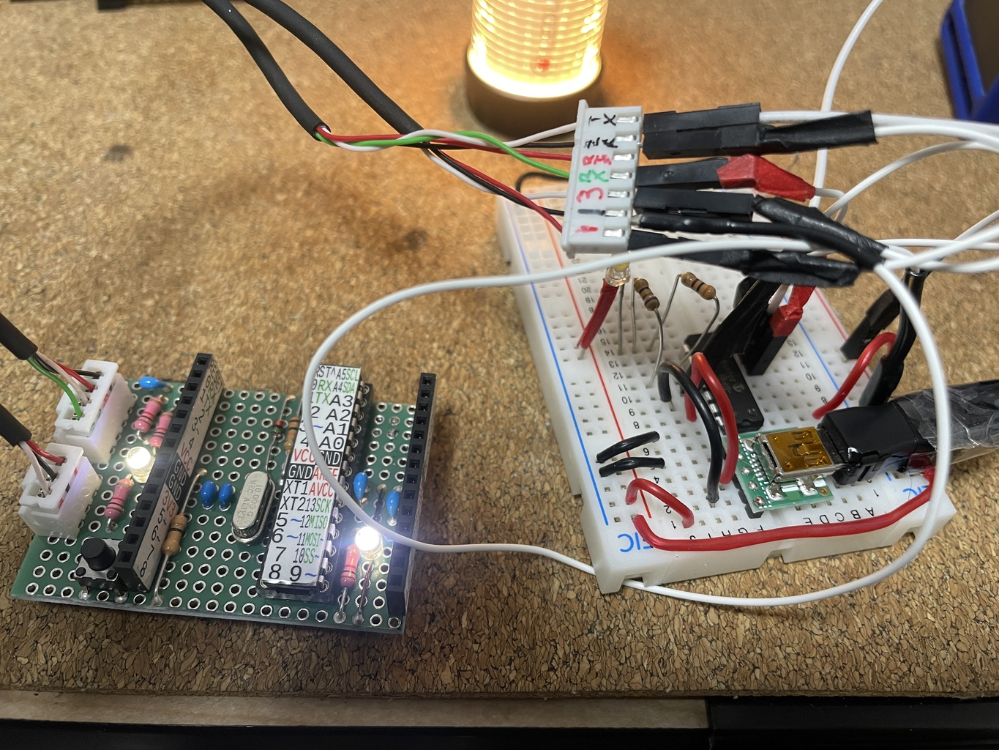

ATMega で書き込んだ PIC で ATMega を書き込むというのは、なかなかロマン度が高い気がした。

ここまで簡単に事が進んだので後者だけ検討していけば良いだろう。

さて LED ピンを共通化したいので io_mapping.h を書き換える。

```diff
--- io_mapping.h.org    2024-03-21 20:25:52.231722197 +0900
+++ io_mapping.h        2024-03-21 20:28:12.195059668 +0900
@@ -153,7 +153,7 @@
     #define LED_Rx_PIN   0

     #define LED_Tx_PORT  C
-    #define LED_Tx_PIN   1
+    #define LED_Tx_PIN   0

     /** I/O pin definitions **************************************************************************/

```

これで LED Rx = LED Tx = RC0 となったはず。ちなみにピン配置図には描かれていないが RA5 に
RTS, RA4 に CTS, RC2 に DSR が割り当てられているらしい。なので分かる人であれば ICSP だかで
プログラマが書けるのだろう。私はできないので、当面はスルー。

いろいろ触っている内に LED が光らなくなってしまった。元に戻しても光らない。壊してしまった
のかもしれないし、プログラムに何か切り替えのバグがあるのかもしれない。プログラム的には LED
on で output の low, LED off で input に切替えているらしいが、とりあえず output の low,
high で普通に Lチカしたら動いた。んー、ま今は面倒なので TX, RX LED は無しにしよう。

実装だけど前に USB を持ってきて、ピンは横にソケットを出して、その上に基板を重ねて必要な線
を出すのが良さそう。無理に FT232RL 用のケーブルを使えるようにせず、素直に出し易い様に出せ
ば良いだろう。

## 実装 ver 1.0

1段目に USB と PIC で 2段目に XH コネクタという設計にしてみた。

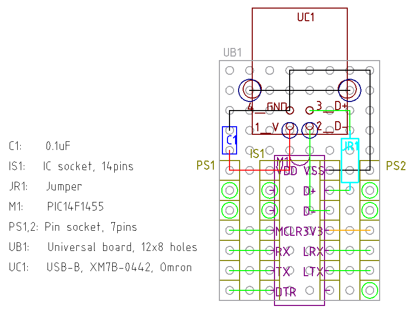

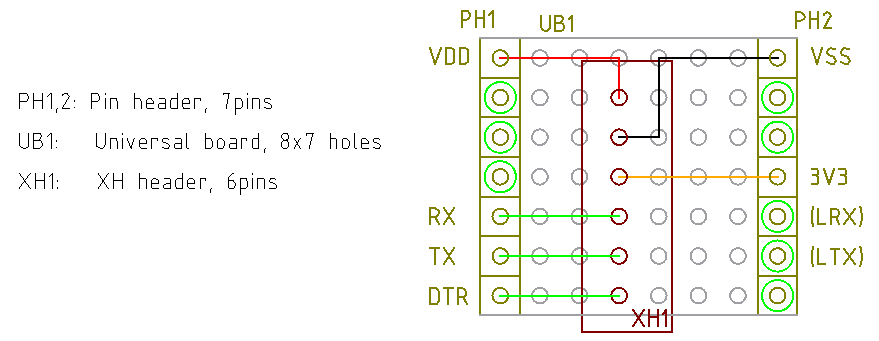

1段目の部品表

| 記号 | 品目、型番              | 合計個数 |
| ---  | ---                     | ---      |
| C1   | 0.1uF                   | 1        |
| IS1  | IC ソケット, 7x2ピン    | 1        |
| JR1  | ジャンパ抵抗            | 1        |
| M1   | PIC16F1455              | 1        |
| PS1,2| ピンソケット 7ピン      | 2        |
| UB1  | ユニバーサル基板 12x8穴 |  1       |
| UC1  | USB Bコネクタ, XM7B-0042| 1        |

2段目の部品表

| 記号 | 品目、型番              | 合計個数 |
| ---  | ---                     | ---      |
| PH1,2| ピンヘッダ, 7ピン       | 2        |
| UB1  | ユニバーサル基板 8x7穴  | 1        |
| XH1  | XH ヘッダ 6ピン         | 1        |

ケーブルのことも忘れないように。

- スリムロボットケーブル 3芯以上, 40cm
  - 20cm にして 2本使うので
- XH ハウジング, 6極 x1
- XH ハウジング 3極 x 2 (ASOBoard 側, 忘れやすい)
- XH 端子 12個以上

USB ケーブルも

- スリムロボットケーブル 4C, シールド有りを 50cm
- typeB オスケーブルコネクタ
- typeA オスケーブルコネクタ

完成品と ASOBoard の Lチカ

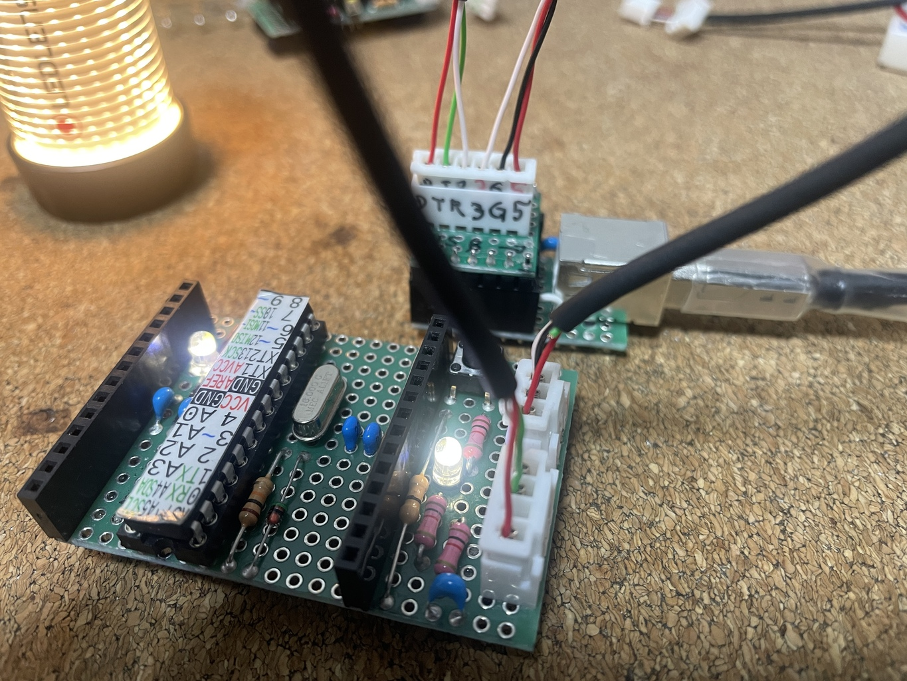

反省点は USB D+ ラインと USB コネクタが狭すぎて、接触してしまう恐れがあったこと。被覆ケー
ブルを使うことで解決したがコネクタの下を通るようにすべきだった。USB コネクタは下に下駄とな
っているプラスチックパートの背が高いので、ケースの金属が基板に接しないようになっている。

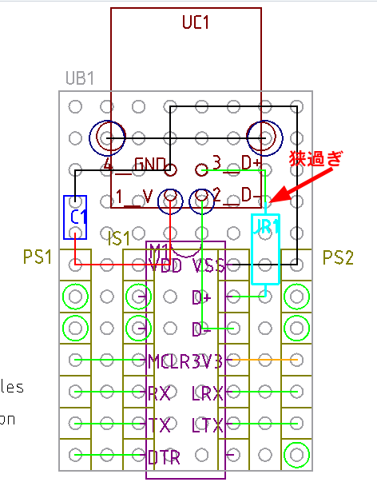

あと 3.3V 出力にコンデンサを付けていないため、出力がちょっとノイズが多い。この出力を自分に
も接続先の ATMega328P にも使うわけではないので、使う時にコンデンサを付けても良いけど、スペ
ースに余裕があるので付けておいたら良いと思う。LED 負荷テストでは 1uF ではっきりと効果があ
る。

コンデンサ無し↓

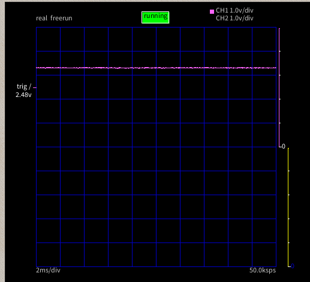

0.1uF 追加。少しは効果がある

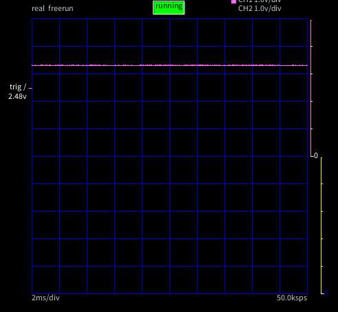

1uF。はっきり効果がある

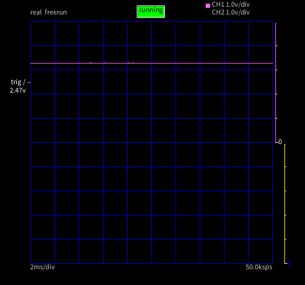

データシートの表 29.7 VUSB 3 V 3 and USB Voltage Regulator Specifications にしっかりと
0.22 ~ 2.2uF (標準 0.47uF) のセラコンを付けるように書いてあった。

先のテストはケミコンで行い、すでに空きスペースにはんだ付けしてしまったが、次回作ではセラコ
ンとしよう。

## ver 1.1 (skip)

変更点

- ジャンパ JR1 をコネクタの下から通して、確実に干渉を避ける。
- 3.3V ラインに 1uF のセラコンを付ける

1.0 で使ってた機器と互換性があるので、1.1 に。

さすがに回路図を書かないのは雑すぎるので、

[回路図 1.1](./kicad/pic16f1455_serial_adaptor_1.1/pic16f1455_serial_adaptor_1.1.pdf)

設計図 1.1

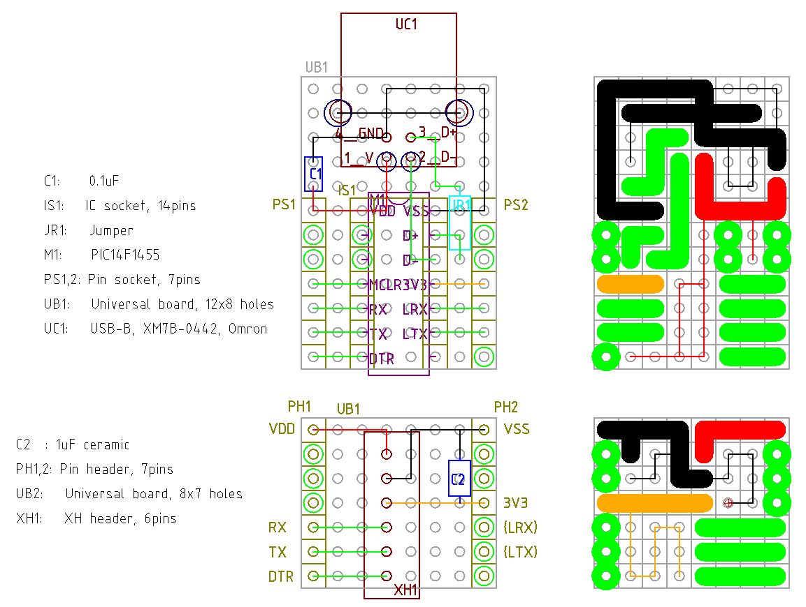

部品表

| 記号 | 品名等                                                 | 個数  |
| ---- | -----------------------------------------------------  | ----- |
| C1   | 0.1uF セラコン                                         | 1     |
| C2   | 1uF セラコン                                           | 1     |
| IS1  | IC ソケット 14P                                        | 1     |
| JR1  | ジャンパ抵抗等                                         | 1     |
| M1   | PIC16F1455                                             | 1     |
| PH1,2| ピンヘッダ 7P                                          | 2     |
| PS1,2| ピンソケット 7P                                        | 2     |
| UB1  | ユニバーサルボード 12x8P                               | 1     |
| UB2  | ユニバーサルボード 8x7P                                | 1     |
| UC1  | USB B メスコネクタ                                     | 1     |
| XH1  | XH ヘッダ 6P                                           | 1     |

ケーブルも忘れずに

| 品目                                                   | 個数  |
| ------------------------------------------------------ | ----- |
| XH ハウジング 6P                                       | 1     |
| XH ハウジング 3P                                       | 1     |
| XH ハウジング 4P                                       | 1     |
| XH コンタクト                                          | 12    |
| ケーブル                                               | 適宜  |

## ver 1.2 欲張って LED

なんか LRX, LTX 線を使って LED 光らせたくなってきたので v1.1 を作成せずに次に行く。

[回路図 v1.2](./kicad/pic16f1455_serial_adaptor_1.2/pic16f1455_serial_adaptor_1.2.pdf)

io_mapping.h を読むと LED を付けるときは LOW output で電流を引き込み、消すときは input に
して絶縁している。PIC と LED への電圧の違いを踏まえて、単純に High, Low にはしていないとの
こと。なので、抵抗を並列にしても、抵抗同士で電流が流れることはない (input で溜まった電荷の
吐き出しによる電流はあるだろうが、無視できるだろう、知らんけど)

設計図

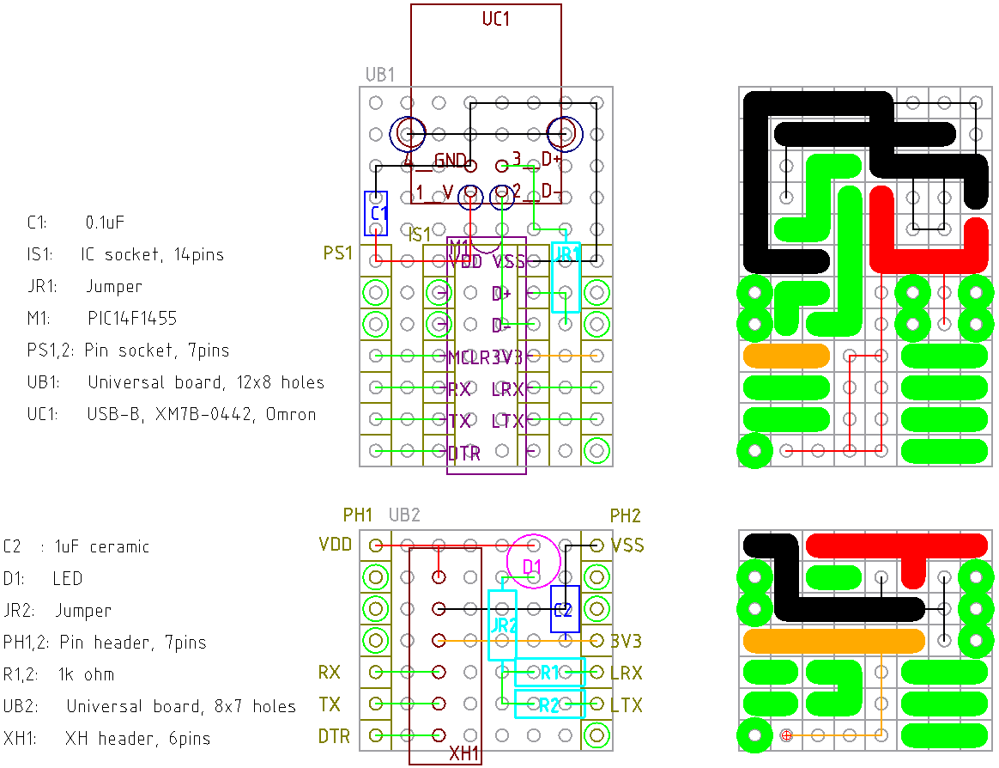

部品表

| 記号  | 品名、品目             | 個数 |
| ---   | ---                    | ---  |
| C1    | 0.1uF セラコン         | 1    |
| C2    | 1uF セラコン           | 1    |
| D1    | LED *1                 | 1    |
| IS1   | IC ソケット 14p        | 1    |
| JR1,2 | ジャンパ               | 2    |
| M1    | PIC16F1455             | 1    |
| PH1,2 | ピンヘッダ 7P          | 2    |
| PS1,2 | ピンソケット 7P        | 2    |
| R1,2  | 1kΩ                   | 2    |
| UB1   | ユニバーサル基板 12x8P | 1    |
| UB2   | ユニバーサル基板 8x7P  | 1    |
| UC1   | USB B コネクタ         | 1    |
| XH1   | XH ヘッダ 6P           | 1    |

*1) スペースに問題がなければヒロスギ LED スペーサーを敷く。

完成品。適当に Serial.print() をしている所。

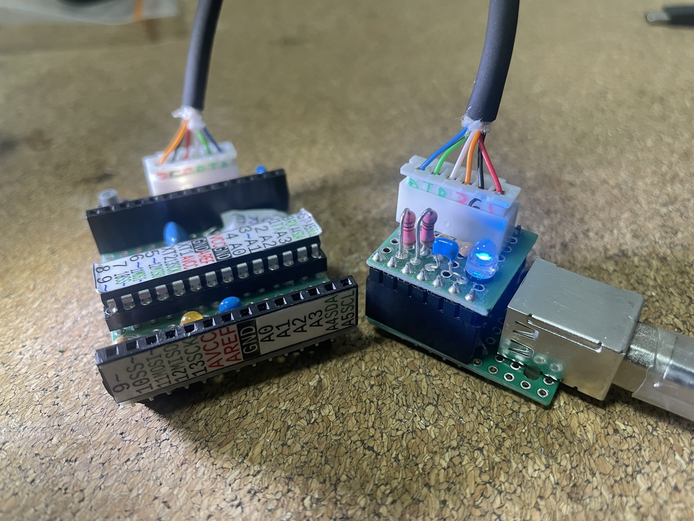
