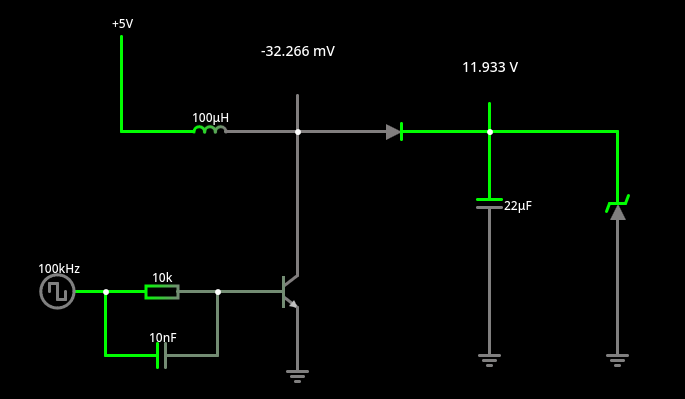
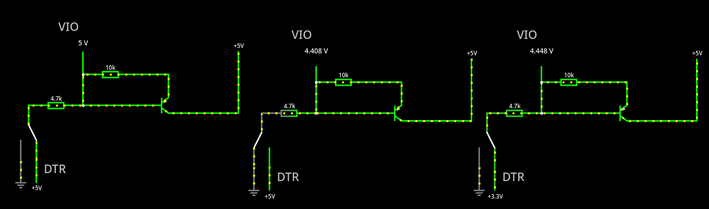
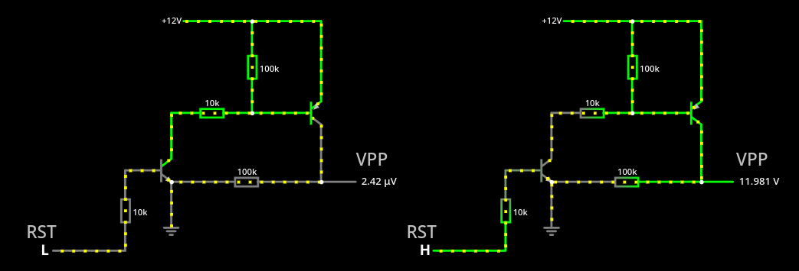

# PICerFT

http://einstlab.web.fc2.com/PICerFT/PICerFT.html

そろそろ挑戦しても良いだろう。

## テスト1、電源回路

この回路は 12V, または 9V の電源を作っている回路ということが分かった。12V は Nipron が作れ
て、書き込みたいのが PICF2550 なので、Nipron に任せれば良いはずだ。

まあ、まずはそのまま作ってみても良いと思う。

## テスト2、FT232RL の VIO, DTR のあたり

これは何をしているのか分からない。DTR の状態に係らず、4.4 ~ 5V を VIO に入力しているように
見える。常に 5V 入力ではだめなんだろうか。

とりあえず、そのまま作ってみるしかないか。

## テスト3、PIC ライター回り

FT232RL の RI# ピンが LOW のときには PIC の VPP (プログラム用電力供給ピンかな) に電圧を掛
けずに、RI# が HIGH の時に掛けるというスイッチの役目をしている。

