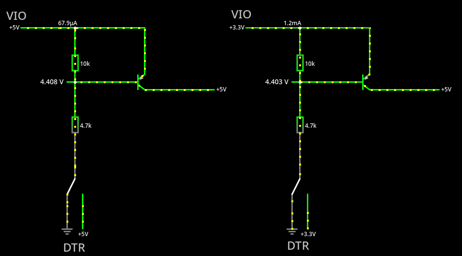

# PICerFT

http://einstlab.web.fc2.com/PICerFT/PICerFT.html

そろそろ挑戦しても良いだろう。

## テスト1、電源回路

この回路は 12V, または 9V の電源を作っている回路ということが分かった。12V は Nipron が作れ
て、書き込みたいのが PICF2550 なので、Nipron に任せれば良いはずだ。

まあ、まずはそのまま作ってみるが。

なお自分の対象は PIC18F2550 で min VPP = 9V なので 9V 側で動かせるかもしれない。

## テスト2、FT232RL の VIO, DTR のあたり

これは何をしているのか分からない。DTR の状態に係らず、4.4 ~ 5V を VIO に入力しているように
見える。常に 5V 入力ではだめなんだろうか。

違うな。秋月のこれだと VCCIO は秋月のモジュールの時点で USB からの 5V もしくは内蔵 レギュ
レータからの 3.3V が入っているので、VIO に入力しているわけではないな。

https://akizukidenshi.com/catalog/g/g106693/

VIO = 3.3V で DTR = LOW のときに 5V 電源から 1.2mA の電流が VIO に流れるのを確認。もしかし
てこれは、電圧を何かしたいわけではなくて、電流 (電力) を補充しているのか。VIO 3.3V は
FT232RL 自身のレギュレータからやってくるが、もしかして微妙に足りなくなることがあるのだろう
か。

今自分が書き込みたいのが PIC18F2550 で、これは VDD=5.5V までの対応だから、VIO = 5V で良い。
となると、自分には、この回路は不要なのかもしれない。

まあ、まずはそのまま作ってみるが。

## テスト3、PIC ライター回り

FT232RL の RI# ピンが LOW のときには PIC の VPP (プログラム用電力供給ピン) に電圧を掛けず
に、RI# が HIGH の時に掛けるというスイッチの役目をしている。

