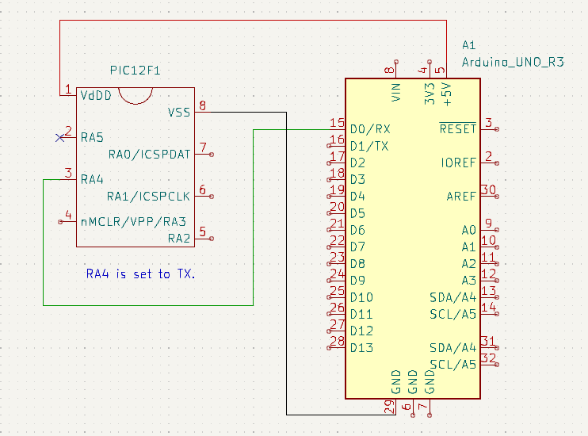

# PICのシリアル出力をArduinoで読む

## PIC 側の準備

使ったのは PIC12F2840.
参考にしたのはデータシートと、次のヒサオメモ氏の記事。 

https://hisaomemo.blogspot.com/2016/02/picarduino.html

データシートに TRISA や ANSELA のあたりは書いてなかったと思うんだけど、きっとやってる人に
は当たり前のことなんだろうなあ。Simulator の I/O ピンの状態を見ながら Dout になるまで設定。
Simulator の UART 1 出力には出ていただけに、たちが悪い。ハードで出ないものは出さないでほし
いなあ。

## Arduino 側の準備

先のヒサオメモ氏のコードをそのままコピペ。

## 結線

Kicad のライブラリって、なんでピンの物理的な位置を考慮してくれないんだろうか。PIC はどこが
どこだか見て分からないので、自分の作業に不都合にならないように、物理的なピンの位置で作りな
おした。

## 出力確認

Arduino のシリアルモニタでも ``cat /det/ttyUSB0`` でもどちらでも良い。
