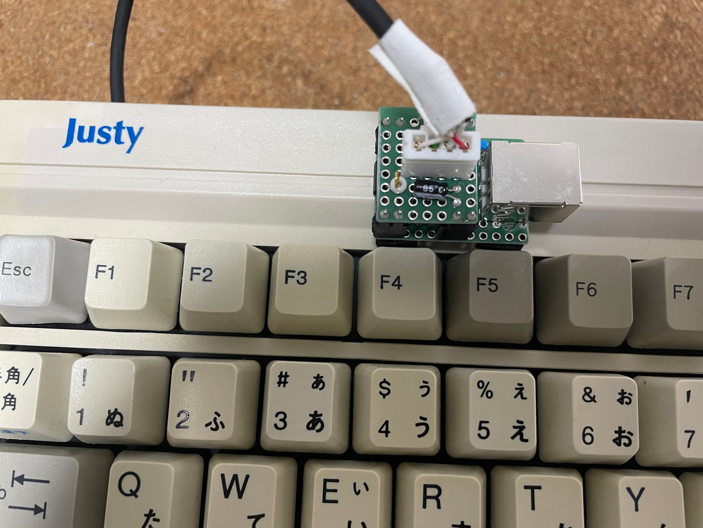

# PS/2 キーボードを USB に変換するアダプタ

# v1.0, PIC16F1455 版

ソースは

https://github.com/Nobutarou/at2usb_jp

[設計図1.0](./librecad/ps2toUSB_v1.0.pdf)

部品表

| 記号 | 品目 | 個数 |
| ---  | ---  | ---  |
| C1   | セラコン 0.1uF | 1 |
| C2   | ケミコン 1uF    | 1 |
| IS1  | IC ソケット 14P | 1 |
| J1   | チェック端子    | 1 |
| JR1  | ジャンパ線      | 1 |
| M1   | PIC16F1455      | 1 |
| PH1  | ピンヘッダ 3P   | 1 |
| PH2-4 | ピンヘッダ 2P  | 3 |
| PS1  | ピンソケット 3P | 1 |
| PS2-4 | ピンソケット 2P | 3 |
| UB1   | ユニバーサル基板 12x8P | 1 |
| UB2   | ユニバーサル基板 8x7P  | 1 |
| UC1   | USB-B コネクタ         | 1 |
| XH1   | XH ヘッダ 4P           | 1 |
| ---   | ---                    | --- |
|       | ケーブル類             |     |
|       | 4芯シールド線, 好きな長さ | 1 |
|       | XHP コネクタ 4P           | 1 |
|       | XH 端子                   | 4 |

