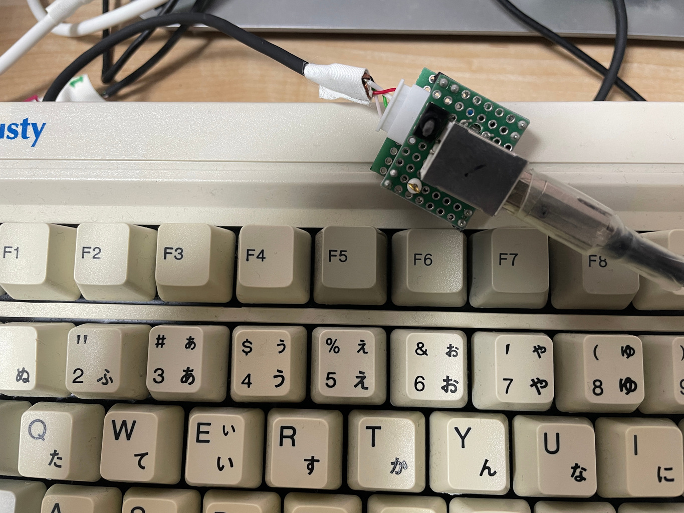

# PS/2 キーボードを USB に変換するアダプタ

# v1.0, PIC16F1455 版

ソースは

https://github.com/Nobutarou/at2usb_jp

[設計図1.0](./librecad/ps2toUSB_v1.0.pdf)

部品表

| 記号 | 品目 | 個数 |
| ---  | ---  | ---  |
| C1   | セラコン 0.1uF | 1 |
| C2   | ケミコン 1uF    | 1 |
| IS1  | IC ソケット 14P | 1 |
| J1   | チェック端子    | 1 |
| JR1  | ジャンパ線      | 1 |
| M1   | PIC16F1455      | 1 |
| PH1  | ピンヘッダ 3P   | 1 |
| PH2-4 | ピンヘッダ 2P  | 3 |
| PS1  | ピンソケット 3P | 1 |
| PS2-4 | ピンソケット 2P | 3 |
| UB1   | ユニバーサル基板 12x8P | 1 |
| UB2   | ユニバーサル基板 8x7P  | 1 |
| UC1   | USB-B コネクタ         | 1 |
| XH1   | XH ヘッダ 4P           | 1 |
| ---   | ---                    | --- |
|       | ケーブル類             |     |
|       | 4芯シールド線, 好きな長さ | 1 |
|       | XHP コネクタ 4P           | 1 |
|       | XH 端子                   | 4 |

# v1.1, 改良

v1.0 の反省点と改良点:

- 縦に XH を置いたため、ケーブルがもこってなる
  - 寝かせた方が良さそう
- OS 立ち上がりまで PC が認識できないのか、キーボード側が動けていないのか不明だが、USB 切
  替え器のスイッチや、USB 抜き差しが必要だ
  - 個別にスイッチ付けよう。

スイッチの選定:

直流表記のないやつは DC30V までは AC125V と同程度とある。メーカーによる違いはあるだろうけ
ど、ある程度の参考になる。

https://www.nkkswitches.co.jp/pdf/nkk_ma20131002.pdf

トグルスイッチだとミヤマの MS-611K 125VAC 0.3A が小さくて良さそうだ。オン抵抗は最大 20mΩ。
と思ったのだが USB テスターによると 5mA。まあいい加減だと思うがその程度のオーダーというこ
とになる。そうなると、NKK G-12, DC28V で 0.1A で十分だ。

またはタクトスイッチと MOSFET でリセット掛けられるようにしても良さそうだ。参考にしたのは

https://memoteki.net/archives/1352

MOSFET の使い方自体は

https://www.marubun.co.jp/technicalsquare/9023/

ただこれはスイッチを入れるとオンだけど、今回はスイッチを押したらオフにしたいので、プルダウ
ンとプルアップを入れ替える。

練習した回路はこちら。そろそろやれる気がする。

https://x.gd/wmYxU

NchMOSFET はサンケンの EKI04036。オン抵抗が秋月表記 3.9mΩと小さい (Vgs, Id で変化するみた
い)。放熱板付いているけど、Vds≒0[V] なので気にしなくて大丈夫だと思う。

PchMOSFET は東芝の TJ60S04M3L。オン抵抗が秋月表記で 4.8mΩと小さい。

一応 3通りの設計をしてみた。分ってはいたが、トグルスイッチが一番コンパクト。やはりトグルス
イッチで設計する。MOSFET はもっと大電流を長すときに頑張ってもらおう。今回はスイッチとして
の使い方は理解したというところで満足。

v1.0 のケーブルをそのまま使いたいので XH ヘッダは横型ではなく縦型のを横にして使う (切れ目
がある方が裏になる、と思う。頻繁に間違えるので作業時に確認要)

[回路図v1.1](./kicad/ps2-USB_KB_1.1/ps2-USB_KB_1.1.pdf)

[設計図v1.1](./librecad/ps2toUSB_v1.1.pdf)

部品表 v1.1:

| 記号  | 品目                    | 個数 |
| ---   | ---                     | ---  |
| C1    | ケミコン 1uF, 任意      | 1    |
| C2    | セラコン 0.1uF          | 1    |
| IS1   | IC ソケット 14P         | 1    |
| J1    | USB-B コネクタ          | 1    |
| J2    | チェック端子            | 1    |
| JR1-3 | ジャンパ線              | 1    |
| PH1   | ピンヘッダ 4P           | 1    |
| SW1   | NKK G12 トグルスイッチ  | 1    |
| U1    | PIC16F1455              | 1    |
| UB1   | ユニバーサル基板 10x16P | 1    |
| XH1   | XH ヘッダ 縦型 4P       | 1    |

ケーブルは v1.0 のを使うから、作成の必要なはい。

# v1.2, 小型化

v1.1 を作っていないが二段組による小型化に挑戦。今回はケーブルの向きを一方向にしたいので、
折り曲げ型はやらずに普通に二段にしてみる。

[設計図v1.2](./librecad/ps2toUSB_v1.2.pdf)

部品表 v1.2:

| 記号  | 品目                     | 個数 |
| ---   | ---                      | ---  |
| C1    | ケミコン 1uF, 任意       | 1    |
| C2    | セラコン 0.1uF           | 1    |
| IS1   | IC ソケット 14P          | 1    |
| J1    | USB-B コネクタ           | 1    |
| J2    | チェック端子             | 1    |
| PH1   | ピンヘッダ H=3mm, 4P     | 1    |
| PH2-5 | ピンヘッダ H=6mm, 2P     | 4    |
| PS1-4 | ピンソケット H=8.5mm, 2P | 4    |
| SW1   | NKK G12 トグルスイッチ   | 1    |
| U1    | PIC16F1455               | 1    |
| UB1   | ユニバーサル基板 10x9P   | 1    |
| UB2   | ユニバーサル基板 10x8P   | 1    |
| XH1   | XH ヘッダ 縦型 4P        | 1    |

