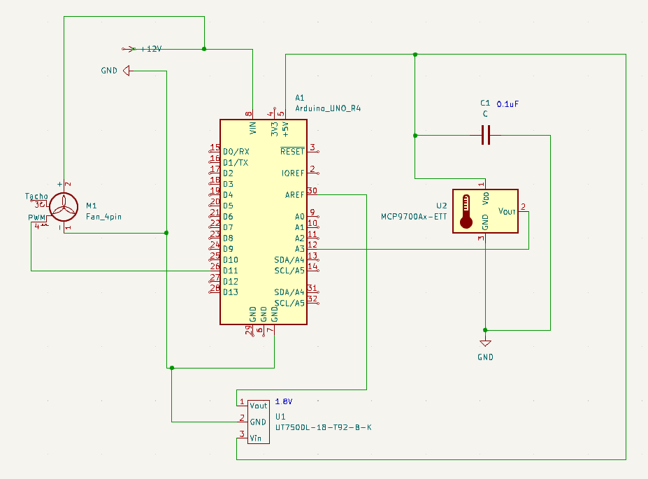
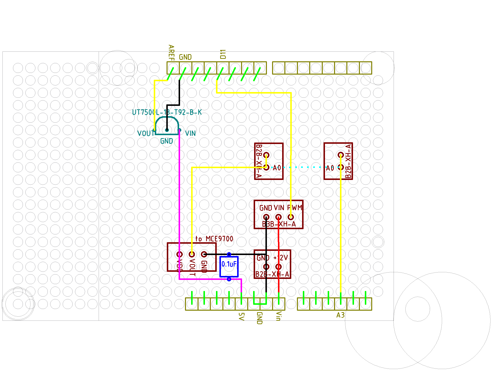
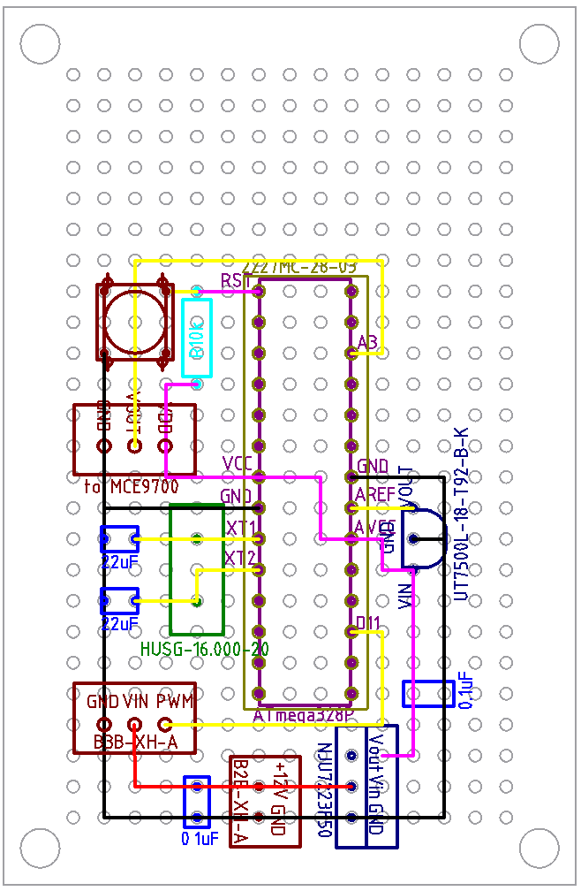

# これは何

PWM ファンを PID 制御して対象物の温度を目標値にする。
通常のファンコントローラは、特定温度まで一定回転、そこを越えると比例回転となるのが一般的だ
けど、つまらないので PID で制御してみることにした。

# 配線について

1.8V 定圧レギュレータを (U1) 使ったのは、温度センサーの出力が大きくても 0.5~1.5V なので、
参照電圧 3.3, 5V では大き過ぎる気がしたからだ。というのもピンを変えるたびに、そして 12V 電
源を差すか差さないかで、値が変わったからだ。しかし、実際のところは良く分からない。1.8V を
参照電圧にしたところで、やっぱりピンと12V 電圧の差す差さないで値は変わった。あと多分いくつ
かのピンを壊してると思うし、正直、今後ちゃんと壊さずに作業できるようになったときに、どうす
るかだな。

コンデンサ (C1) は要らないんじゃないかと思う。良く知らんが電源投入時の安定のためだと思うん
だけど、温度センサーは応答が遅いから、正直電源を入れた直後に多少なにかあっても、どうでも良
さそうに思うからだ。

# プログラムについて (ATmega328P で実装したいからボツにする)

Uno R4 は PWM 関数が追加されてるから簡単に可聴域越えの周波数での動作ができた。今後
Atmega328P での作成も考えてるから、この関数は使えない。まあそのときで。

<a href="Pwm-Temp.ino" target="_blank">UNO R4 向けプログラム</a>

# シールド実装 (ATmega328P で実装したいからボツにする)

なるべく裏配線が交差しない配置を考えてみた。どうしても温度センサー出力を A3 に持っていくと
こだけは交差するので、そこだけコネクタで表を走らせることにする。ググると被覆コードで全部や
る人が多いみたいだけど、はんだに自身がないので。

またボードの外からの接続も含めて、コネクタは JST XH コネクタにした。2.5mm ピッチで普通に
2.54mm ピッチのボードに差さるらしいし、しっかりと差さって抜けないことを知ってるので採用し
てみる。

ボードは余りそうなので、折って小さくできそうだ。

# ユニバーサル基板に実装 (保留)

プログラムも書いてないのに設計だけしてみた。ピンは UNO R4 で生きていたピンのまま。もし PWM
でうるさいなど問題があれば D10 を使えば 20kHz やれそう。

https://rtmrw.parallel.jp/laboratory6/lab-report-157/lab-157.html

問題はあるみたいだけど、今回、他のデジタルピンは使わないから大丈夫ではないかな。

できたと思ったんだけど、PIC ならもっと小さくできそう。今実際にファンコンで困ってない
ので、慌てて作る必要もないので PIC も調べてみる

# PIC12F1572 でプログラムを書いてみようとした --> 挫折

--> PIC12F1752 のデータシートと格闘しながらプログラムを買いていたんだけど、プログラム領域
が圧倒的に足りない。あらかじめ紙と鉛筆で計算しておいて、最終式だけ書くとかすると達成できる
のかもしれないけど、そうなると、自分でもコードを読めなくなってしまう。おそらく達人の技が必
要そう、と言うことで、PIC は諦める。

# Arduino UNO R3 向けにもプログラムを書いてみる

R4 はフラッシュメモリが 256kB あり、プログラムが 56kB で問題なかったが、R3 のフラッシュメ
モリは 32kB だから足りなくない？ということで、こちらも見直しが必要になりそうな気配。先走っ
てハード買ってなくて良かった。

で

