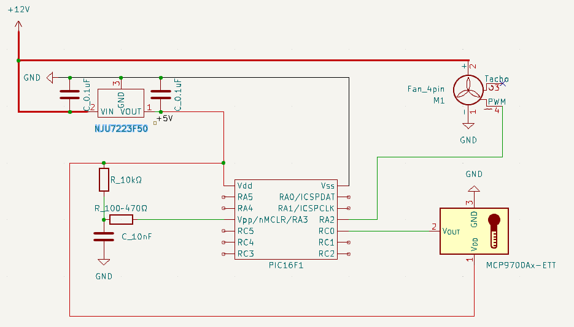

# これは何

PWM ファンを PID 制御して対象物の温度を目標値にする。
通常のファンコントローラは、特定温度まで一定回転、そこを越えると比例回転となるのが一般的だ
けど、つまらないので PID で制御してみることにした。

PID 制御については、こちらがとても分かりやすかった。

https://kurobekoblog.com/pid

# 配線について

1.8V 定圧レギュレータを (U1) 使ったのは、温度センサーの出力が大きくても 0.5~1.5V なので、
参照電圧 3.3, 5V では大き過ぎる気がしたからだ。というのもピンを変えるたびに、そして 12V 電
源を差すか差さないかで、値が変わったからだ。しかし、実際のところは良く分からない。1.8V を
参照電圧にしたところで、やっぱりピンと12V 電圧の差す差さないで値は変わった。あと多分いくつ
かのピンを壊してると思うし、正直、今後ちゃんと壊さずに作業できるようになったときに、どうす
るかだな。

コンデンサ (C1) は要らないんじゃないかと思う。良く知らんが電源投入時の安定のためだと思うん
だけど、温度センサーは応答が遅いから、正直電源を入れた直後に多少なにかあっても、どうでも良
さそうに思うからだ。

# プログラムについて (ATmega328P で実装したいからボツにする)

Uno R4 は PWM 関数が追加されてるから簡単に可聴域越えの周波数での動作ができた。今後
Atmega328P での作成も考えてるから、この関数は使えない。まあそのときで。

<a href="Pwm-Temp.ino" target="_blank">UNO R4 向けプログラム</a>

# シールド実装 (ATmega328P で実装したいからボツにする)

なるべく裏配線が交差しない配置を考えてみた。どうしても温度センサー出力を A3 に持っていくと
こだけは交差するので、そこだけコネクタで表を走らせることにする。ググると被覆コードで全部や
る人が多いみたいだけど、はんだに自身がないので。

またボードの外からの接続も含めて、コネクタは JST XH コネクタにした。2.5mm ピッチで普通に
2.54mm ピッチのボードに差さるらしいし、しっかりと差さって抜けないことを知ってるので採用し
てみる。

ボードは余りそうなので、折って小さくできそうだ。

# ユニバーサル基板に実装 (保留)

プログラムも書いてないのに設計だけしてみた。ピンは UNO R4 で生きていたピンのまま。もし PWM
でうるさいなど問題があれば D10 を使えば 20kHz やれそう。

https://rtmrw.parallel.jp/laboratory6/lab-report-157/lab-157.html

問題はあるみたいだけど、今回、他のデジタルピンは使わないから大丈夫ではないかな。

できたと思ったんだけど、PIC ならもっと小さくできそう。今実際にファンコンで困ってない
ので、慌てて作る必要もないので PIC も調べてみる

# PIC12F1572 でプログラムを書いてみようとした --> 挫折

--> PIC12F1752 のデータシートと格闘しながらプログラムを買いていたんだけど、プログラム領域
が圧倒的に足りない。あらかじめ紙と鉛筆で計算しておいて、最終式だけ書くとかすると達成できる
のかもしれないけど、そうなると、自分でもコードを読めなくなってしまう。おそらく達人の技が必
要そう、と言うことで、PIC は諦める。

# Arduino UNO R3 向けにもプログラムを書いてみる

R4 はフラッシュメモリが 256kB あり、プログラムが 56kB で問題なかったが、R3 のフラッシュメ
モリは 32kB だから足りなくない？ということで、こちらも見直しが必要になりそうな気配。先走っ
てハード買ってなくて良かった。

で

は、どちらも 4kB 強のプログラムとなった。ブートローダが 1kB 強だから、合計 6kB くらいか。
PIC で 4kW くらいあるやつなら自分レベルでも書けるかもしれない。

# PIC をもう一度探してみる
--> PIC24F08KL200-I/P は 19mm 長で、プログラムメモリが 8kB (word じゃない!) で PWM も使え
るぞ。

--> 良くみたら命令長さが 20ビットに増えててワード数としては大差ないみたいな気がしてきた。

--> そもそもこの機種だと PWM 使えなかった

--> PIC16F15325-I/P は PWM 確実にあるぞ。命令調 14bit で 8kw の領域があるから,
8000x14/8=14kB くらい使えそうな気がす。19mm 長だし、もう一度挑戦してみよう

データシートと格闘しながら、エラーなくコンパイルしたものは出きた。シミュレーションでは動い
ているように見えるけど。 

水晶と参照電源まで省ける結果となった

# PIC16F15325 での配線図と基板

そもそも PIC の最小構成すら知らない。データシートの図2-1 に描いてある。で回路はこうなった。

でユニバーサル基板への設計はこうなった。縦に 2行くらい詰められそうだけど、それは現場で考え
る。

心配事は

* FT232RL で本当に書き込めるかな
* 動くのかな

で、プログラマとして使おうと思ってた 
https://github.com/gphalkes/fpicprog
でサポートリストに載っていない。多分自分でデバイスリストを書けばできるんだけど、調べかたが
分からん。

もう一つ見つけた
https://github.com/jaromir-sukuba/a-p-prog
これならできそう。もともと壊した UNO R4 の変わりに UNO R3 は 1台は持っておこうと思ってたし、
FT232RL 購入ついでに付いてくる Aki のマイコンボード自体も UNO R3 の代わりをしてくれそうだ
し。

ただ、先のコードをコンパイルしたら 2572 words だったので、fpicprog のデバイスリストで入り
そうなのを調べていたら PIC12F1840-I/P という 8ピンで ADC も PWM も使えるものを見つけてしま
った。

またコード書き直そう。PIC ってハード買う前から遊べるのすげえな。種類が多くて切りがない。

# PIC12F1840 でもやってみる 

これはもともと狙っていた fpicprog でサポートされてるし、a-p-prog では、なんとテスト済でも
ある。これは確実だ。コードが書ければだけど。

--> 書けた

--> 配線図の PDF

--> ユニバーサル基板での部品配置図の PDF。配線を交差させたら負けだと思ってたけどジャンパー抵抗というの
を知った。単に交差させてるだけなのになんかそれっぽいから、気が楽になった

正直 nMCLR にプルアップが必要なのか分からない。なぜならデータシートによると weak pullup が
デフォルトで有効だからだそうだ。weak って何だよ。何Ωとか言ってくれよ。っていうか
PIC16F16325 みたいに、最小構成も載せておいてくれよ。

--> ブレッドボードでのテストは nMCLR への配線は不要だった。

とはいえ 1行しか小くできなかった。

さて、ここまで組んでレギュレータのテストをしたらレギュレータが焦げた。

ここまで組んでレギュレータのテストをしたらレギュレータが焦げた。
知恵袋に聞いたことと、そこから考えたことは、

* コンデンサと適当に扱うな。必要だから付けろと仕様書は言っているのだ。
* コンデンサはなるべくレギュレータに近くに配置するべし
* 5V ラインにもちゃんとコンデンサを付けてからテストするべきだった。
* 一般電解コンデンサの方が、発振なる現象を起こさないようだ。
* レギュレータは NJM7805 というシリーズが、こちらの世界では定番のようだ。

 で取り付けたコンデンサを調べてみたが、新品
と同じ値が出た (0.17uF) ので壊してはなさそうだ。コンデンサについては、今のはんだ技術で取り
付けられていると考えて良さそうだ。

対象のコンデンサは リード型積層セラミックコンデンサ 0.1uF 50V 
RPEF11H104Z2P1A01B という村田のものであった。データシートを今一度見返すと、誤差が +80/-20%
というものであった。適当な計測とはいえ、0.17uF は案外正しい数値なのかもしれない。

さて今一度、秋月のマイコン開発ボード(うちでは Arduino Uno R3 互換機) を見てみると、知恵袋
で教わった 7805 レギュレータの Vin, Vout を挟む形で、回路図では 100uF のコンデンサが入って
おり、実際もアルミのコンデンサで 100までは読めるものが入っている。7805 のデータシートの測
定回路の 300-1000 倍が入っている。なるほど、ここまで入れちゃって良いんだ。

とういうとで自作を考えているうちに、ふとツェナーダイオードというものがあることを思いだした。
その時はなに言ってるのか分からなくて、IC になってるレギュレータの方が分かりやすいと思った
ものだが、今なら分かりそうだし、実際に焦がしてみると、ちょっとレギュレータを敬遠したい自分
も居る。それに今回は PIC を動かすだけだから、そんなに精度良く電圧が出なくても良い。

ということで次はツェナーダイオードで 5V 電源作るようにしてみよう。

# PIC12F1840 版 02, ツェナーダイオードで定電圧回路 (obso)

電圧の上限、下限を調べてみる。単位は V. 

|                                | min | typ | max |
| ---                            | --- | --- | --- |
| 温度センサーIC MCP9700-E/TO | 2.3 | -   | 5.5 |
| PIC12F1840 16MHz 駆動       | 2.3 | -   | 5.5 |
| SanAce80                       | 不明| 不明| 不明|

ファンだけは不明なので出たとこ勝負となる。

台湾 Panjit の GDZJ5.1A と US OnSemi の 1N5338BG がある。出力電圧はどっちでも良い。
しかし Panjit のは最大消費電力 500mW なので、最大電流は約 100mA。
PIC の最大消費電力が 800mW なので最大電流は約 160mA。

PIC の実際の電力が読めないのだが、最悪、0 (ツェナーダイオードに対して無視できるという意味
で) から 160mA まで振れるとしたときに、能力が足りない。

なるほど、消費電力は、定電圧回路側の消費電力を越えてれば安全なんだな。

ということで US OnSemi のは 5W 対応だ。1A 流れる。さすがにやりすぎだ。が他にない。

そして差し込む抵抗を決めるには、それはここの定電圧回路の計算式を活用できる。

https://www.paltek.co.jp/techblog/techinfo/210621_01

ツェナー電流は 240mA であり、仮に PIC が全力になる 160mA の場合 (12-5.1)x(0.16+0.24) = 17Ω

手元で一番近いのが 75Ωで、これだと流せる電流が (12-5.1)/75 = 92mA
2並列すると 184mA。ていうか 1/2W 抵抗だから、だめじゃん。

全然部品点数も減らないし、これならやっぱり定
電圧のレギュレータで良いや。

ということで、これはここまで。次回はぶっ壊したやつの回路のまま、実装を考えていこう。

# PIC12F1840 版 03、コンデンサと実装を見直し

実装設計上の見直しは次の通り。

* レギュレータに付けるコンデンサを 100uF などでかい電解コンデンサにする
* レギュレータの物理的な隣りに付ける
* レギュレータは定番の 7805 にする
* MCP9700 は必要ではないけどコンデンサ 0.1uF-1uF を電力ラインに推奨、PIC12F1840 もクロック
  の精度を保つためには 0.1uF, 0.01uF の並列が必要と買いてあるので、これも付ける

手持ちの 7223 とは悩んだが、どうせいくつか買い物をしなくてはならず、レギュレータも予備を一
つ買う予定なので、それなら定番と言われる 7805 を採用して, 7223 を予備に回せば良いと考えた。

なるべく近くにしろ、のなるべくが不明だし、mm 単位の設計には、さすがに誤差でしかないと思う。
電気の速度 = 光の速度 = 30万km/s = 30x10^4x10^6 = 3e11 mm/s。温度センサーに繋ぐケーブルは
せいぜい長くて 300mm。つまり 3e11/300 = 1e9 Hz = 1GHz。マイコンの 16MHz を狙うには、どうで
も良いレベルと思われる。そのため、

組付け時の注意点は

* レギュレータの Vin, Vout 両方にコンデンサを付けて、GND もしっかり落とす。つまりデータシ
  ートの測定回路が出きるまではテストしない。
* レギュレータはんだ時は、逆ピンセットかクリップを使って熱を逃がすようにする。

で回路図はこちら

設計図はこちら

|記号 |品番、説明                   |
|---- |----------                   |
|C1,2 | 35ZLH100MEFC6.3X11, 100uF35V|
|C3   | RPEF11H104Z2P1A01B, 0.1uF50V|
|C4   | RDDV103Z1H5L1, 0.01uF50V    |
|HS1  | B2B-XH-A                    |
|HS2,3| B3B-XH-A                    |
|PC1  | PIC12F1840                  |
|PS1  | 2227MC-08-03                |
|R1,2 | CFS50J0RB, 0ohm             |
|RG1  | NJM7805FA                   |
|SW1  | 2MS1-T1-B4-M2-Q-E           |

温度センサー用のコンデンサはマイコンのに兼任してもらう。もともとブレッドボードでの試験は無
しで動いていたし、マイコンと温度センサーのコンデンサは重要視していない。レギュレータは 12V
入れるので、煙吐いて壊れるが、ここで 5V さえできていれば、センサーとマイコンが燃えるとは思
えない。それに、光の速度 3e11 mm/sec なら1000mm の長さがあっても 300MHzという 16MHz のマイ
コン周波数とは比較にならない周波数なので、気にする必要がなさそうだ。もともとなるべく近くと
いうあいまいな表現だし。

# PIC12F1840 版 04、SATA 電源から 5V, 12V を引いてくる

これまでマザーボードのファンヘッダから 12V を引いてきて 3端子レギュレータで 5V と 12V に分
けようとしていた。しかし燃やしてしまったので億劫になっていたのだが、良く考えたら SATA から
取れば良い。マザーボードから取っていたのは手が届きやすいというだけの理由であった。ちなみに
ペリフェラルから取っても良いのだけど、今ケーブルを差してないので手っ取り早く SATA で行く。

これによりレギュレータは不要。レギュレータ用のコンデンサも不要。スイッチも不要だ。スイッチ
は 12V をなんか間違えて 5V に入れたくないという安心感のためであって、実質ちゃんと組めてる
なら、無くても問題ないのだ。

かなりすっきりする。

|記号   |品番、説明                   |
|----   |----------                   |
|C1     | RPEF11H104Z2P1A01B, 0.1uF50V|
|C2     | RDDV103Z1H5L1, 0.01uF50V    |
|HS1,2,3| B3B-XH-A                    |
|PC1    | PIC12F1840                  |
|PS1    | 2227MC-08-03                |
|R1     | CFS50J0RB, 0ohm             |

