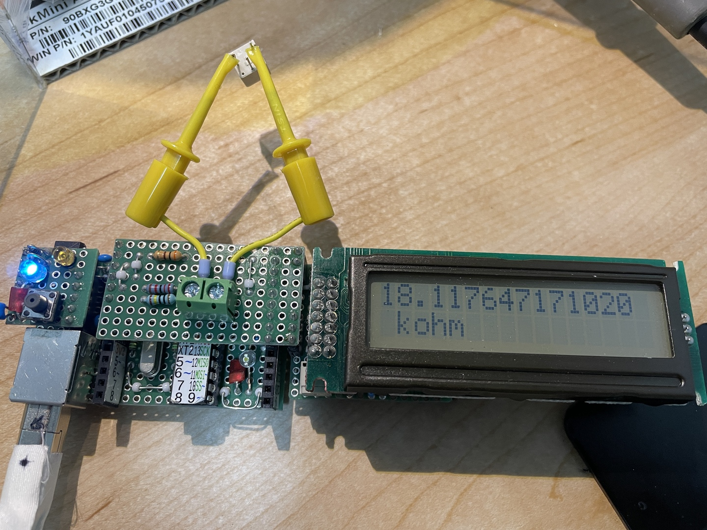

# 抵抗計

# version 1.0 没

<!-- {{{ -->
静電容量計が思いの他便利だったので、

[静電容量計](./../CondenserMeasure/抵抗自動選択式の開発.md)

抵抗計も作ってみることにした。とてもじゃないけどカラー
コードを覚えられないし、毎回カラーコードを読むのも老眼にはつらい。

原理は、単純に直列して、電圧を測定して、抵抗を逆算するだけ。

VCC - R0 - R1 - GND で R1-GND の電圧を V1 とすれば

V1/VCC = R1/(R0+R1)

... R1 = R0 V1 / (VCC - V1 )

a を 8ビット DAC の読取値とすると

a = V1/VCC * 1023

... V1 = a VCC / 1023

... R1 = R0 a / (1023-a)

となる。

8ビット ADC なので、上下 100ずつを除いた範囲で利用することを考えると、手持ちの抵抗では次の
ようになる。

| R0 [Ω] | R1 [Ω] | a |
| ---     | ---     | --- |
| 300     | 47      | 139 |
| 300     | 2.2k    | 900 |
| 22k     | 4.7k    | 180 |
| 22k     | 100k    | 839 |
| 1M      | 220k    | 184 |
| 1M      | 4.7M    | 844 |

MΩなんて静電容量計でしか使わないので、まあ十分だろう。

## 回路図

こちら

[回路図 v1.0](./kicad/RegisterMeter_1.0/RegisterMeter_1.0.pdf)

| Reference | Value      | 数量 | 
| --------- | ---------- | ---- | 
| R1        | 300        | 1    | 
| R2        | 22k        | 1    | 
| R3        | 1M         | 1    | 
| R4        | R          | 1    | 
| U1        | ATmega328P | 1    | 

ピンの選択は ASOBoard 用シールドに都合の良いものを選んだ。応答速度はのんびりで良いのでレジ
スタ操作の都合は考えなくて良い。

## ブレボでテスト

以下の抵抗をテストした結果。まずまずだけど 300Ωを参照した場合の結果がいまいち、やたらと低
い。

| テストした抵抗 [Ω] | 結果 [Ω] |
| --------------      | -------   |
| 2k                  | 1.89k     |
| 100M                | 92M       |
| 300                 | 278       |
| 75                  | 69        |
| 210k                | 206k      |
| 600                 | 560       |
| 100k                | 100k      |
| 3k                  | 2.92k     |

300Ω で 75Ωを測定しているときに D2 を A4 に差してみたところ analogRead() は 966 となった。
1023 からかなり下っている。

これだな。出力ピンの電圧も測って、その比率とする必要があるな。

ていうか、これだと静電容量計も 300Ωを使う結果はかなり怪しそうだな。まあ大きなコンデンサは
容量が数字でプリントしてあるから、故障だけ判断できれば良いんだけど。
<!-- }}} -->

# ver 1.1
<!-- {{{ -->
v1.0 を改良。

## 回路図

PDF はこちら

[回路図 1.1](./kicad/RegisterMeter_1.1/RegisterMeter_1.1.pdf)

| Reference | Value      | 数量 | 
| --------- | ---------- | ---- | 
| R1        | 300        | 1    | 
| R2        | 22k        | 1    | 
| R3        | 1M         | 1    | 
| R4        | R          | 1    | 
| U1        | ATmega328P | 1    | 

## ソース

[ソース 1.1](./arduino/RegisterMeter_1.1/RegisterMeter_1.1.ino)

## テスト結果

| テストした抵抗 [Ω] | 結果 [Ω] |
| --------------      | -------   |
| 2k                  | 2.0k      |
| 100M                | 112M      |
| 300                 | 296       |
| 75                  | 79        |
| 210k                | 206k      |
| 600                 | 600       |
| 100k                | 100k      |
| 3k                  | 2.9k      |

なかなか良好だけど、実は一つ良く分からずに苦労したところがあった。1MΩ以外からの給電のと
きは analogRead を出力ピン電圧、測定対象抵抗電圧の順番で問題がないのだけど、1MΩのときだ
け、順番を逆にしないと、測定対象の抵抗の電圧の値がおかしくなってしまう。

というか、もう電圧の降下はないから、わざわざ測るのをやめることにした。

一応自分を納得させるための解釈としては、普通は回路とマイコンだとマイコンの抵抗が十分に大き
いので、回路から余計な電荷が流れ困なかったり、利用した電荷を回路に返したりできるのだけど、
回路の抵抗が大きくなってくると、回路から余計な電荷が来てしまったり、返そうとしても返せなく
て、マイコン内の行きやすいところに行ってしまう。そのように自分を納得させることにした。

## 設計図

テストで 1MΩの A4 での analogRead() はむしろシステムに悪影響だったから、省いている。


## 成果物


反省点:

- 現物のピン配置に合わせて回路図も変更するべきだった。ソースは ```#define``` で簡単に変更
  できるようにしてあったのだから、こんなにジャンパー抵抗で飛ぶ必要はない。さぼったつもりが、
  作業に思ったよりも手間取った。
  - 制作が最後だから、さぼったが、ハードをソフトに合わせるより、ソフトをハードに合わせるべ
    きだろう。名前の通り、柔軟なのが長所なのだから。

良かった所:

- 片面基板でもかなりしっかりピンヘッダを部品面に取り付けることができる方法を開発できた。
  - このように、ピンヘッダの一つ手前のホールにしっかりとリード線をはんだし、そのリード線に
    シール基板を介してピンヘッダをはんだすることで、かなりしっかりと取り付けることができた。


<!-- }}} -->

# ver 2.0

SHARP の LCD [LM162AT1](../LM162AT1_SharpLCD/) の I2C 版で結果表示できるようにしてみる。A5
が使われているが、これは I2C に必要なので A1 に持っていくことにする。他は面倒だから極力触
らない。

[回路図 2.0](./kicad/RegisterMeter_2.0/RegisterMeter_2.0.pdf)

[設計図 2.0](./librecad/RegisterMeter2.0.pdf)

部品表
| 記号 | 品番、品目 | 個数 |
| --- | --- | --- |
| PH1 | ピンヘッダ 3P | 1 |
| PH2 | ピンヘッダ 2P | 1 |
| PH3 | ピンヘッダ 9P | 1 |
| PH4 | ピンヘッダ 6P | 1 |
| R1 | 300Ω | 1 |
| R2 | 22kΩ | 1 |
| R3 | 1MΩ | 1 |
| T1 | 端子台 2P | 1 |
| UB1 | ユニバーサル基板 17x9P | 1 | 
| | ジャンパ線 | 適量 |

[ソース](./arduino/RegisterMeter_2.0/)



# v3.0

これまで電圧を GPIO から出していて、抵抗が小さいときに電圧効果をするから、電圧を測るという
ようなことをやっていたが、5V を使って、GPIO を LOW にして引き込めば良いのではないかと思っ
た。

```
5V --- test_R --- R300 --- D2
               +- R22k --- D3
               +- R1M  --- D4
```

と思って TinkerCAD で試したんだけど、digitalWrite で LOW を指定しても 0V には成らないので
没。
https://www.tinkercad.com/things/iWHy3yTFYF9-pinmodeinput-
