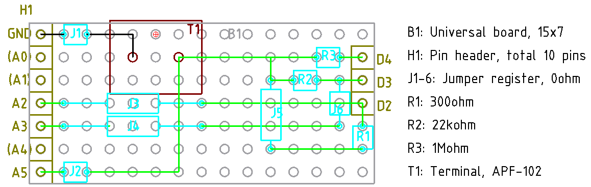
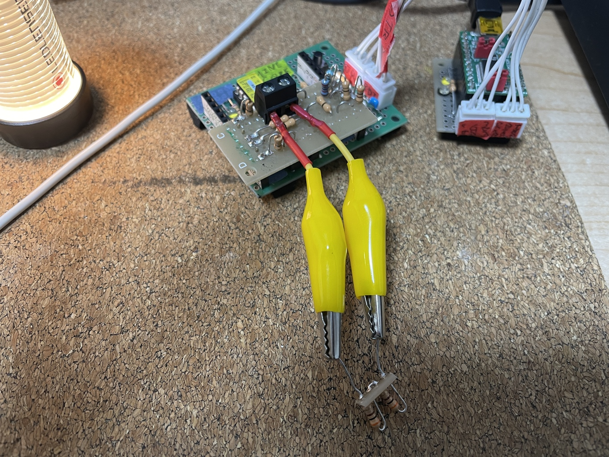
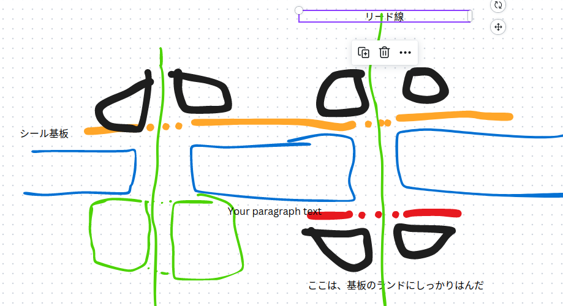
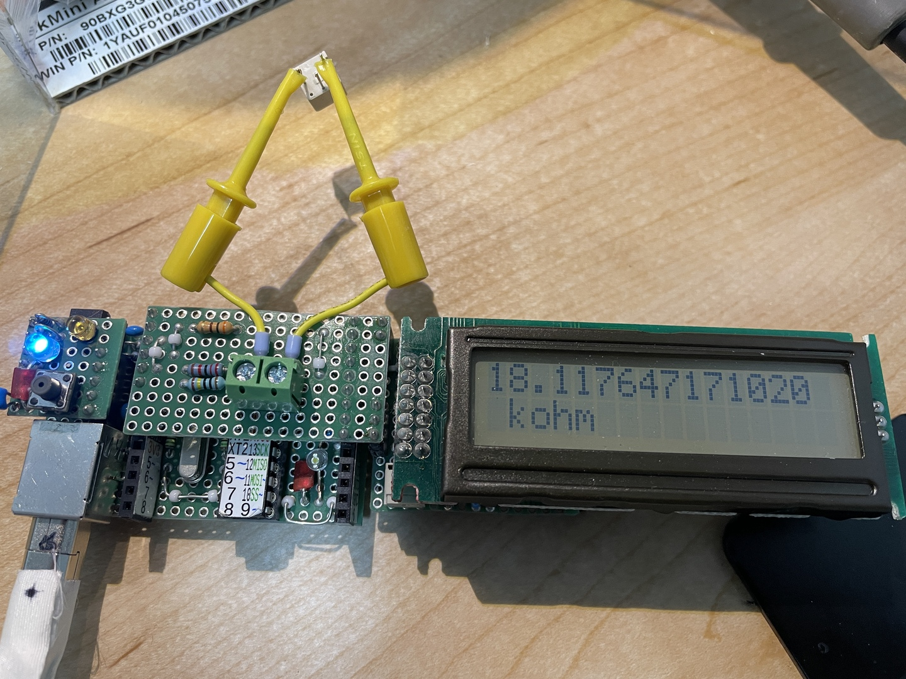
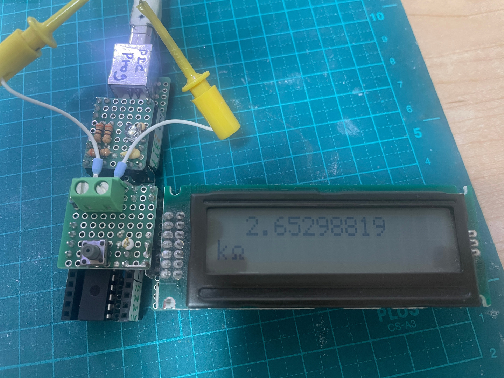

# 抵抗計

# version 1.0 没

<!-- {{{ -->
静電容量計が思いの他便利だったので、

[静電容量計](./../CondenserMeasure/抵抗自動選択式の開発.md)

抵抗計も作ってみることにした。とてもじゃないけどカラー
コードを覚えられないし、毎回カラーコードを読むのも老眼にはつらい。

原理は、単純に直列して、電圧を測定して、抵抗を逆算するだけ。

VCC - R0 - R1 - GND で R1-GND の電圧を V1 とすれば

V1/VCC = R1/(R0+R1)

... R1 = R0 V1 / (VCC - V1 )

a を 8ビット DAC の読取値とすると

a = V1/VCC * 1023

... V1 = a VCC / 1023

... R1 = R0 a / (1023-a)

となる。

8ビット ADC なので、上下 100ずつを除いた範囲で利用することを考えると、手持ちの抵抗では次の
ようになる。

| R0 [Ω] | R1 [Ω] | a |
| ---     | ---     | --- |
| 300     | 47      | 139 |
| 300     | 2.2k    | 900 |
| 22k     | 4.7k    | 180 |
| 22k     | 100k    | 839 |
| 1M      | 220k    | 184 |
| 1M      | 4.7M    | 844 |

MΩなんて静電容量計でしか使わないので、まあ十分だろう。

## 回路図

こちら

[回路図 v1.0](./kicad/RegisterMeter_1.0/RegisterMeter_1.0.pdf)

| Reference | Value      | 数量 | 
| --------- | ---------- | ---- | 
| R1        | 300        | 1    | 
| R2        | 22k        | 1    | 
| R3        | 1M         | 1    | 
| R4        | R          | 1    | 
| U1        | ATmega328P | 1    | 

ピンの選択は ASOBoard 用シールドに都合の良いものを選んだ。応答速度はのんびりで良いのでレジ
スタ操作の都合は考えなくて良い。

## ブレボでテスト

以下の抵抗をテストした結果。まずまずだけど 300Ωを参照した場合の結果がいまいち、やたらと低
い。

| テストした抵抗 [Ω] | 結果 [Ω] |
| --------------      | -------   |
| 2k                  | 1.89k     |
| 100M                | 92M       |
| 300                 | 278       |
| 75                  | 69        |
| 210k                | 206k      |
| 600                 | 560       |
| 100k                | 100k      |
| 3k                  | 2.92k     |

300Ω で 75Ωを測定しているときに D2 を A4 に差してみたところ analogRead() は 966 となった。
1023 からかなり下っている。

これだな。出力ピンの電圧も測って、その比率とする必要があるな。

ていうか、これだと静電容量計も 300Ωを使う結果はかなり怪しそうだな。まあ大きなコンデンサは
容量が数字でプリントしてあるから、故障だけ判断できれば良いんだけど。
<!-- }}} -->

# ver 1.1
<!-- {{{ -->
v1.0 を改良。

## 回路図

PDF はこちら

[回路図 1.1](./kicad/RegisterMeter_1.1/RegisterMeter_1.1.pdf)

| Reference | Value      | 数量 | 
| --------- | ---------- | ---- | 
| R1        | 300        | 1    | 
| R2        | 22k        | 1    | 
| R3        | 1M         | 1    | 
| R4        | R          | 1    | 
| U1        | ATmega328P | 1    | 

## ソース

[ソース 1.1](./arduino/RegisterMeter_1.1/RegisterMeter_1.1.ino)

## テスト結果

| テストした抵抗 [Ω] | 結果 [Ω] |
| --------------      | -------   |
| 2k                  | 2.0k      |
| 100M                | 112M      |
| 300                 | 296       |
| 75                  | 79        |
| 210k                | 206k      |
| 600                 | 600       |
| 100k                | 100k      |
| 3k                  | 2.9k      |

なかなか良好だけど、実は一つ良く分からずに苦労したところがあった。1MΩ以外からの給電のと
きは analogRead を出力ピン電圧、測定対象抵抗電圧の順番で問題がないのだけど、1MΩのときだ
け、順番を逆にしないと、測定対象の抵抗の電圧の値がおかしくなってしまう。

というか、もう電圧の降下はないから、わざわざ測るのをやめることにした。

一応自分を納得させるための解釈としては、普通は回路とマイコンだとマイコンの抵抗が十分に大き
いので、回路から余計な電荷が流れ困なかったり、利用した電荷を回路に返したりできるのだけど、
回路の抵抗が大きくなってくると、回路から余計な電荷が来てしまったり、返そうとしても返せなく
て、マイコン内の行きやすいところに行ってしまう。そのように自分を納得させることにした。

## 設計図

テストで 1MΩの A4 での analogRead() はむしろシステムに悪影響だったから、省いている。



## 成果物



反省点:

- 現物のピン配置に合わせて回路図も変更するべきだった。ソースは ```#define``` で簡単に変更
  できるようにしてあったのだから、こんなにジャンパー抵抗で飛ぶ必要はない。さぼったつもりが、
  作業に思ったよりも手間取った。
  - 制作が最後だから、さぼったが、ハードをソフトに合わせるより、ソフトをハードに合わせるべ
    きだろう。名前の通り、柔軟なのが長所なのだから。

良かった所:

- 片面基板でもかなりしっかりピンヘッダを部品面に取り付けることができる方法を開発できた。
  - このように、ピンヘッダの一つ手前のホールにしっかりとリード線をはんだし、そのリード線に
    シール基板を介してピンヘッダをはんだすることで、かなりしっかりと取り付けることができた。


<!-- }}} -->

# ver 2.0

SHARP の LCD [LM162AT1](../LM162AT1_SharpLCD/) の I2C 版で結果表示できるようにしてみる。A5
が使われているが、これは I2C に必要なので A1 に持っていくことにする。他は面倒だから極力触
らない。

[回路図 2.0](./v2.0/RegisterMeter_2.0/RegisterMeter_2.0.pdf)

[設計図 2.0](./v2.0/RegisterMeter2.0.pdf)

部品表
| 記号 | 品番、品目 | 個数 |
| --- | --- | --- |
| PH1 | ピンヘッダ 3P | 1 |
| PH2 | ピンヘッダ 2P | 1 |
| PH3 | ピンヘッダ 9P | 1 |
| PH4 | ピンヘッダ 6P | 1 |
| R1 | 300Ω | 1 |
| R2 | 22kΩ | 1 |
| R3 | 1MΩ | 1 |
| T1 | 端子台 2P | 1 |
| UB1 | ユニバーサル基板 17x9P | 1 | 
| | ジャンパ線 | 適量 |

[ソース](./v2.0/arduino/RegisterMeter_2.0/)



# v3.0 (制作せず)
<!-- {{{ -->
AVR64DD28 で考えてみる。ADC は 12bit。ピンの電流は 50mA が上限。となると最小の抵抗は 220Ω。

測定抵抗 を R、基準抵抗を RB とすると ADC=R/(R+RB)*2^12 となる。ピン出力電圧が差がらなけれ
ばだが。

ADC は Absolute error が 4LSb つまり 16。抵抗の値を知りたいのではなく動作確認なので 20% く
らいのエラーは上等。と考えると ADC の読みで下は 160, 上は 3935 くらいあれば十分ということ
になる。

| 測定抵抗 [Ω] | 基準抵抗 [Ω] | ADC  | コメント                                     |
| ---           | ---           | ---  | ---                                          |
| 1             | 220           | 19   | 存在は確認できる                             |
| 2.2           | 220           | 41   | 1Ωでも 4.7Ωでもないことは確認できる        |
| 4.7           | 220           | 86   |                                              |
| 10            | 220           | 178  |                                              |
| 1k            | 220           | 3357 |                                              |
| 2.2k          | 220           | 3724 |                                              |
| 4.7k          | 220           | 3913 | 電圧降下の問題もあるし、ここが切替え時だろう |
| 4.7k          | 100k          | 184  | ここからは 100kΩ                            |
| 1M            | 100k          | 3724 |                                              |
| 10M           | 100k          | 3918 | 4.7M でも 22M でもないことは確認できる       |
| 22M           | 100k          | 4077 | 断線していないことは確認できる               |

こんな感じで、なんとか 1~22M までの確認はできそうだ。そもそも値の分かっている小分け袋から
出すので。47MΩになると、断線してるのか抵抗なのか判定はできないが、使う機会はないだろう。
<!-- }}} -->

# v4.0 (設計図で大ミス)

PIC18F27Q43 で制作を考えてみる。v3.0 のときに 22MΩまで測れるとか考えていたけど、そもそも
マイコン中心の電子工作で 22MΩとか使わない。使っても思うような動作はしない。すごい抵抗を使
えばすごい小さいコンデンサでも時定数が測れるとか思ってたけど、そもそも全然まともに動作しな
かった。せいぜいプルアップ抵抗の 100kΩで十分。100kΩも残ってるから使ってるだけで 10kΩと
かで十分。

小さい方はマイコン系だと、せいぜい 220Ωが分かれば良い。25mA くらいしかピンに流せないので。
充電池を作るときに 1Ωを使ったり、チップ LED をビカビカ光らせるのに 10Ωとか使ったけど。

まあ小さすぎたり大きすぎたりして上手く測れないものは、普通にテスター使えば良いでしょう。

基準抵抗 1kΩのときの ADC の値はこうなる。この並びで

```
電力ピン --- 基準抵抗 --- 測定抵抗 --- GND
```

| 測定抵抗 | ADC |
| ---      | --- |
|0	 | 	0 |
|1	 | 	4 |
|2.2	 | 	9 |
|4.7	 | 	19 |
|10	 | 	41 |
|22	 | 	88 |
|47	 | 	184 |
|100	 | 	372 |
|220	 | 	738 |
|470	 | 	1309 |
|1k	 | 	2048 |
|2.2k	 | 	2815 |
|4.7k	 | 	3377 |
|10k	 | 	3723 |
|22k	 | 	3917 |
|47k	 | 	4010 |
|100k	 | 	4054 |
|220k	 | 	4076 |
|470k	 | 	4086 |
|1M	 | 	4091 |
|2.2M	 | 	4093 |
|4.7M	 | 	4094 |
|1.00E+07	 | 	4095 |
|2.20E+07	 | 	4095 |
|4.70E+07	 | 	4095 |
|1.00E+08	 | 	4095  |

まあまあじゃないかな。

[回路図](./v4.0/RMeter4.0/RMeter4.0.pdf)

[設計図](./v4.0/RMeter4.0.pdf)

部品表

| 記号 | 品目、品名 | 個数 |
| --- | --- | --- |
| B1 | ユニバーサル基板 9x9P | 1 |
| H1-3 | ピンヘッダ 1P | 3 |
| H4-6 | ピンヘッダ 2P | 3 |
| H7 | ピンヘッダ 4P | 1 |
| R1 | 1kΩ | 1 |
| SW1 | タクトスイッチ | 1 |
| T1 | 端子台 2P | 1 |
| T2 | チェック端子 | 1 |

失敗
- LCD の VDD と GND を上下逆にしてしまっている
  - 作成後に気が付き、ナイフでパターンを切って、ジャンパ線で繋ぎ変えた。
- 端子台が PIC プログラマに近すぎて、プログラマを後から嵌める場合、干渉する
  - 端子台に挿しているフェルール端子を上に曲げて干渉を逃れた
  - もう一列下げたほうが、多分良い

成功
- リセットボタンが押しやすい
- なんか速い
  - LCD 部分をデータシート見ながら自分でタイミングとか考えて wait 決めたからかな


