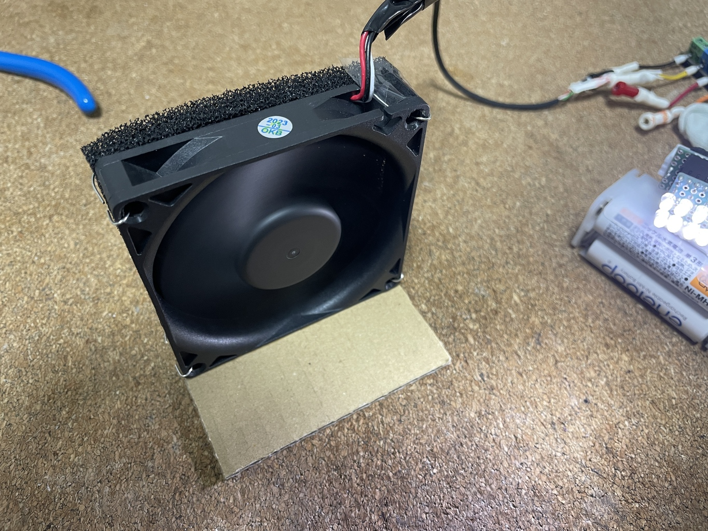

# はんだ吸塵機の DIY

こちらが完成品

材料

| 素材                     | コメント                                                             |
| ---                      | ---                                                                  |
| ケースファン             | どこのご家庭にもある                                                 |
| 段ボール                 | ファンを倒れないようにできるものであればなんでも良い                 |
| 接着剤                   | 段ボールとファンを固定する                                           |
| SS-10F Goot 替えフィルタ | フィルタに詳しくないので、これは本家。フィルタに詳しい人なら他もあり | 
| スズメッキ線             | フィルタをファンにくくりつける。他でも良い                           |
| 適当な配線、コネクタ     | 電源に継ぐためのもの。手持ちの電源に合わせれば良い                   |
| 12V DC 電源              | どこのご家庭にもある                                                 |

80mm, 2000RPM のファンだけど 10cm 程度のとこなら十分吸う。このままでも十分な感じだが、大き
くして、吸い込み力を上げても良いけど、エネループで作動するようにしてモバイル化するのも良さ
そうな気がする。
