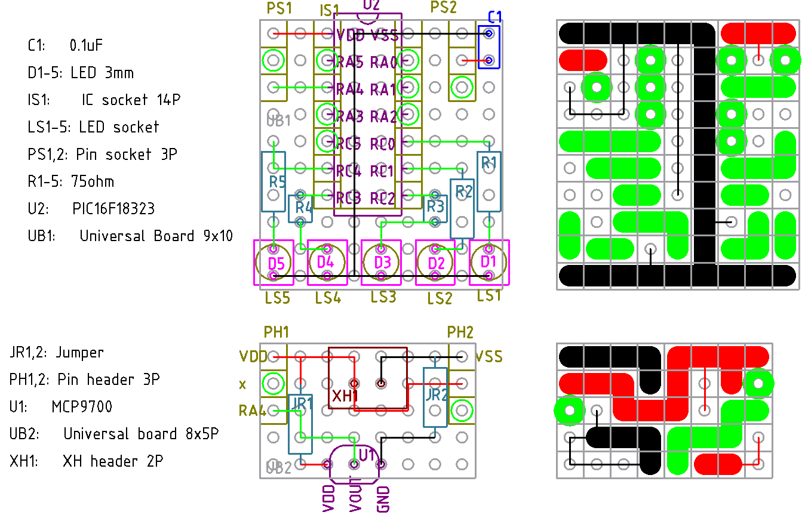

# 概要

MCP9700 の使い方は
[こちら](../../sensor/temperature/MCP9700/README.md)
。

そこでは PIC16F1455 を使っているが USB 機能がある必要がないので、

- ピン本数 14本
  - VDD, VSS, MCLR, センサー入力, LED x5 の 9本で良いが、10本の PIC は無いので
  - MCLR に IO ピンを割り当てれば 8本で良いが、プログラミングに支障とか出てほしくないので
    触らないことにしている
- ADC が 1.024V の内蔵参照電圧を使える

という要件で PIC16F18323 の選定となった。データシートはこちら

https://x.gd/AGjOI

LED 5個で温度を表示する。0~31℃までとなる。室温が 30℃を超えてはならないので 31℃までの表
示で問題ない。

# V1.0

回路図は概要のところの回路図のまま(PIC の型番は代わるけどピン配置は同じ)。LED 抵抗は余りま
くって使い道のない 75Ωとする。ASOBoard のように作業するわけではないので、多少眩しくても問
題ない。実測で 5V 駆動のときに 3.1V, 3.3V 駆動で 2.9V。詳細が不明だが DC3.6V, 20mA と書い
てあるので、おそらく定格が 3.6V だから、まあ大丈夫だろう。

部品表

| 記号  | 品名、品目                                           | 個数  |
| ---   | ---                                                  | ---   |
| C1    | C 0.1uF                                              | 1     |
| D1-5  | LED 3mm                                              | 5     |
| IS1   | IC ソケット 14P                                      | 1     |
| LS1-5 | LED ソケット                                         | 5     |
| PS1,2 | ピンソケット 3P                                      | 2     |
| R1-5  | R 75Ω                                               | 5     |
| U2    | PIC16F18323                                          | 1     |
| UB1   | ユニバーサル基板 9x10                                | 1     |
| ---   | ---                                                  | ---   |
| JR1,2 | ジャンパ抵抗など                                     | 2     |
| PH1,2 | ピンヘッダ 3P                                        | 2     |
| U1    | MCP9700                                              | 1     |
| UB2   | ユニバーサル基板 8x5                                 | 1     |
| XH1   | XH ヘッダ 2P                                         | 1     |
| ---   | ---                                                  | ---   |
|       | XH ハウジング 2P                                     | 1     |
|       | XH コンタクト                                        | 2     |
|       | ケーブル AWG24 程度                                  | 2     |
|       | フェルール端子                                       | 2     |

[ソース](./src/main.c)

完成品。これは 24℃。

