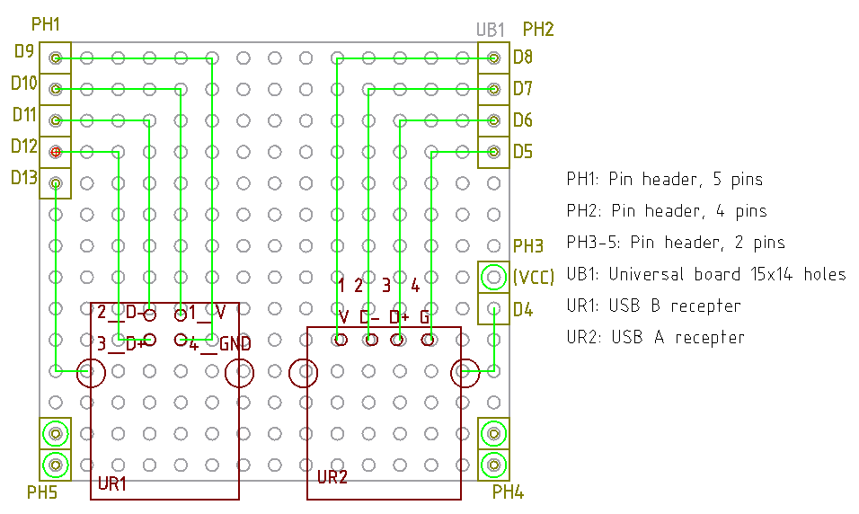

# A-B checker ver 1.0

回路図

[回路図](./kicad/A-B_checker_1.0/A-B_checker_1.0.pdf)

なんか物理的な配置と回路図は、わざと変化させて混乱させなくてはならないみたいな決まりでもあ
るのだろうか。。。

ソース

[ソース](./arduino/A-B_checker/A-B_checker.ino)

シールド設計図

部品表

| 設計図記号 | 部品                     | 個数 | メーカー |
| ---------  | ----                     | ---- | ---      |
| PH1        | ピンヘッダ 5極           | 1    | ヒロスギ |
| PH2        | ピンヘッダ 4極           | 1    | ヒロスギ |
| PH3-5      | ピンヘッダ 2極           | 3    | ヒロスギ |
| UB1        | ユニバーサル基板 15x14穴 | 1    | 矢島     |
| UR1        | USB B メス               | 1    | オムロン |
| UR2        | USB A メス               | 1    | オムロン |

