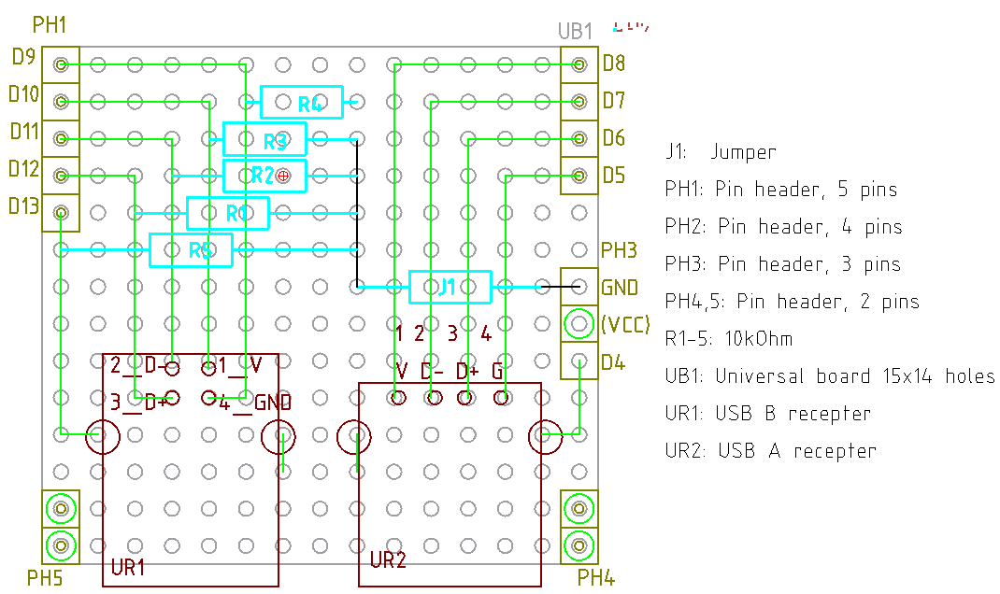

# A-B checker ver 1.0

回路図

[回路図](./kicad/A-B_checker_1.0/A-B_checker_1.0.pdf)

なんか物理的な配置と回路図は、わざと変化させて混乱させなくてはならないみたいな決まりでもあ
るのだろうか。。。

ソース

[ソース](./arduino/A-B_checker/A-B_checker.ino)

シールド設計図


部品表

| 設計図記号 | 部品                     | 個数 | メーカー |
| ---------  | ----                     | ---- | ---      |
| PH1        | ピンヘッダ 5極           | 1    | ヒロスギ |
| PH2        | ピンヘッダ 4極           | 1    | ヒロスギ |
| PH3-5      | ピンヘッダ 2極           | 3    | ヒロスギ |
| UB1        | ユニバーサル基板 15x14穴 | 1    | 矢島     |
| UR1        | USB B メス               | 1    | オムロン |
| UR2        | USB A メス               | 1    | オムロン |

実装してみたが digitalRead() が誤反応してしまう。

```
VA-VB: OK
D-A-D-B: OK
D+A-D+B: OK
GNDA-GNDB: OK
ShiledA-VB: ERR, wrongly connected
ShieldA-D-B: ERR, wrongly connected
ShieldA-D+B: ERR, wrongly connected
Shiled: Yes
Shiled is grounded in the cable
```

GND と B 側の配線を抵抗でつなぐと誤検知はなくなるので、プルダウン抵抗が必要になる。上手く
行っている方がたまたま。

# A-B checker ver 1.1

感覚としてなかなか自分のものにできないプルダウン抵抗あり版



部品表

| 設計図記号 | 部品                     | 個数 | メーカー |
| ---------  | ----                     | ---- | ---      |
| J1         | 抵抗型ジャンパ           | 1    | Faithfull Link |
| PH1        | ピンヘッダ 5極           | 1    | ヒロスギ |
| PH2        | ピンヘッダ 4極           | 1    | ヒロスギ |
| PH3        | ピンヘッダ 3極           | 1    | ヒロスギ |
| PH4,5      | ピンヘッダ 2極           | 1    | ヒロスギ |
| R1-5       | 10kΩ 抵抗               | 5    | Faithfull Link |
| UB1        | ユニバーサル基板 15x14穴 | 1    | 矢島     |
| UR1        | USB B メス               | 1    | オムロン |
| UR2        | USB A メス               | 1    | オムロン |

```
Plug in a USB cable. Enter to start check
VA-VB: OK
D-A-D-B: OK
D+A-D+B: OK
GNDA-GNDB: OK
Shiled: Yes
```

OK!
