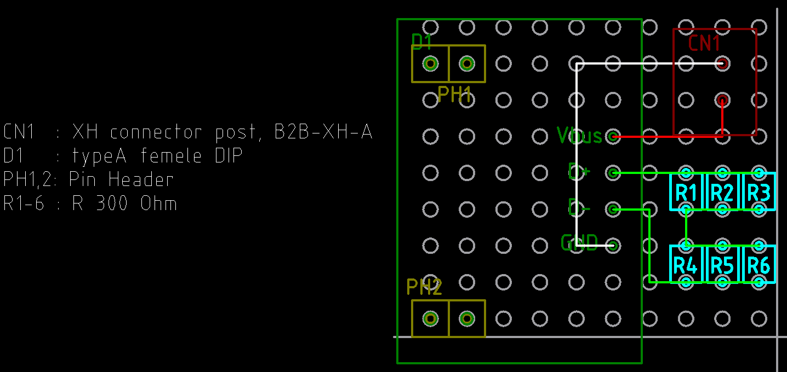

# USB チャージャーを自作できないか

## 規格

参考は

https://kohju.justplayer.com/SmartPhoneTips_power_usbcurrent.html

おそらく参照先は

https://usb.org/sites/default/files/USB_Battery_Charging_1.2.pdf

とりあえず分かったこと

* D-, D+ の 200Ωは 200Ωで決め打ち

## テスト

手持ちに 300Ωがあったので 3並列を 2直列して 200Ωとして、テストしてみたところ、Android ス
マホ、LED ランタン、iPhoneSE と充電できたので大丈夫そう。

## 実装

設計図

| デバイス | 電流 |
| -------  | ---  |
| Android  | 1.5A |
| iPhone   | 1.0A |
| LED ランタン | 0.5A |

USB2.0 の規格は 0.5A なので、急速充電対応デバイスに対して急速充電ができた。

Android

iPhone (カメラ使いながら充電)

LED ランタン

## いつかの参考に

PD チャージャーの規格らしい

https://www.usb.org/document-library/usb-power-delivery

