# データシート

https://aitendo3.sakura.ne.jp/aitendo_data/product_img/ic/inteface/GL850G/GL850G-HHY22.PDF

# 参考回路

MA8601 と違い Genesys Logic が作成したと思われる回路図がある。

https://fccid.io/R7IKT-UH406/Schematics/SCHEMATICS-1907737.pdf

https://x.gd/srPtItY

どちらもほぼ同じに見えるので、どちらでも良さそう。

# 1回目の挑戦
<!-- {{{ -->

## 回路の研究

OVCUR1# は VCC 5V から抵抗で 3V くらいを作って High の入力をしている。そしてヒューズが切れ
ると Low になるということのようだ。これはもしブレボでのテストをパスしたら採用してみよう。

ちなみに GANG モードを利用なので OVCUR2# は未使用。PGANG は 3.3V に 100kΩで プルアップさ
れている。100kΩはデータシートの指定

PSELF のところはややこしいので

https://www.falstad.com/circuit/circuitjs.html

でのシミュレーションをしてみた。

[PSELF テスト](./GL850G/GL850G_PSELF_sim.txt)

するとバスパワーのときは PSELF=LOW, セルフのときは HIGH となることが分かった。ただし IC 自
体に電流を感知する仕組みはないので、low, high でどう挙動が変わるのか、想像が付かない。High
または Low のままで、不都合があるのか調べてみたい。あと 5V 入力はぎりぎりなのでどうなのか
と言う気はしている。

PREF の 680Ωもデータシートの指定。1kΩとかで作ってくれよ。

TEST は Option のところを使わないので未使用になる。データシートによると Internal pull down
となっているので、こちらから積極的にプルダウンする必要はないはず。

PWREN は Option のところを使わないので未使用だが、もともと電源が入ってるかの出力ピンなので
使わない。

### AVDD のところの検討

良く分からないのだが AVDD にはコイルを入れてあり DVDD には入れていない。矛盾しない理由とし
てはデジタル回路 DVDD は High, Low だけなんとかなれば良いから電源電圧がブレても問題ないが、
アナログ回路 AVDD はきっちり電源を出したいというところだろうか。電圧がブレるということは内
蔵レギュレータはスイッチング方式なのかもしれない。

そう思って 

https://www.falstad.com/circuit/circuitjs.html

でテストしてみた。スイッチングを模擬するため 100kHz の三角波を電源、データシートの Table
6.6 のよると、この IC には 50mA 程度の電流が流れるみたいなので 3.3V/50mA=66Ωということで、
模擬してみた。

[モデルファイル](./GL850G/AVDD_test.txt)


結果として、何もしないのが一番となった。もしかしたらだが、Spice 系のソフトには、定常状態で
計算を開始するものがあり（この場合、コイルに 50mA 程度の電流とコンデンサに 3.3V が掛かって
いる状態からスタート)、その場合は電圧のオーバーシュートは起きずにきれいに減衰していく。そ
れを見て効果ありと判断したのではないだろうか。
けない方が良さそう。


もちろんこのシミュレーションは理想回路のシミュレーションでいきなり電圧が 0V から 3.3V まで
立ち上がったりするから、そこまで大きなオーバーシュートはないのかもしれないが、作動電圧が最
大 3.6V なので、やはりコイルを入れる気にはならない。もし入れるならダイオードは必須であろう。

例えば、このようにコイルを入れていない人もいる。

https://github.com/RyanDam/TinyUSBHub

あとノイズということで 48MHz のパルス波を与えてみたんだけど、コイル付けるならコンデンサ付
けない方が効果ありそう。


またデータシート 6.6 に

  The 3.3V power output is guaranteed by an internal voltage reference
  circuit to prevent unstable 5V power compromise USB data integrity. 

と、「この3.3V」を使えば USB のデータがおかしくなることはない、と言いきっており、それなら
ばそのまま使えば良いのではないだろうか。

おそらく、V5, GND 接続だけでレギュレータは動くだろうから、一応オシロで見てみて、定格範囲を
飛び出したりしてなければ、そのまま行こうと思う。

## テスト用回路図, 1.0, バスパワー

[バスパワー用テスト回路 1.0](./GL850G/kicad/GL850G_1.0/GL850G_1.0.pdf)

部品表

| 記号  | 品目                                          | 個数  |
| ---   | ---                                           | ---   |
| C1,2  | C, 15pF                                       | 2     |
| C3,4  | C, 0.1uF                                      | 2     |
| C5    | 電解コンデンサ 100uF台                        | 1     |
| J1    | USB A メスコネクタ                            | 1     |
| J2    | USB B メスコネクタ                            | 1     |
| R1    | R 680Ω                                       | 1     |
| R2,5  | R 10kΩ                                       | 2     |
| R3    | R 47kΩ                                       | 1     |
| R4    | R 100kΩ                                      | 1     |
| R6    | R 22kΩ                                       | 1     |
| U1    | GL850G                                        | 1     |
| Y1    | クリスタル 12MHz                              | 1     |

## テスト 1.0

### 基本動作まで

R3 47kΩを買っていなかったため 56kΩで代用している。

まず、ホストのみの接続で、ハブとして認識。

```dmesg
[ 5047.830338] usb 3-1.2: new full-speed USB device number 12 using xhci_hcd
[ 5047.993667] usb 3-1.2: new high-speed USB device number 13 using xhci_hcd
[ 5048.086130] usb 3-1.2: New USB device found, idVendor=05e3, idProduct=0608, bcdDevice=85.38
[ 5048.086132] usb 3-1.2: New USB device strings: Mfr=0, Product=1, SerialNumber=0
[ 5048.086134] usb 3-1.2: Product: USB2.0 Hub
[ 5048.134279] hub 3-1.2:1.0: USB hub found
[ 5048.134747] hub 3-1.2:1.0: 4 ports detected
```

でポート1 にキーボード差してみたところ、電力不足で拒否。

```dmesg
[ 5471.767012] usb 3-1.2.1: new full-speed USB device number 16 using xhci_hcd
[ 5471.877012] usb 3-1.2.1: New USB device found, idVendor=2efd, idProduct=7812,
bcdDevice= 2.10
[ 5471.877014] usb 3-1.2.1: New USB device strings: Mfr=1, Product=2, SerialNumber=0
[ 5471.877016] usb 3-1.2.1: Product: USB Keyboard
[ 5471.877018] usb 3-1.2.1: Manufacturer: SONiX
[ 5471.877086] usb 3-1.2.1: rejected 1 configuration due to insufficient available bus
power
[ 5471.877088] usb 3-1.2.1: no configuration chosen from 1 choice
```

念の為、キーボードを直接差すと動くので、電力が足りてないはずはない。また OVCUR1 には 3.8V
入っており、これが妨げになっているはずはない。

PGANG が 1.8V まで下っている。抵抗手前で 3.3V 出ているので、PGANG が 1.8V を出力していると
いうことになるんだが、正解が分からない。

とりあえず PSELF を 5V に直接差すとなぜか認識して文字も打てた。PGANG は変わらないから問題
なかったようだ。

```dmesg
[ 7083.550387] usb 3-1.2.1: new full-speed USB device number 30 using xhci_hcd
[ 7083.660085] usb 3-1.2.1: New USB device found, idVendor=2efd, idProduct=7812,
bcdDevice= 2.10
[ 7083.660089] usb 3-1.2.1: New USB device strings: Mfr=1, Product=2, SerialNumber=0
[ 7083.660091] usb 3-1.2.1: Product: USB Keyboard
[ 7083.660092] usb 3-1.2.1: Manufacturer: SONiX
[ 7083.702198] input: SONiX USB Keyboard as /devices/pci0000:00/0000:00:08.1/0000:05:
00.3/usb3/3-1/3-1.2/3-1.2.1/3-1.2.1:1.0/0003:2EFD:7812.0006/input/input19
[ 7083.757179] hid-generic 0003:2EFD:7812.0006: input,hidraw4: USB HID v1.11 Keyboard
[SONiX USB Keyboard] on usb-0000:05:00.3-1.2.1/input0
```

5V 直は嫌な感じなので 3.3V に差してみる。これでも動作したので PSELF は 3.3V 差しで決定で良
いだろう。良く知らないけど USB の階層とか関係するのかな。

機材が足りてないので、あくまで 1ポート毎の動作だが、とりあえず全ポートが動作。

とりあえず、基本的な動作ができたので、あとは疑問に思っていたところのテスト

### 3.3V ラインはどうなのか

動いた後で今さらだけど、3.3V は何も必要なかったし、オシロで見てみたけど十分安定しているよ
うに見える。

### RST ラインの R, C の必要性

R2 を省いて直接 3.3V に入れたら、

- 親機の抜き差し
- 子機の抜き差し
- PC 自体のリブート

どれも上手く動いた。

そのまま R3, C3 も省いたら

- 親機の抜き差し
- 子機の抜き差し
- PC 自体のリブート

どれも上手く動いた。おそらくだけど、物理的なリセットボタンとか付けるときに必要になってくる
のではないだろうか。

ということで RST は 3.3V 直結で良い。GND への接続は不要。

### OVCUR1 を 3.3V に継げられないのか？

3.3V に直結してみたら、

- 親機の抜き差し
- 子機の抜き差し
- PC 自体のリブート

どれも動いた。ということで OVCUR1 も 3.3V へ直結で良いと思う。

### セルフパワーテスト

最後に Nipron から 5V 供給してみたが、何も問題なく動作した。

## テストまとめ

- PSELF は 3.3V に差す必要がある。直差しで OK。
- RST は 3.3V 直結のみでも良い。
- OVCUR1 は 3.3V 直結で良い。
- セルフパワーにするための回路切り替えは不要

## 実装 v1.1

テストを 1.0 としていたので実装は 1.1 とする。

[実装回路図 1.1](./GL850G/kicad/GL850G_2.0/GL850G_2.0.pdf)

回路部品表

| 記号           | 詳細                                                    | 個数  |
| ---------------| ------------------------------------------------------  | ----  |
| C1             |15p                                                      | 1     |
| C2             |15pF                                                     |1      |
| C3             |0.1u                                                     |1      |
| C4             |100+u                                                    |1      |
| J1             |USB_B Female connector                                   |1      |
| J2-5           |USB_A femele connector                                   |4      |
| R1             |680                                                      |1      |
| R2             |100k                                                     |1      |
| SW1            |SW_SPDT                                                  |1      |
| U1             |GL850G                                                   |1      |
| Y1             | Crystal, 12MHz                                          |1      |

設計図

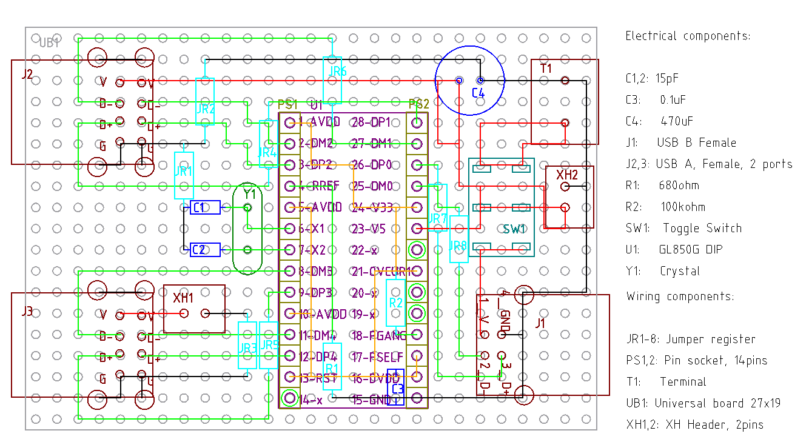

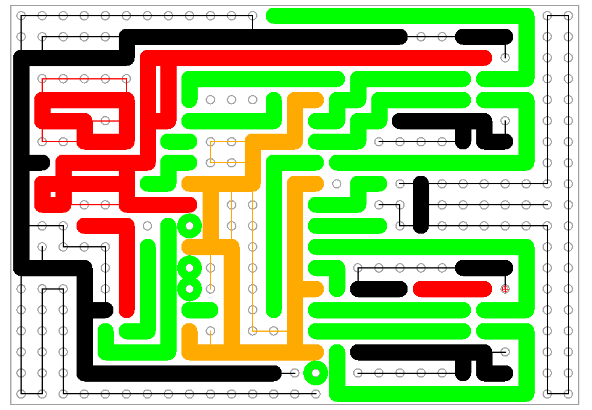

実装部品表

| 記号           | 詳細                                                    | 個数  |
| ---------------| ------------------------------------------------------  | ----  |
| JR1-8          | ジャンパ(図面は抵抗型だけでなんでも良い)                | 8     |
| PS1,2          | ピンソケット 14P                                        | 2     |
| T1             | ターミナル                                              | 1     |
| UB1            | ユニバーサル基板, 27x19 穴                              | 1     |
| XH1,2          | XH ヘッダ, 2P                                           | 2     |

忘れやすいケーブル類

| 詳細                                                    | 個数  |
| ------------------------------------------------------  | ----  |
| XH ハウジング 2P                                        | 2     |
| XH 端子                                                 | 4     |
| ケーブル (AWG24) 適当な長さ                             | 2     |

## 結果と反省 1.1

結果は、無事に動作。

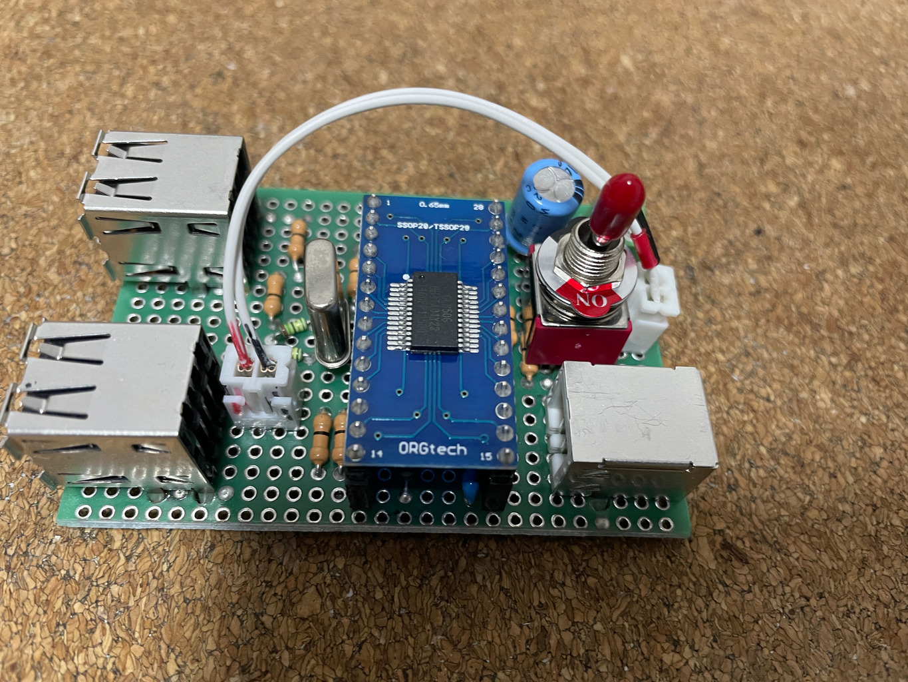

以下、反省

- タミヤのスイッチの寸法を間違えていて、XH コネクタに思い切り干渉して斜めにしてしまってい
  るし、ジャンパ抵抗 JR8 を思い切り踏み付けている。
- 十字配線基板に慣れ過ぎてしまい、なんとなくスイッチの接続部のみを、すずめっき線で繋いで完
  成した気になってしまったが、基板とも何らかの接続をしないと通電しないことに気がつくのに時
  間が掛かってしまった。
  - パネル用スイッチを基板に付ける方法は、何か別に考えたほうが良い
  - もしくは MosFET を活用すべきか。
- コンデンサ C1 とジャンパ抵抗 JR1 の穴が取り合いになってしまっている。幸い C1 を一つ下に
  ずらして無事に回避できた。
- 電源ラインを念の為強化しようと思っていたが、終ってからだと良く分からなくなったため、やっ
  ていない。
- 水晶とコンデンサを少し浮かすのに苦労したけど、サンハヤトのリードベンダでぽこってさせれば
  良かったのでは。
- USB のツメのはんだブリッジに一苦労。こうすれば上手くできるという確かなものがない。
<!-- }}} -->

# v2.0 
<!-- {{{ -->

スイッチのところだけど、そもそもバスパワーとセルフパワーをそんなに頻繁に使い分けることは無
いと思う。なので USB からの 5V, GND をターミナルにつなぎ、セルフが必要なときだけ Nipron の
5V, GND につなぎ替えれば、スイッチは不要となる。

常時ターミナルに差さる状況であるならスペース的に上から差したいと思ったが、上から差せる端子
台はそもそもサイズが大きいから、結局占有スペース的には無意味になってしまう。

JST の NV コネクタが良さそうとも思ったが、XH に慣れているせいか一見小さく見えるだけで実際
は結構な大きさだから普通の端子台で良いだろう。

回路図はスイッチのところが変更になるけど、まあ放置。

C1 も直して、強化ラインもあらかじめ決めておくことにした。

でテストしてるときに気が付いたのだが C3 を入れないと動かない。また 0.01u ~ 33UF まででの動
作を確認したが 22pF では動かなかった。これ、おそらく 3.3V レギュレータのの平滑コンデンサで、
大きければ良い類の物だと思う。前回 v1.0 が 0.1uF だったので今回は 1.0uF のセラコンにしてお
こう。大きいのでも良いのだが、スペースの都合もあるので。

テストしてみたところ LED で負荷を掛けると 1uF で非常に綺麗に平滑化された。フォルダには他の
パターンもあるので参考に。

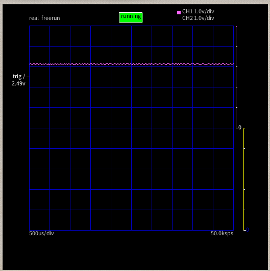

コンデンサ無し

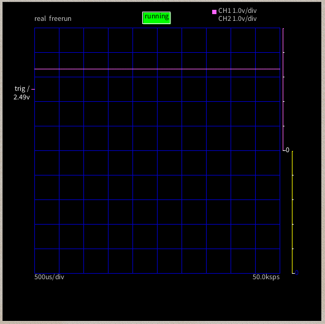

1uF 

[他のパターン](./GL850G/figure/3v3_test/)

ということで結局回路図も変更になる。

[回路図 v2.0](./GL850G/kicad/GL850G_2.0/GL850G_2.0.pdf)

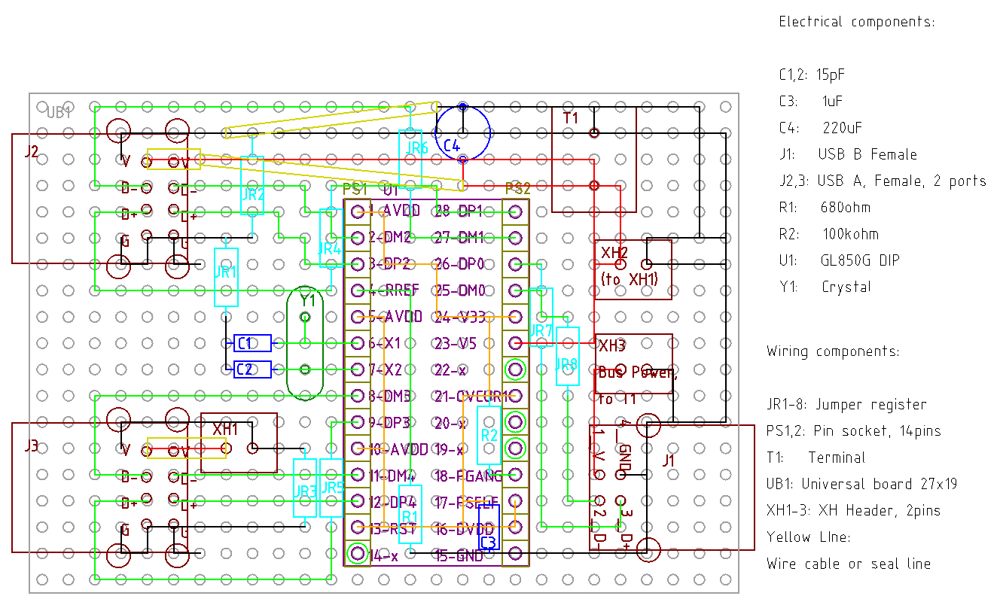

ここで黄色の線がサンハヤトの電源ライン用シール基板 (ICB-062) または、ケーブルで電源ライン
を補強する部分んである。

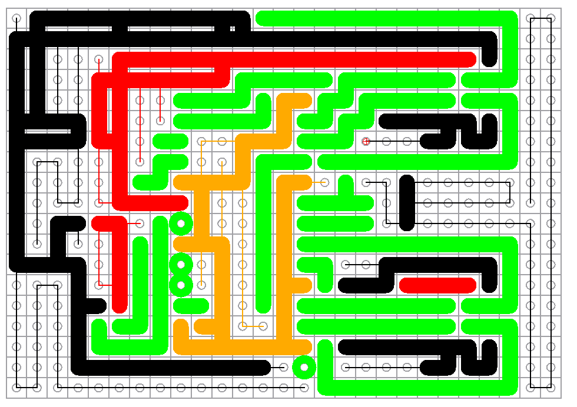

回路部品表

| 記号           | 詳細                                                    | 個数  |
| ---------------| ------------------------------------------------------  | ----  |
| C1,2           |15pF                                                     | 2     |
| C3             |1u                                                       |1      |
| C4             |220u                                                     |1      |
| J1             |USB_B Female connector                                   |1      |
| J2-5           |USB_A femele connector                                   |4      |
| R1             |680                                                      |1      |
| R2             |100k                                                     |1      |
| U1             |GL850G                                                   |1      |
| Y1             | Crystal, 12MHz                                          |1      |

実装部品表

| 記号           | 詳細                                                    | 個数  |
| ---------------| ------------------------------------------------------  | ----  |
| JR1-8          | ジャンパ(図面は抵抗型だけでなんでも良い)                | 8     |
| PS1,2          | ピンソケット 14P                                        | 2     |
| T1             | ターミナル                                              | 1     |
| UB1            | ユニバーサル基板, 27x19 穴                              | 1     |
| XH1-3          | XH ヘッダ, 2P                                           | 3     |
| -              | ICB-062 シール基板                                      | 適量  |
| -              | AWG24 あたりのケーブル                                  | 適量  |

忘れやすいケーブル類

| 詳細                                                    | 個数  |
| ------------------------------------------------------  | ----  |
| XH ハウジング 2P                                        | 3     |
| XH 端子                                                 | 6     |
| ケーブル (AWG24) 適当な長さ                             | 適量  |

完成品。問題は見当らず。


知見

- USB アダプタのブラケットは、近隣の穴にスズメッキ線をはんだしておいて、線を曲げてブラケッ
  とはんだしてみたとろ、ブリッジよりもはるかに簡単だった。固定強度も十分に感じる。
- 今までは、粘土で固定するとき、粘土に埋めるようにしていたが、それよりもテープの代わりに貼
  り付ける方が便利なことが分かった。テープと違い、形が自在なので、厚みのある部品の固定にも
  使いやすい。注意点はスルーホールの穴に掛らないようにすること。掛ると温度が上りにくくなり、
  はんだしにくくなる。 

## 改良

とりあえず 5V ラインにパスコンを入れていないのが心配になったので 1uF のセラコンを差し込ん
でおいた。
<!-- }}} -->

# v2.1: v2.0 の小型化
<!-- {{{ -->
順番が逆になっているが v3.2 の IC DIP 化基板の幅違い版で小型化できたので、こちらも出きると
思う。

ぼんやりと思い描いているやりかたは

- v3.2 の設計図の DIP 化基板の幅をこちらに合わせる
- クリスタル発振コンデンサ C1, C2 は DIP 化基板の下に入れる
- 実際の利用状況鑑みて、電源用端子は XH コネクタで十分。
- もしできれば、電源ラインをケーブル化して基板から浮かせることで小型化を測る。これは v3.2
  ではやっていない内容。ケーブル化は v3.0, v3.1 の両ボツ案で失敗してるので、やって良いのは
  電源ラインのみ。

とりあえず、横 2列、縦 1列小型化できた。

[設計図](./GL850G/librecad/GL850G_v2.1.pdf)

ジャンパの JR7 は外にはみ出すのではなくて、ジャンパ JR6 の上を通す。

右 1/3 を段重ねにするなどすれば、まだ接地面積は小さくできそうだけど、とりあえずやめておく。

部品表

| 記号           | 詳細                                                    | 個数  |
| ---------------| ------------------------------------------------------  | ----  |
| C1,2           |15pF                                                     | 2     |
| C3             |1u                                                       |1      |
| C4             |220u                                                     |1      |
| J1             |USB_B Female connector                                   |1      |
| J2,3           |USB_A femele connector, 2段                              |2      |
| JR1-10         | ジャンパ(として使えるもの)                              | 10    |
| PS1,2          | ピンソケット 14P                                        | 2     |
| R1             |680                                                      |1      |
| R2             |100k                                                     |1      |
| U1             |GL850G DIP                                               |1      |
| UB1            | ユニバーサル基板, 23x16 穴                              | 1     |
| Y1             | Crystal, 12MHz                                          |1      |
| XH1,2          | XH ヘッダー, 2P                                         | 2     |
| ---            | ---                                                     | ---   |
|                | XH ハウジング, 2P                                       | 2     |
|                | XH コンタクト                                           | 4     |
|                | ケーブル                                                | 2     |

完成品。左から v2.0, v3.2 そして今回の v2.1 と小さくできている。

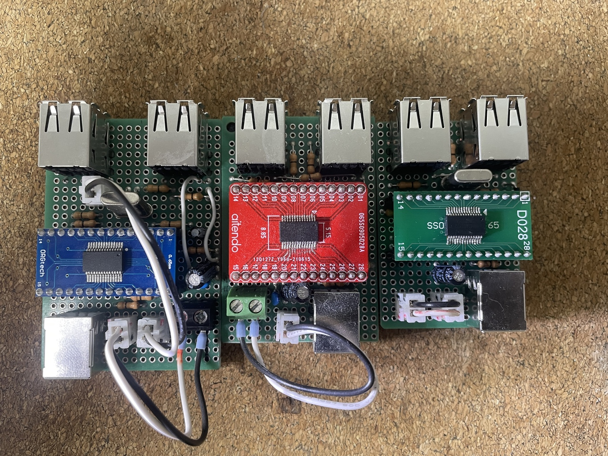
<!-- }}} -->

# v2.2 (制作しない)

思い付いたこと

- 段重ねすれば接地面積を減らせる
- GND 共通化すれば 3P の XH ヘッダー 1個で電源切り替えできる
-- バスパワーのときはヘッダーにジャンパを差し込む

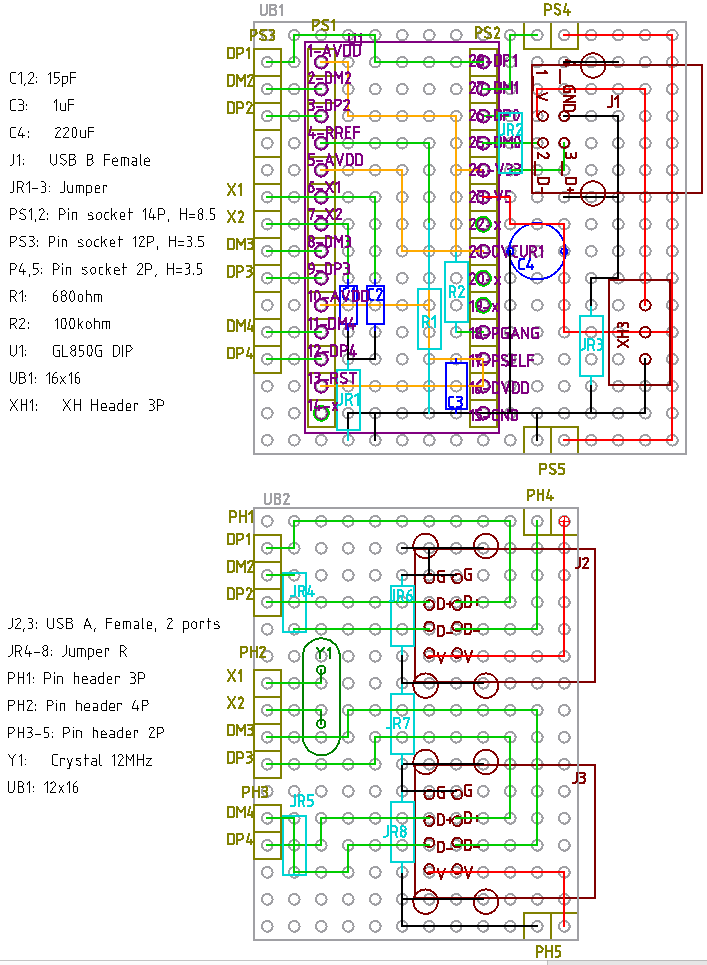

でもやらない。なんというか力ずくな感じが面白く感じないから。

# v2.3 左側を 180度折り返す

v2.2 が何となく気に入らなかったので、今回は左側を上に載せるのではなく、下に折り返すことに
してみた。どっちの面をどうやって置くかという問題はあるが、箱に詰め込むときにいろいろ試すこ
とにしてみる。

[設計図 v2.3](./GL850G/librecad/GL850G_v2.3.pdf)

5mm 高さくらいのピンヘッダーを直接はんだしても良いのだけど H=3.5mm のピンソケットがあるの
で使ってみる。ピンが少ないとぐらぐらするけど、これだけあれば大丈夫では。あと導通してない経
験があって不安だけど、良く考えたらフラックスが取り切れてなくて絶縁されてしまっていただけな
気がする。短いから全体がフラックスまみれになりやすいのかも。ということでとにかく挑戦してみ
よう。

部品表

| 記号   | 品目、型番等                                   | 個数  |
| ---    | ---                                            | ---   |
| C1,2   | セラコン 15pF                                  | 2     |
| C3     | セラコン 1uF                                   | 1     |
| C4     | ケミコン 220uF                                 | 1     |
| J1     | USB B コネクタ XM7B-0442                       | 1     |
| J2,3   | USB A 2段コネクタ  XM7A-0442-A                 | 2     |
| JR1-7  | ジャンパ抵抗など                               | 6     |
| PH1-6  | ピンヘッダ 2P                                  | 6     |
| PH7    | ピンヘッダ 3P                                  | 1     |
| PS1-2  | ピンソケット H=8.5 14P                         | 2     |
| PS3-6  | ピンソケット H=3.5 2P                          | 4     |
| PS7    | ピンソケット H=3.5 11P                         | 1     |
| R1     | 抵抗 680Ω                                     | 1     |
| R2     | 抵抗 100kΩ                                    | 1     |
| UB1    | ユニバーサル基板 15x16穴                       | 1     |
| UB2    | ユニバーサル基板 10x16穴                       | 1     |
| XH1    | XHP ヘッダ 3P                                  | 1     |
| Y1     | 水晶 12MHz                                     | 1     |
| ---    | ---------------------                          | ---   |
|        | 回路切り替えジャンパ                           | 1     |

完成したもの。腕時計と比べられるような大きさ (接地面積) に。USB A コネクタで結構しっかり立
つことができている。

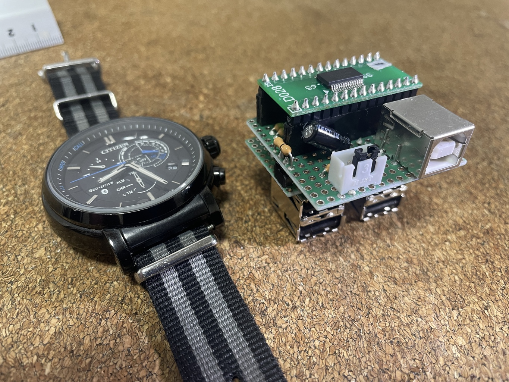

## 知見

- ジャンパ (JR3, JR4) よりも先にピンヘッダ (PH4, PH6) を付けないといけない。
- 基本的に先に表面にはんだして、後から裏面をはんだしたが、その方法だと上段のピンヘッダ PH5
  や、下段のピンソケット PS3 などが、はんだしにくい。
  - 基本的に表裏で順番を付けるよりも、背の低い順にはんだするのが、無難かなと思う。
- 段重ねのヘッダ、ソケットは、上段にできるだけ真っ直ぐヘッダをはんだして、下段はソケットを
  ヘッダに入れた状態で基板を段重ねしておいて、はんだしたところ、きれいにはんだできた。
  - H=5mm のヘッダを直接両方ともはんだすることも考えていたが、遊びがないので難しかったので
    は。
- ヘッダ、ソケットはフラックスのせいで接触不良を起こすこおが多い気がするので、追いフラック
  スはせずに、はんだの中のフラックスのみではんだして、よく洗浄してみたところ、ちゃんと全て
  の噛み合せで導通した。H=3.5mm のソケットもフラックスに気を配ればちゃんと導通しそうだ。
- 基板へのはんだは、320℃くらいの設定でちょうど良いが、USB コネクタのブラケットは 400℃
  くらいの設定で一気にはんだしたほうが、うまくできる。

# v2.4, v2.3 のジャンパ線部分の改修

v2.3 の JR3, JR4 がすっきりしないと言うか、うっかりピンヘッダよりも先に、ぴっちりはんだし
てしまうと、ピンヘッダを付けられなくなるのが嫌なので、このジャンパを回避したい。

また C5 付近で適当にコンデンサの在庫処分ができるようにしてある。

[設計図 v2.4](./GL850G/librecad/GL850G_v2.4.pdf)

部品表
| 記号   | 品目、型番等                                   | 個数  |
| ---    | ---                                            | ---   |
| B1     | ユニバーサル基板 15x16穴                       | 1     |
| B2     | ユニバーサル基板 10x16穴                       | 1     |
| C1,2   | セラコン 15pF                                  | 2     |
| C3     | セラコン 1uF                                   | 1     |
| C4     | ケミコン 220uF                                 | 1     |
| C5     | 在庫処分コンデンサ                             | 1~    |
| H1-5   | ピンヘッダ 2P H3                               | 5     |
| H6,7   | ピンヘッダ 3P H3                               | 2     |
| J1     | USB B コネクタ XM7B-0442                       | 1     |
| J2,3   | USB A 2段コネクタ  XM7A-0442-A                 | 2     |
| R1     | 抵抗 680Ω                                     | 1     |
| R2     | 抵抗 100kΩ                                    | 1     |
| S1-2   | ピンソケット H8.5 14P                          | 2     |
| S3-6   | ピンソケット H3.5 2P                           | 4     |
| S7     | ピンソケット H3.5 12P                          | 1     |
| X1     | XHP ポスト 3P                                  | 1     |
| Y1     | 水晶 12MHz                                     | 1     |
| 無し   | 回路切り替えジャンパ                           | 1     |

# v3.0 (没)

# v3.1 (没)

v3.0, v3.1 はケーブルを基板に直接はんだする設計を考えていたが、自分の 2D CAD 作画能力の限
界で何が描いてあるのか分からなくなってしまったので、やめた。

# v3.2
<!-- {{{ -->
結局 v2.0 をベースに v2.0 と同じ感じで設計することにした。また、どうせ今のところ大して電流
使わないし、実際にセルフパワーにする機会もないし、気にせず作ることにした。しょせん USB2.0
だし、本当に必要になったときに裏面をスズメッキ線なりシール基板なりで補強すれば良いでしょう。

クリスタルを折り畳んで DIP 下に配置するなどの工夫をした結果、v2.0 よりも接地面積を小さくす
ることが出きた。DIP を下から挿そうと考えていたが、そんな必要がなかった。

部品表

| 記号  | 詳細                      | 個数 |
| ---   | ---                       | ---  |
| C1,2  | C 15pF                    | 2    |
| C3    | C 1uF                     | 1    |
| C4    | C 220uF                   | 1    |
| J1    | USB B メスコネクタ        | 1    |
| J2,3  | USB A 二段メスコネクタ    | 2    |
| JR1-8 | ジャンパ R など           | 8(1) |
| PS1,2 | ピンソケット 14P          | 2    |
| R1    | R 680Ω                   | 1    |
| R2    | R 100kΩ                  | 1    |
| T1    | ターミナル 2P             | 1    |
| U1    | GL850G DIP                | 1    |
| UB1   | ユニバーサル基板 25x17P   | 1    |
| Y1    | クリスタル 12MHz          | 1    |
| XH1   | XH ヘッダ 2P              | 1    |
| ---   | ---                       | -    |
|       | XH ハウジング 2P          | 1    |
|       | XH コンタクト             | 2    |
|       | フェルール端子 径0.25mm^2 | 2    |
|       | AWG 24 ケーブル           | 2    |

1) 図面に記号入れ忘れている。DP0 ラインのところ。

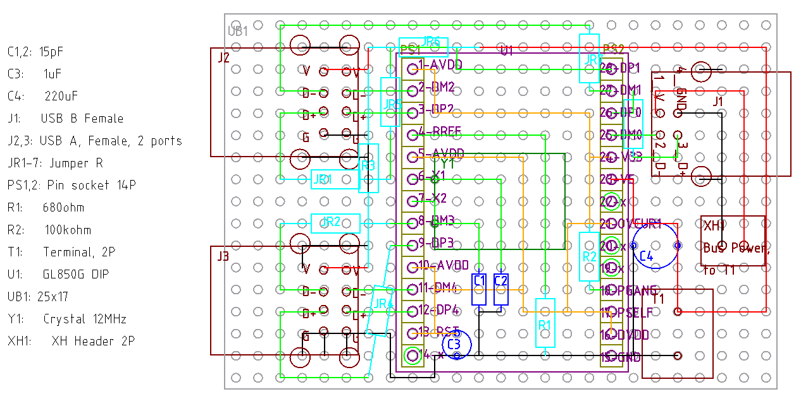

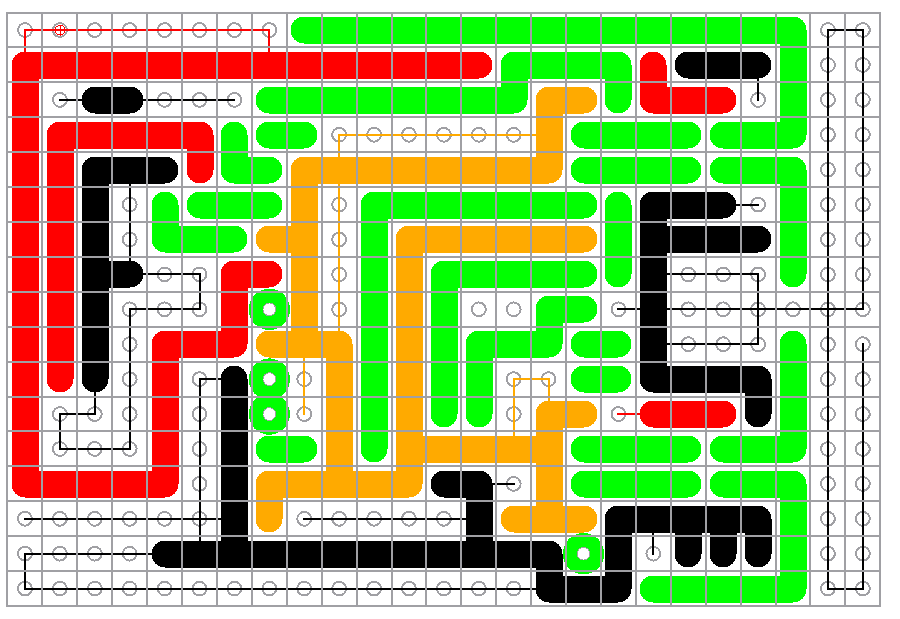

写真を撮り忘れたが、無事動作。制作も特にトラブル無し。私ごときが 3個中 3個とも完成させられ
るのだから、取り扱い易い IC なのだろう。

## テストと改良

どうにも v2.0 に比べて Arduino の書き込み失敗が目立つ。v2.0 のときは 3.3V-GND に 1uF のセ
ラコンを入れたが、今回は在庫処分で 1uF のケミコンにしていた。もしかしてと思い、空いている
3.3V-GND に 1uF のセラコンを入れたところ改善したように見える。絶対に書き込み成功しなかっ
たセルフパワーでも成功した。

ついでに 5V ラインにパスコンを入れてないのが心配になり、かつ、スペース以外にデメリットがな
いので、5V ラインにも 1uF のセラコンを差し込んだ。

今回の教訓

「動作が変ならコンデンサを追加してみよう」
<!-- }}} -->
