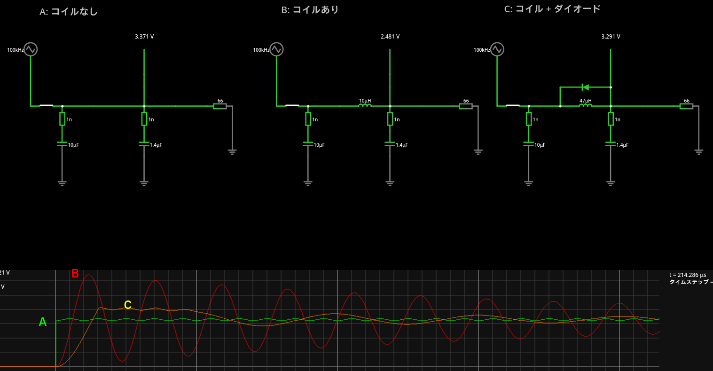
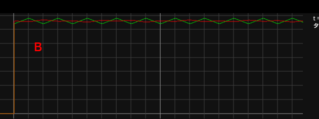
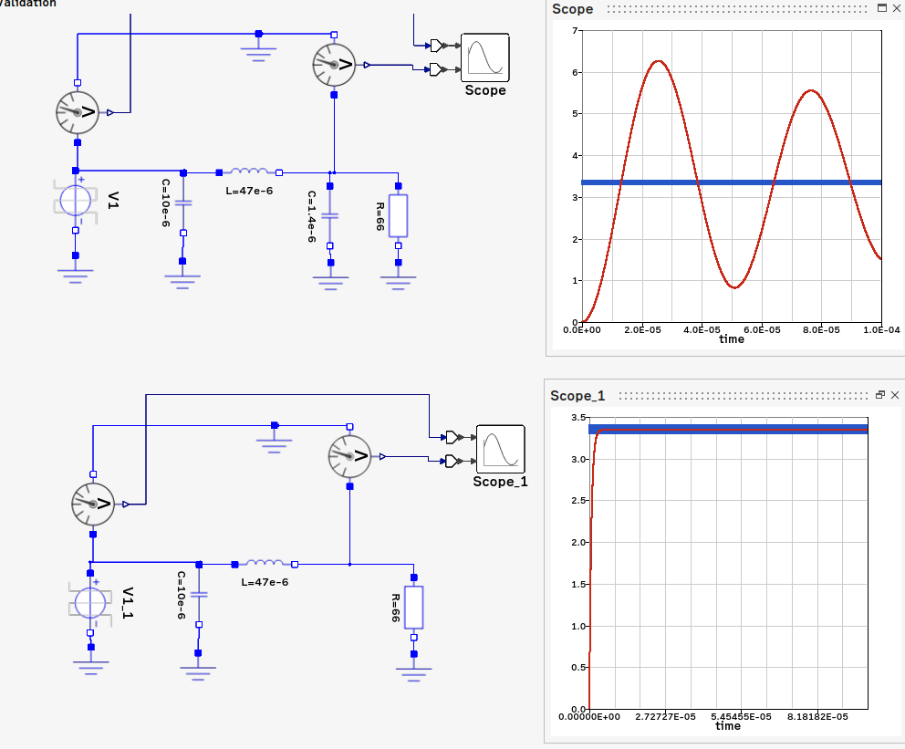

# データシート

https://aitendo3.sakura.ne.jp/aitendo_data/product_img/ic/inteface/GL850G/GL850G-HHY22.PDF

# 参考回路

MA8601 と違い Genesys Logic が作成したと思われる回路図がある。

https://fccid.io/R7IKT-UH406/Schematics/SCHEMATICS-1907737.pdf

https://x.gd/srPtItY

どちらもほぼ同じに見えるので、どちらでも良さそう。

# 1回目の挑戦

## 回路の研究

OVCUR1# は VCC 5V から抵抗で 3V くらいを作って High の入力をしている。そしてヒューズが切れ
ると Low になるということのようだ。これはもしブレボでのテストをパスしたら採用してみよう。

ちなみに GANG モードを利用なので OVCUR2# は未使用。PGANG は 3.3V に 100kΩで プルアップさ
れている。100kΩはデータシートの指定

PSELF のところはややこしいので

https://www.falstad.com/circuit/circuitjs.html

でのシミュレーションをしてみた。

[PSELF テスト](./GL850G/GL850G_PSELF_sim.txt)

するとバスパワーのときは PSELF=LOW, セルフのときは HIGH となることが分かった。ただし IC 自
体に電流を感知する仕組みはないので、low, high でどう挙動が変わるのか、想像が付かない。High
または Low のままで、不都合があるのか調べてみたい。あと 5V 入力はぎりぎりなのでどうなのか
と言う気はしている。

PREF の 680Ωもデータシートの指定。1kΩとかで作ってくれよ。

TEST は Option のところを使わないので未使用になる。データシートによると Internal pull down
となっているので、こちらから積極的にプルダウンする必要はないはず。

PWREN は Option のところを使わないので未使用だが、もともと電源が入ってるかの出力ピンなので
使わない。

### AVDD のところの検討

良く分からないのだが AVDD にはコイルを入れてあり DVDD には入れていない。矛盾しない理由とし
てはデジタル回路 DVDD は High, Low だけなんとかなれば良いから電源電圧がブレても問題ないが、
アナログ回路 AVDD はきっちり電源を出したいというところだろうか。電圧がブレるということは内
蔵レギュレータはスイッチング方式なのかもしれない。

そう思って 

https://www.falstad.com/circuit/circuitjs.html

でテストしてみた。スイッチングを模擬するため 100kHz の三角波を電源、データシートの Table
6.6 のよると、この IC には 50mA 程度の電流が流れるみたいなので 3.3V/50mA=66Ωということで、
模擬してみた。

[モデルファイル](./GL850G/AVDD_test.txt)



結果として、何もしないのが一番となった。もしかしたらだが、Spice 系のソフトには、定常状態で
計算を開始するものがあり（この場合、コイルに 50mA 程度の電流とコンデンサに 3.3V が掛かって
いる状態からスタート)、その場合は電圧のオーバーシュートは起きずにきれいに減衰していく。そ
れを見て効果ありと判断したのではないだろうか。
けない方が良さそう。




もちろんこのシミュレーションは理想回路のシミュレーションでいきなり電圧が 0V から 3.3V まで
立ち上がったりするから、そこまで大きなオーバーシュートはないのかもしれないが、作動電圧が最
大 3.6V なので、やはりコイルを入れる気にはならない。もし入れるならダイオードは必須であろう。

例えば、このようにコイルを入れていない人もいる。

https://github.com/RyanDam/TinyUSBHub

あとノイズということで 48MHz のパルス波を与えてみたんだけど、コイル付けるならコンデンサ付
けない方が効果ありそう。



またデータシート 6.6 に

  The 3.3V power output is guaranteed by an internal voltage reference
  circuit to prevent unstable 5V power compromise USB data integrity. 

と、「この3.3V」を使えば USB のデータがおかしくなることはない、と言いきっており、それなら
ばそのまま使えば良いのではないだろうか。

おそらく、V5, GND 接続だけでレギュレータは動くだろうから、一応オシロで見てみて、定格範囲を
飛び出したりしてなければ、そのまま行こうと思う。

## テスト用回路図, 1.0, バスパワー

[バスパワー用テスト回路 1.0](./GL850G/kicad/GL850G_1.0/GL850G_1.0.pdf)

部品表

| 記号  | 品目                                          | 個数  |
| ---   | ---                                           | ---   |
| C1,2  | C, 15pF                                       | 2     |
| C3,4  | C, 0.1uF                                      | 2     |
| C5    | 電解コンデンサ 100uF台                        | 1     |
| J1    | USB A メスコネクタ                            | 1     |
| J2    | USB B メスコネクタ                            | 1     |
| R1    | R 680Ω                                       | 1     |
| R2,5  | R 10kΩ                                       | 2     |
| R3    | R 47kΩ                                       | 1     |
| R4    | R 100kΩ                                      | 1     |
| R6    | R 22kΩ                                       | 1     |
| U1    | GL850G                                        | 1     |
| Y1    | クリスタル 12MHz                              | 1     |

## テスト 1.0

R3 47kΩを買っていなかったため 56kΩで代用している。

まず、ホストのみの接続で、ハブとして認識。

```dmesg
[ 5047.830338] usb 3-1.2: new full-speed USB device number 12 using xhci_hcd
[ 5047.993667] usb 3-1.2: new high-speed USB device number 13 using xhci_hcd
[ 5048.086130] usb 3-1.2: New USB device found, idVendor=05e3, idProduct=0608, bcdDevice=85.38
[ 5048.086132] usb 3-1.2: New USB device strings: Mfr=0, Product=1, SerialNumber=0
[ 5048.086134] usb 3-1.2: Product: USB2.0 Hub
[ 5048.134279] hub 3-1.2:1.0: USB hub found
[ 5048.134747] hub 3-1.2:1.0: 4 ports detected
```

でポート1 にキーボード差してみたところ、電力不足で拒否。

```dmesg
[ 5471.767012] usb 3-1.2.1: new full-speed USB device number 16 using xhci_hcd
[ 5471.877012] usb 3-1.2.1: New USB device found, idVendor=2efd, idProduct=7812,
bcdDevice= 2.10
[ 5471.877014] usb 3-1.2.1: New USB device strings: Mfr=1, Product=2, SerialNumber=0
[ 5471.877016] usb 3-1.2.1: Product: USB Keyboard
[ 5471.877018] usb 3-1.2.1: Manufacturer: SONiX
[ 5471.877086] usb 3-1.2.1: rejected 1 configuration due to insufficient available bus
power
[ 5471.877088] usb 3-1.2.1: no configuration chosen from 1 choice
```

念の為、キーボードを直接差すと動くので、電力が足りてないはずはない。また OVCUR1 には 3.8V
入っており、これが妨げになっているはずはない。

PGANG が 1.8V まで下っている。抵抗手前で 3.3V 出ているので、PGANG が 1.8V を出力していると
いうことになるんだが、正解が分からない。

とりあえず PSELF を 5V に直接差すとなぜか認識して文字も打てた。PGANG は変わらないから問題
なかったようだ。

```dmesg
[ 7083.550387] usb 3-1.2.1: new full-speed USB device number 30 using xhci_hcd
[ 7083.660085] usb 3-1.2.1: New USB device found, idVendor=2efd, idProduct=7812,
bcdDevice= 2.10
[ 7083.660089] usb 3-1.2.1: New USB device strings: Mfr=1, Product=2, SerialNumber=0
[ 7083.660091] usb 3-1.2.1: Product: USB Keyboard
[ 7083.660092] usb 3-1.2.1: Manufacturer: SONiX
[ 7083.702198] input: SONiX USB Keyboard as /devices/pci0000:00/0000:00:08.1/0000:05:
00.3/usb3/3-1/3-1.2/3-1.2.1/3-1.2.1:1.0/0003:2EFD:7812.0006/input/input19
[ 7083.757179] hid-generic 0003:2EFD:7812.0006: input,hidraw4: USB HID v1.11 Keyboard
[SONiX USB Keyboard] on usb-0000:05:00.3-1.2.1/input0
```

5V 直は嫌な感じなので 3.3V に差してみる。これでも動作したので PSELF は 3.3V 差しで決定で良
いだろう。良く知らないけど USB の階層とか関係するのかな。

機材が足りてないので、あくまで 1ポート毎の動作だが、とりあえず全ポートが動作。

とりあえず、基本的な動作ができたので、あとは疑問に思っていたところのテスト

動いた後で今さらだけど、3.3V は何も必要なかったし、オシロで見てみたけど十分安定しているよ
うに見える。

## テストまとめ

- PSELF は 3.3V に差す必要がある。抵抗不要。
