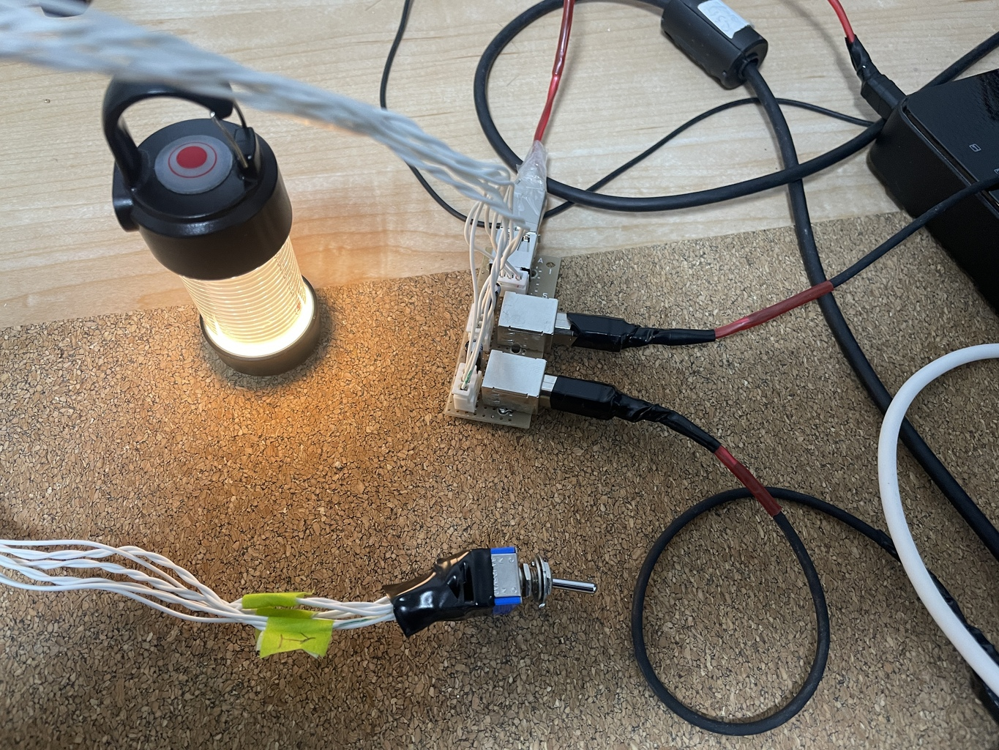
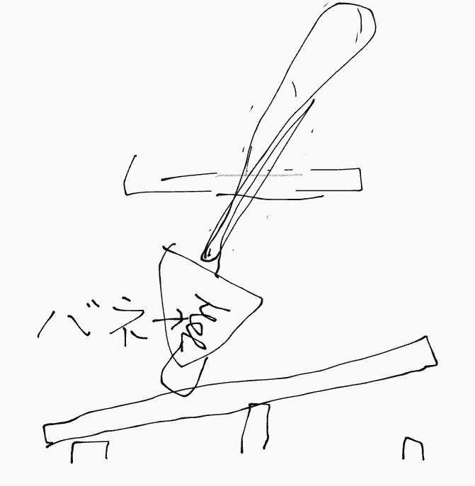

# USB 切り替え器を作ってみたい

## ver 1.0

まじめにやるなら TS3USB30EDGSR という専用のコントローラ IC を使うべきだけど、素人考えで、
信号線と電源線をつなぐだけで問題ないんじゃないかと、つまり、途中で線が変わってても、PC な
ど USB ホストコントローラ側には、そんなこと分からないんじゃないかという、舐めた考えて、た
だただ切り替えてみる。

実際に USB アナログスイッチ IC などで検索すると TS3USB30EDGSR などが出てくるが、中身を見る
とアナログスイッチのようである。秋月などで売っている一般のアナログスイッチを見ると思いのほ
かオン抵抗が大きい。100Ω単位である。こういうのが USB の邪魔になるということで存在している
IC なのではないだろうか。今回はむしろ、理想的には抵抗 0 の導線でつなぐだけなので、むしろ有
利な可能性すらあるのではないだろうか。

ミヤマの 3回路の物理なスイッチ MS-500M-B があるので、それを使ってみる。脳筋な感じが気に入った。

セルフパワーにしようかと思ったけど、出力側の USB コネクタはせいぜい 1, 2A な設計だろうから、
ここでセルフにする意味がない。セルフにするならハブ作るときにやるべきだ。

回路図はこちら

設計図はこちら。ユニバーサル基板は 23x8 穴必要。

スイッチ MS-500M-B 側はこちら。添字は設計図と回路図の J1-J3 の添字と同じ。左右は別に間違え
ても大丈夫。

| 左列 | 中央列 | 右列 |
| ---  | ---    | ---  |
| V1   | V3     | V2   |
| D-1  | D-3    | D-2  |
| D+1  | D+3    | D+2  |

完成したのがこちら。

ちなみにスイッチに導通トラブルがあった。中を開けて接点復活剤で磨いたりグリス塗ったり、ばね
を入れ直してたりしたら治った。中を開けて知ったが、3枚のシーソーを一個のレバーで倒していて、
押し込めるようにレバーの先端にはばねがあるが、シーソー板もばねも置いてあるだけなので、輸送
の衝撃とがでずれるかもしれない。ネコポス使ったし。また、回路数が増えるほど、ちょっと無理が
出てくるような気がする。

### 知見

結論から言うと、信号線を捻る効果を思い知った。ツイストケーブルと言って、シールドのないケー
ブルでもノイズ低減のために信号線を捻っているらしい。自力で捻っても効果があった。

経緯としては、本機と同時に 30cm の B ケーブルと 60cm の B ケーブルも作ったのだが、入力に
30cm、出力にも 30cm の組合せだと接続機器が動作しなかった。電源すら入らない。30cm と 60cm、
もしくは手持ちの市販品 1m 程度のものは動作した。

30cm のケーブルはどちらも単体だと動作しているので、途方に暮れたのだが、エレコムのケーブル
を見ていて、シールドの無いものでもツイストペアケーブルと言うものを使っていることに気が付い
た。そして自分が使っているスリムロボットケーブルもそういえば、なんか捻ってあることを思い出
した。

USB ケーブルを作るとき、はんだをしやすくするため、5, 6cm 被覆を剥くし、やりやすい用にほぐ
したりしているのだが 30cm でそれをやると、ツイストペアな部分は 20cm 程度しかない。また、本
機は配線を単芯線 9本でやったが、もともとの巻癖以外になにもしていなかった。

そこで本機のスイッチまでのケーブルのうち D+, D- をペアで捻ってみた。5V 線も含めるのか分か
らなかったが、エレコムだとどれも信号線のところだけ捻っているイラストがあるので信号線だけに
した。だいたい往復で 1m くらいある。そこに 30cm x 2 で継いでみたところ、接続機器が動作した。

まとめである。

- USB の信号線はツイストペアにしよう
  - そういうケーブル使う方が楽だと思う。
  - 協和ハーモネットのスリムロボットケーブルに 9芯や 6芯のものがあるから気になる
- USB ケーブル自作は短すぎても良くない
  - はんだが上手で剥きを最小限にできるなら別だけど。
